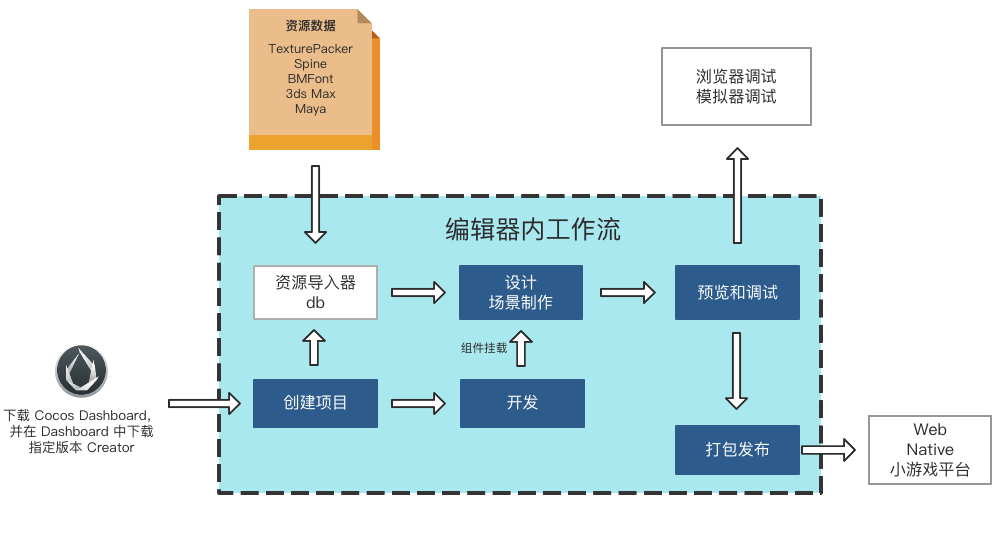
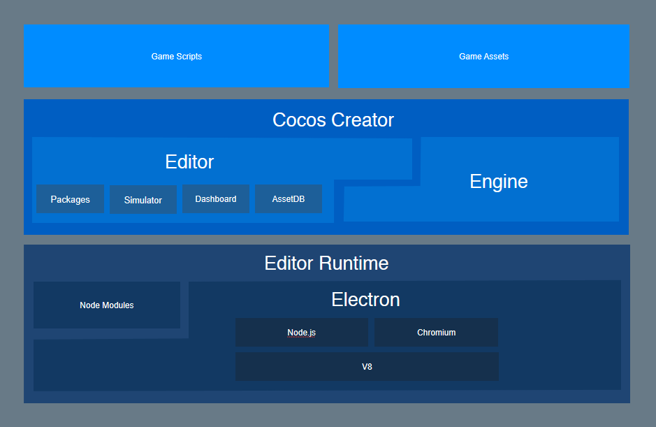
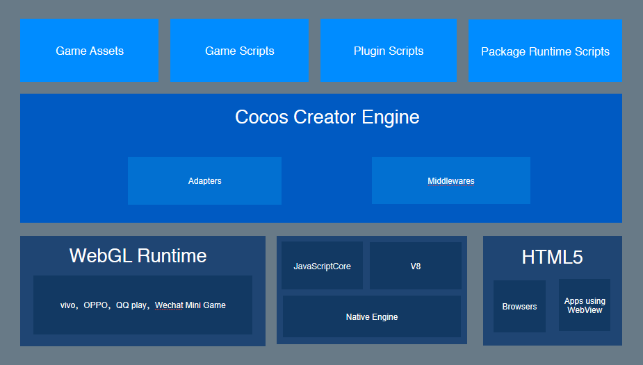

# 关于 Cocos Creator

- **Q**：Cocos Creator 是游戏引擎吗？ 
  **A**：它是一个完整的游戏开发解决方案，包含了轻量高效的跨平台游戏引擎，以及能让你更快速开发游戏所需要的各种图形界面工具。

- **Q**：Cocos Creator 的编辑器是什么样的？ 
  **A**：完全为引擎定制打造，包含从设计、开发、预览、调试到发布的整个工作流所需的全功能一体化编辑器。

- **Q**：我不会写程序，也能使用 Cocos Creator 吗？ 
  **A**：当然！Cocos Creator 编辑器提供面向设计和开发的两种工作流，提供简单顺畅的分工合作方式。

- **Q**：我使用 Cocos Creator 能开发面向哪些平台的游戏？ 
  **A**：Cocos Creator 目前支持发布游戏到 Web、iOS、Android、各类"小游戏"、PC 客户端等平台，真正实现一次开发，全平台运行。

## 产品定位

Cocos Creator 是以内容创作为核心的游戏开发工具，在 Cocos2d-x 基础上实现了彻底脚本化、组件化和数据驱动等特点。

## 工作流程说明

在开发阶段，Cocos Creator 已经能够为用户带来巨大的效率和创造力提升，但我们所提供的工作流远不仅限于开发层面。对于成功的游戏来说，开发和调试、商业化 SDK 的集成、多平台发布、测试、上线这一整套工作流程不光缺一不可，而且要经过多次的迭代重复。

Cocos Creator 将整套手机页游解决方案整合在了编辑器工具里，无需在多个软件之间穿梭，只要打开 Cocos Creator 编辑器，各种一键式的自动化流程就能花最少的时间精力，解决上述所有问题。开发者就能够专注于开发阶段，提高产品竞争力和创造力！

### 创建或导入资源

将图片、声音等资源拖拽到编辑器的 **资源管理器** 面板中，即可完成资源导入。

此外，你也可以在编辑器中直接创建场景、预制、动画、脚本、粒子等各类资源。

### 搭建场景

项目中有了一些基本资源后，我们就可以开始搭建场景了，场景是游戏内容最基本的组织方式，也是向玩家展示游戏的基本形态。

### 添加组件脚本，实现交互功能

我们可以为场景中的节点挂载各种内置组件和自定义脚本组件，来实现游戏逻辑的运行和交互。包括从最基本的动画播放、按钮响应，到驱动整个游戏逻辑的主循环脚本和玩家角色的控制。几乎所有游戏逻辑功能都是通过挂载脚本到场景中的节点来实现的。

### 一键预览和发布

搭建场景和开发功能的过程中，你可以随时点击预览来查看当前场景的运行效果。使用手机扫描二维码，可以立即在手机上预览游戏。当开发告一段落时，通过 **构建发布** 面板可以一键发布游戏到包括桌面、手机、Web 等多个平台。

## 功能特性

Cocos Creator 功能上的突出特色包括：

- 脚本中可以轻松声明可以在编辑器中随时调整的数据属性，对参数的调整可以由设计人员独立完成。
- 支持智能画布适配和免编程元素对齐的 UI 系统可以完美适配任意分辨率的设备屏幕。
- 专为 2D 游戏打造的动画系统，支持动画轨迹预览和复杂曲线编辑功能。
- 使用动态语言支持的脚本开发，包括 JavaScript 和 TypeScript，使得动态调试和移动设备远程调试变得异常轻松。
- 底层由 Cocos2d-x 演化而来，在享受脚本化开发的便捷时，保持原生级别的轻量和高性能。
- 脚本组件化和开放式的插件系统为开发者在不同深度上提供了定制工作流的方法，编辑器可以大尺度调整来适应不同团队和项目的需求。

## 架构特色

Cocos Creator 包含游戏引擎、资源管理、场景编辑、游戏预览和发布等游戏开发所需的全套功能，并且将所有的功能和工具链都整合在了一个统一的应用程序里。

编辑器在提供强大完整工具链的同时，提供了开放式的插件架构，开发者能够用 HTML + JavaScript 等前端通用技术轻松扩展编辑器功能，定制个性化的工作流程。

以下，是 Cocos Creator 的技术架构图

图一

图二

从图中我们可以看出，编辑器是由 Electron 驱动再结合引擎所搭建的开发环境，引擎则负责提供许多开发上易于使用的组件和适配各平台的统一接口。

引擎和编辑器的结合，带来的是数据驱动和组件化的功能开发方式，以及设计和程序两类人员的完美分工合作：

- 设计师在场景编辑器中搭建场景的视觉表现
- 程序员开发可以挂载到场景任意物体上的功能组件
- 设计师负责为需要展现特定行为的物体挂载组件，并通过调试改善各项参数
- 程序员开发游戏所需要的数据结构和资源
- 设计师通过图形化的界面配置好各项数据和资源
- （就这样从简单到复杂，各种你能想像到的工作流程都可以实现）

以工作流为核心的开发理念，让不同职能的开发者能够快速找到最大化自己作用的工作切入点，并能够默契流畅的和团队其他成员配合。

## 使用说明

在数据驱动的工作流基础上，场景的创建和编辑成为了游戏开发的重心，设计工作和功能开发可以同步进行，无缝协作。不管是美术、策划还是程序员，都可以在生产过程的任意时刻点击预览按钮，在浏览器、移动设备模拟器或移动设备真机上测试游戏的最新状态。

程序员和设计人员现在可以实现各式各样的分工合作，不管是先搭建场景，再添加功能，还是先生产功能模块再由设计人员进行组合调试，Cocos Creator 都能满足开发团队的需要。脚本中定义的属性能够以最适合的视觉体验呈现在编辑器中，为内容生产者提供便利。

场景之外的内容资源可以由外部导入，比如图片、声音、图集、骨骼动画等等，除此之外我们还在不断完善编辑器生产资源的能力，包括目前已经完成的动画编辑器，美术人员可以使用这个工具制作出非常细腻富有表现力的动画资源，并可以随时在场景中看到动画的预览。

支持 2D 和 3D 游戏开发，其功能可满足各种游戏类型的特定需求。深入优化了纯 2D 游戏的编辑器体验和引擎性能，并内置了对中间件的支持，如 Spine、DragonBones、TiledMap、Box2D 和 Texture Packer。

最后，开发完成的游戏可以通过图形工具一键发布到各个平台，从设计研发到测试发布，Cocos Creator 全部帮您搞定。
