# Unity 开发者入门 Cocos Creator 快速指南

近年由于 H5 小游戏的兴起，越来越多的开发者需要一款单次编写，多平台发布的移动端轻量引擎，而 Cocos Creator 恰好是为此而设计的。

本文将从一个 Unity 开发者的视角，从以下角度对比，帮助 Unity 开发者迅速上手 Cocos Creator引擎。

- 安装和版本管理
- 编辑器
- 资源工作流
- 脚本以及调试
- 着色器

## 安装和版本管理

Unity Hub 可以使用来管理 Unity 的编辑器版本、项目以及各种模板。在 Cocos Creator 中，同样您也可以通过 [Cocos Dash Board](https://www.cocos.com/creator-download) 来管理引擎，项目以及模板。

| Unity Hub | Cocos Dashboard |
| :-- | :-- |
| 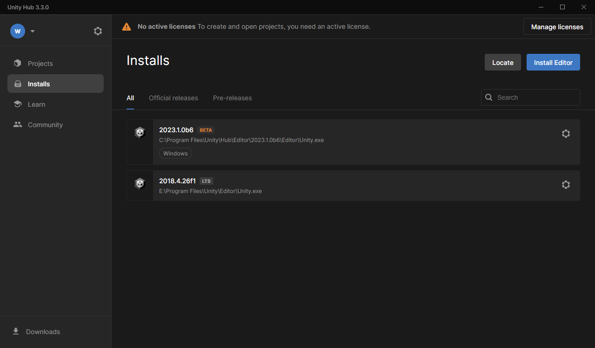 |  |

同样您也可以在 Store 分页中找到大量可供使用的插件、资源和源码，以及在 Learn 分页中找到更多可供学习的素材。

## 编辑器

作为一个 Unity 开发者，在绝大多数的情况下您可以无缝使用 Cocos Creator 的编辑器，他们拥有接近的编辑器布局以及使用方式。

| Unity Editor | Cocos Creator Editor |
| :-- | :-- |
| 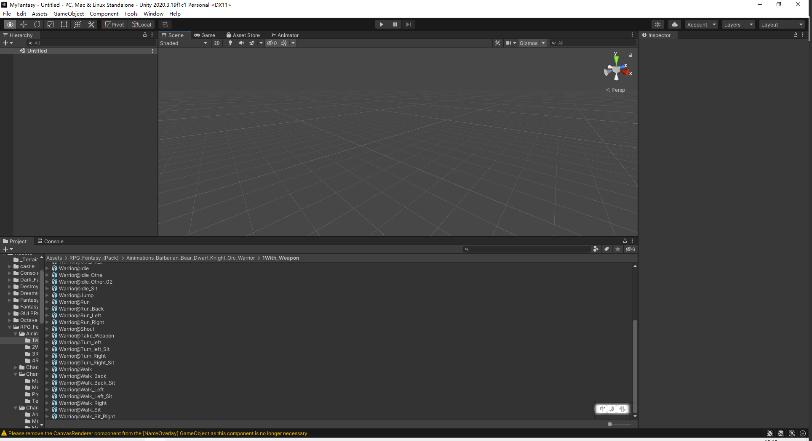 | 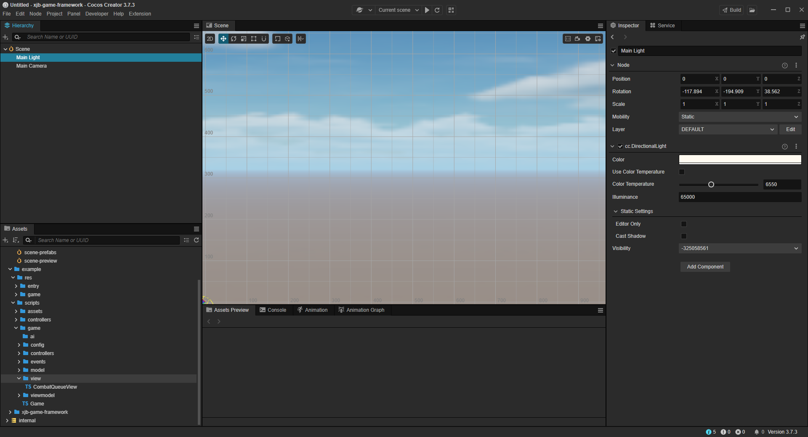

略有不同的地方在于， Cocos Creator 由于使用  Electronic+Chromium 开发，您既可以通过浏览器预览游戏，也可以直接在编辑器内运行游戏。

## 工作流

Cocos Creator 的 2D 和 3D 工作流与 Unity 类似，您可以阅读 [场景制作工作流程](../../concepts/scene/index.md) 来查看 Cocos Creator 的工作流。

## 贴图资源

贴图资源的导入和 Unity 类似。

| Unity | Cocos |
| :-- | :-- |
| 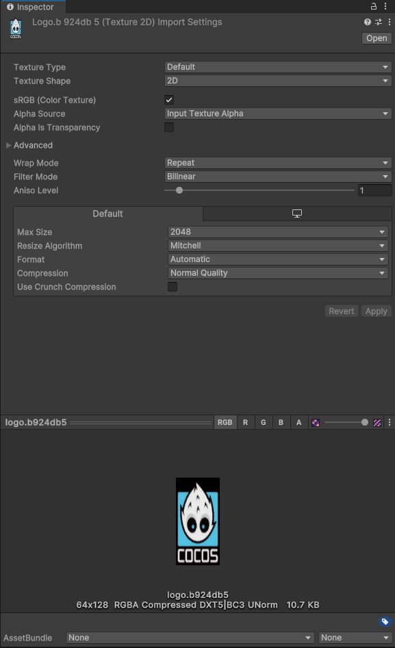 | 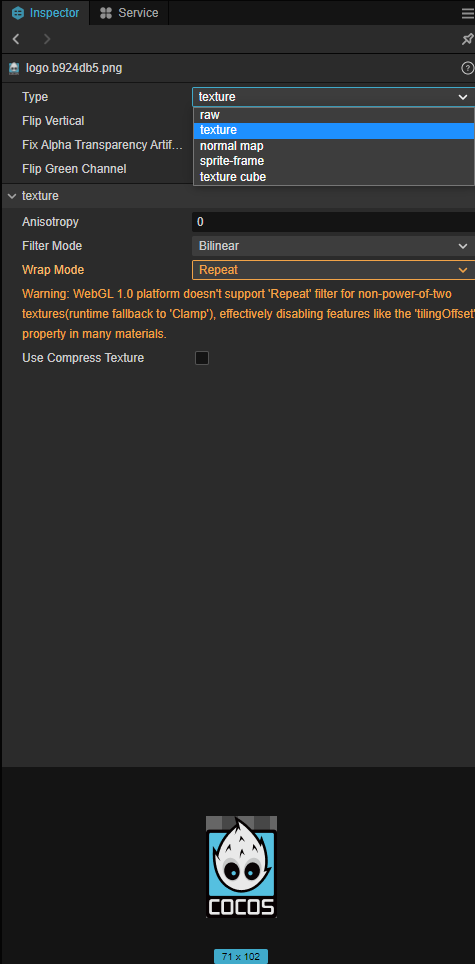 |

也可以在项目设置中配置全局纹理压缩

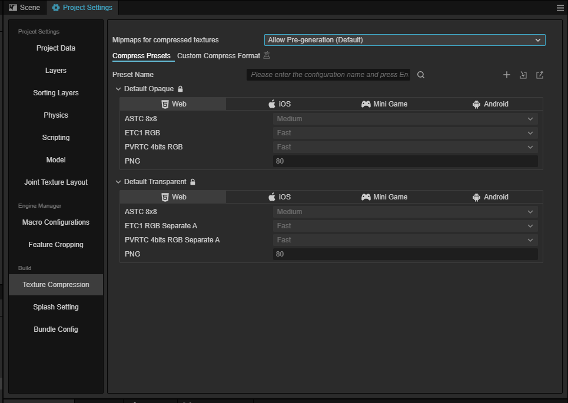

## 模型和动画

在 Cocos Creator 中导入 FBX 和 Unity 是一样的，将文件拖拽或者复制到工程的 Assets 目录下即可。

| Unity | Cocos |
| :-- | :-- |
| 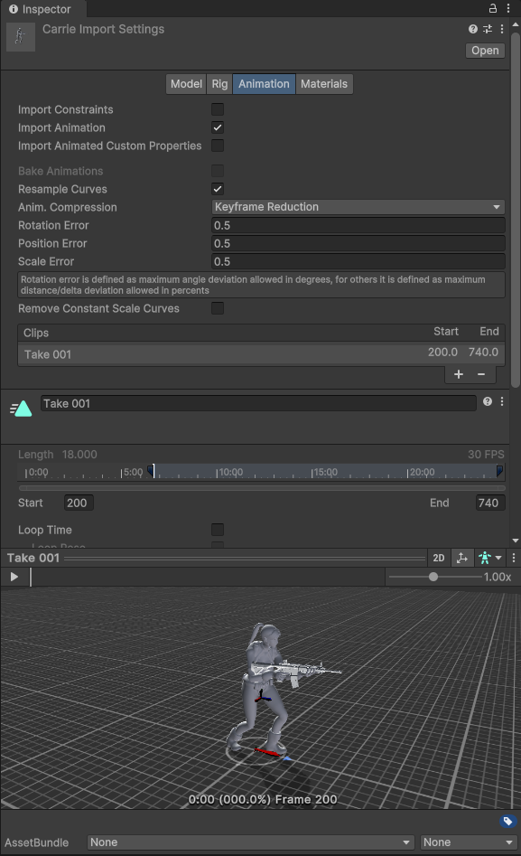 | 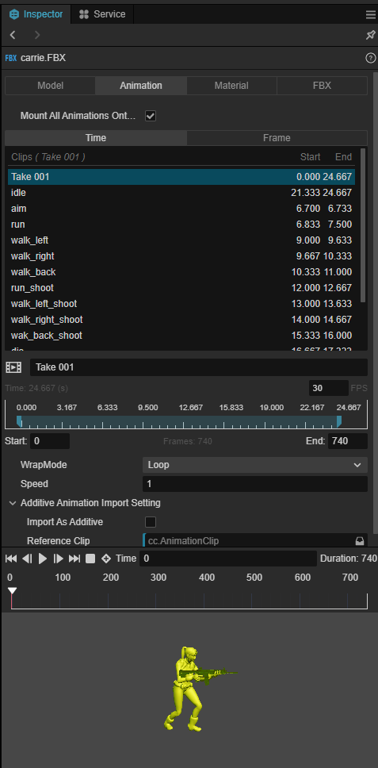 |

同时 Cocos Creator 也支持 glTF 格式的文件，以及 Maya、3DMax 等 DCC 工具的标准材质。

### Spine 骨骼动画

Cocos Creator 内置了 Spine 动画组件，您可以直接通过 `spine.Skeleton` 组件来使用他。

### 动画和状态机

Cocos Creator 支持关键帧动画、骨骼动画。您可以直接在编辑器内编辑和预览这些动画。


和 Unity 的 Animator 类似，Cocos Creator 也支持动画状态机的编辑，您可以在 [Marionette 动画系统](../../animation/marionette/index.md) 中找到他们。

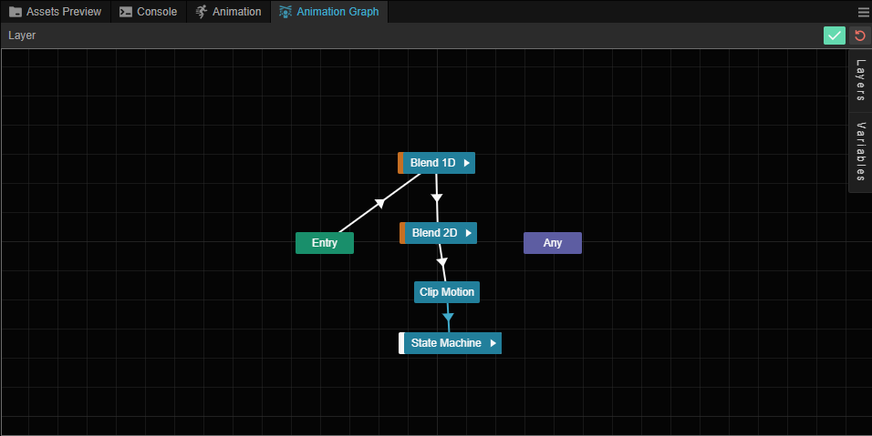

## 音乐和音效

Cocos Creator 同样支持 Audio Source 组件用于播放音乐和音效。

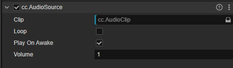

## 资源包

和 Unity 类似，Cocos Creator 也支持从外界导入资源包的方式进行合作开发。

| Unity | Cocos |
| :-- | :-- |
| 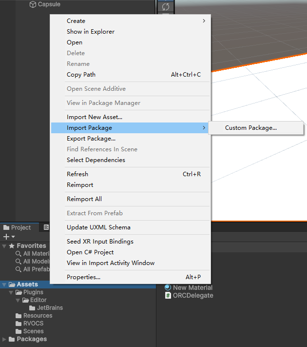 |  |

## 发布和构建

除了和 Unity 一样发布在各种原生平台外，Cocos Creator 也支持发布在如微信小游戏、抖音小游戏等小游戏平台。

| Unity | Cocos |
| :-- | :-- |
|  | 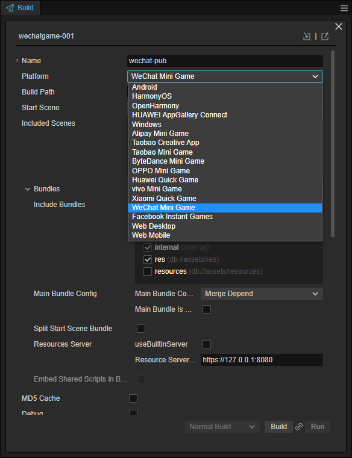 |

## 脚本编程和调试

和 Unity 的 GameObject 不同，在 Cocos Creator 中，场景中的实体被命名为 Node，但是和 Unity 类似的是 Cocos Creator 也是 ECS（Entity-Component-System） 架构，您也可以通过给 Node 添加不同的组件来实现游戏的功能。

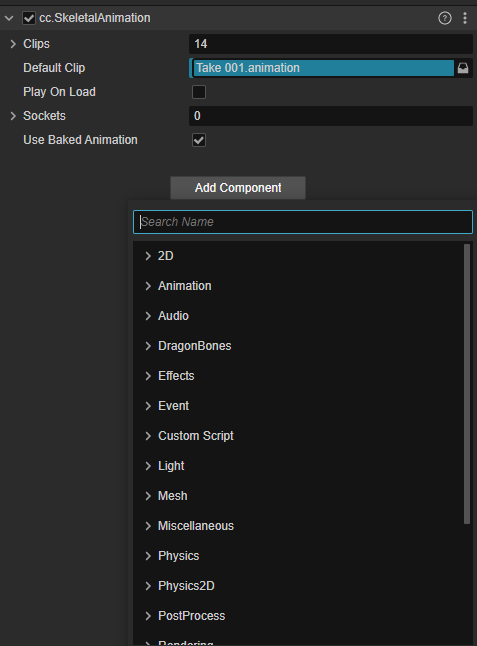

### 组件的生命周期

和 Unity 类似， Cocos Creator 的组件也有自己的生命中期，系统将通过回调组件内已注册的方法，方便开发者处理业务逻辑。

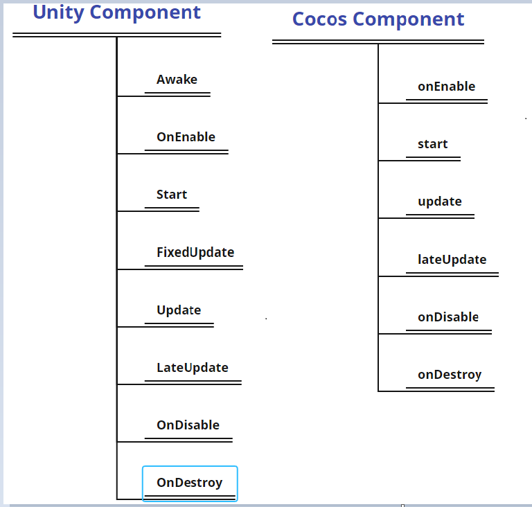

### 自定义组件的编写

在 Unity 中，我们继承 Monobehavior 来实现我们自己的游戏脚本。

```c#
public class Player : NetworkBehaviour
{
    Animation _animation;

    Start(){
        //获取对应的GameObject上的组件
        _animation = gameObject.GetComponent<Animation>();
    }
}
```

Cocos Creator 使用 Typescript 来编写脚本。

下面的例子演示了如何使用 Typescript 实现自定义组件。

```ts
@ccclass('MotionController')
export  class MotionController extends Component {  

    //对要使用的组件进行生命
    animation: SkeletalAnimation;

     start() {
        // 获取动画组件
        this.animation = this.getComponent(SkeletalAnimation);        
    }    
}
```

C# 和 Typescript 都是微软开发的编程语言，其易用程度是类似的。

### 调试和日志

#### 日志调试

Unity中使用日志我们可以使用 `Debug.Log` 的方法。

在 Cocos Creator 中使用日志，既可以使用 js 的日志打印 `console.log()`，也可使用 Cocos Creator 的日志方法：

```ts
cc.log()
cc.debug()
cc.error()
```

#### 断点调试

Unity 可以使用 Visual Studio 或者 VSCode 进行断点调试。

Cocos Creator 使用 VSCode 或者直接在浏览器内通过开发者工具调试。


## 材质以及着色器编写

### 材质

Cocos Creator 的材质和 Unity 材质拥有类似的预览和属性面板。

| Unity | Cocos |
| :-- | :-- |
|  | 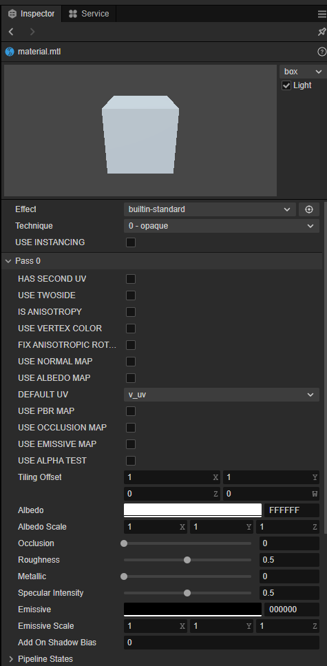 |

和 Unity 不同的地方在于 Cocos Creator 在材质中可以比较方便的查看和定义管线中的渲染状态。

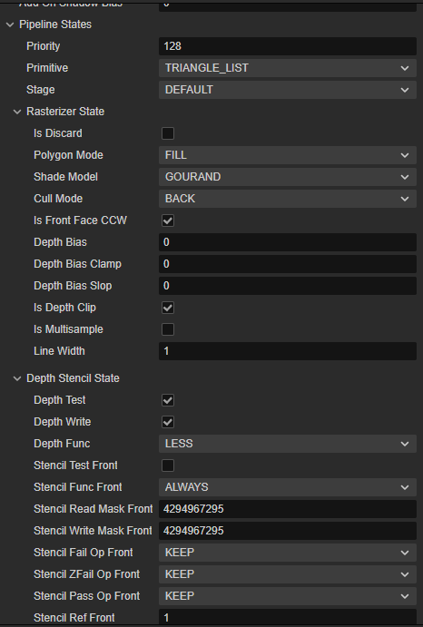

### 着色器

和 Unity 支持 CG、GLSL 以及 HLSL 不同，Cocos Creator 仅支持 GLSL 作为着色器编程语言。

下面的表格对比了他们所使用的文件格式以及 DSL 的区别。

| | Unity | Cocos |
| :--- | :--- | :--- |
| 文件格式  | *.shader | *.effect |
| DSL  | Cg/HLSL/GLSL + Unity Shader Format | GLSL + Yaml |

Unity 采用自定义的 shader 文件来作为 DSL， 而 Cocos creator 使用的是 Yaml 作为 DSL 的文件格式。

#### 着色器语法规则

Unity Shader语法规则

```shader
Shader "Transparent/Cutout/DiffuseDoubleside" {
Properties {
 _Color ("Main Color", Color) = (1,1,1,1)
 _MainTex ("Base (RGB) Trans (A)", 2D) = "white" {}
 _Cutoff ("Alpha cutoff", Range(0,1)) = 0.5
}

SubShader {
 Tags {"IgnoreProjector"="True" "RenderType"="TransparentCutout"}
 LOD 200
 Cull Off
 
CGPROGRAM
#pragma surface surf Lambert alphatest:_Cutoff

sampler2D _MainTex;
float4 _Color;

struct Input {
 float2 uv_MainTex;
};

void surf (Input IN, inout SurfaceOutput o) {
 half4 c = tex2D(_MainTex, IN.uv_MainTex) * _Color;
 o.Albedo = c.rgb;
 o.Alpha = c.a;
}
ENDCG
}

Fallback "Transparent/Cutout/VertexLit"
}

```

Cocos creator effect语法规则

```
// Effect Syntax Guide: https://github.com/cocos-creator/docs-3d/blob/master/zh/material-system/effect-syntax.md

CCEffect %{
  techniques:
  - name: opaque
    passes:
    - vert: general-vs:vert # builtin header
      frag: unlit-fs:frag
      properties: &props
        mainTexture:    { value: white }
        mainColor:      { value: [1, 1, 1, 1], editor: { type: color } }
  - name: transparent
    passes:
    - vert: general-vs:vert # builtin header
      frag: unlit-fs:frag
      blendState:
        targets:
        - blend: true
          blendSrc: src_alpha
          blendDst: one_minus_src_alpha
          blendSrcAlpha: src_alpha
          blendDstAlpha: one_minus_src_alpha
      properties: *props
}%

CCProgram unlit-fs %{`
  precision highp float;
  #include <output>
  #include <cc-fog-fs>

  in vec2 v_uv;
  uniform sampler2D mainTexture;

  uniform Constant {
    vec4 mainColor;
  };

  vec4 frag () {
    vec4 col = mainColor * texture(mainTexture, v_uv);
    CC_APPLY_FOG(col);
    return CCFragOutput(col);
  }
}%

```

### 着色器语法对比

本小节将对比 UnityShader 和 Cocos Effect 的文件结构。

### 结构对比

定义Shader对象

Unity shader:

```shader
Shader "<name>"
{
    <optional: Material properties>
    <One or more SubShader definitions>
    <optional: custom editor>
    <optional: fallback>
}
```

Cocos Shader:

```yaml
CCEffect %{
    <techniques>
        <passes>
    <techniques>
        <passes>

    <shader program>
}

```

### Pass shader结构

UnityShader：

```shader
SubShader{

    <optional>Tag {}    

    <optionall> Pass
}

```

Pass：

```yaml
Pass{
    <name>

    <tag>    

    <code>
}
```

CocosCreator Shader:

```
CCProgram <name> %{

    <in parameters>
    <out parameters>

    <uniforms>  

    function vert();

    function frag();
}%
```
