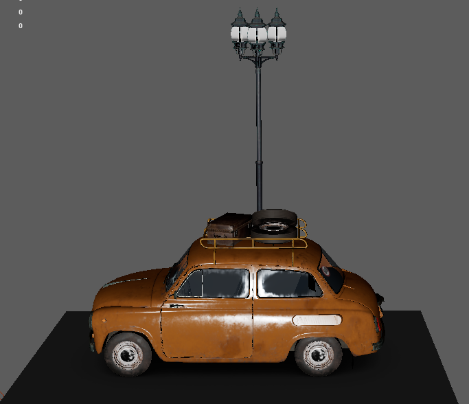
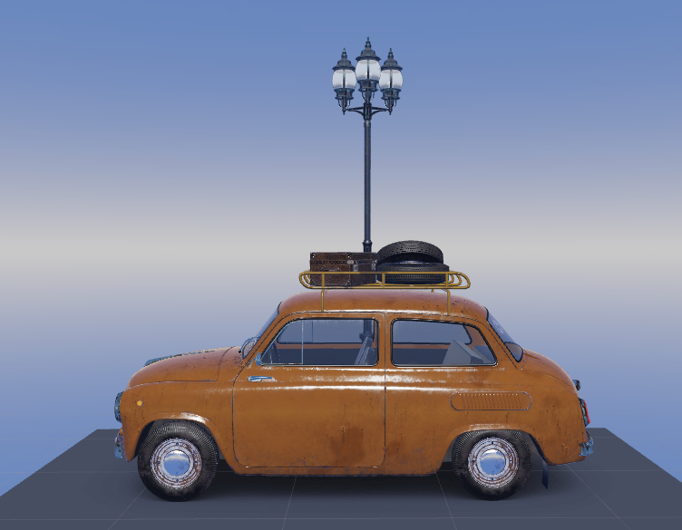
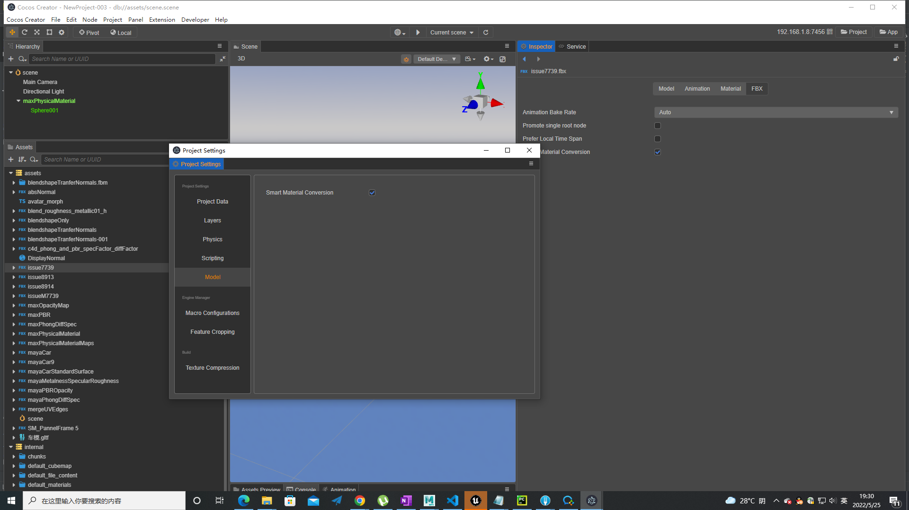
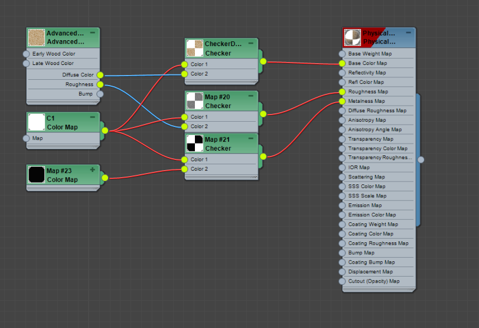
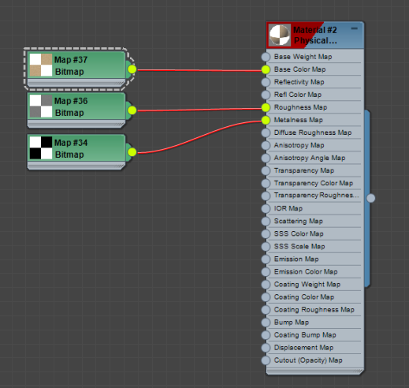
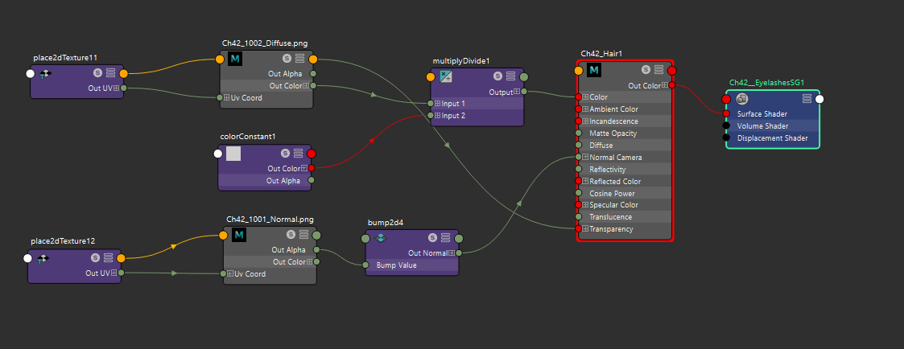
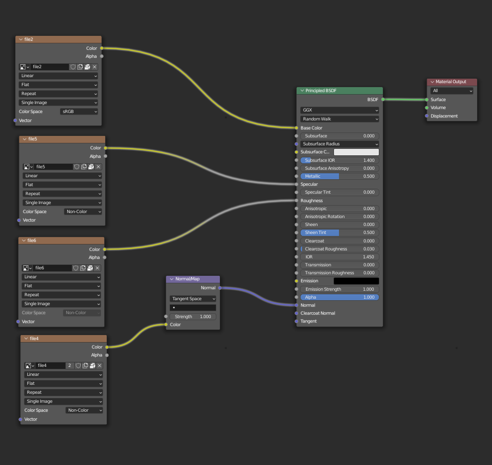

# FBX 智能材质导入

FBX 智能材质导入是模型导入器中辅助转换材质的一个功能，它可以将各种 DCC（Digital Content Creation） 工具导出到模型中的部分标准材质直接映射到 Cocos Creator 的内置材质中，尽量还原美术在 DCC 工具中看到的材质效果。该功能为 v3.5.1 新增。

- 该功能当前支持以下材质：

  | Software | Phong               | PBR               |
  |:-------- |:------------------- |:------------------|
  | 3ds Max  | Standard(legacy)    | Physical Material |
  | Blender  | N/A                 | Principled BSDF   |
  | C4D      | Standard            | N/A               |
  | Maya     | Lambert/Blinn/Phong | Standard Surface  |

- 以 Maya Standard Surface 为例，材质导入 Cocos Creator 效果对比下表所示：

  |  Maya Viewport               | Cocos Creator Viewport       |
  | :----------------------------|:-----------------------------|
  |    |  |

您可以参考以下工程文件设置，以确保导入器可以准确的导入 Maya Standard Surface 各个通道的贴图。

[Maya Car Demo](maya_car.zip)

## FBX 智能材质导入配置和流程

1. 在 Cocos Creator 主菜单依次进入 **Project -> Project Settings -> Model -> Smart Material Conversion** 确保该选项出于开启状态。
2. 在 Cocos Creator 中选中 FBX 文件，确保 FBX 文件的 **Inspector** 面板中 **Smart Material Conversion** 选项处于开启状态。

设置结果如下图所示：

## 不同 DCC 材质支持说明

### Autodesk 3ds Max

- 材质： 支持以下材质类型：
    - Standard（Legacy）
    - Physical Material (建议使用)
    - Multi/SubObject
        - Multi/SubObject 的子材质类型只能是 Standard 或者 Physical Material，不可以是 Multi/SubObject， 否则，导入后部分材质会丢失

- 纹理：
    - 对于 Standard（Legacy） 材质， Cocos Creator 支持以下纹理贴图的自动导入：
        - Diffuse Color
        - Specular Color
        - Glossiness
        - Opacity
        - Bump
    - 对于 Physical Material， Cocos Creator 支持以下纹理贴图的自动导入：
        - Base Color
        - Roughness
        - Metalness
        - Bump
        - Opacity
    - 纹理导入简化要求：
        - 在导出 FBX 前，除 Normal Map 可以用 Normal Bump 节点矫正外，请确保证材质右侧输入的纹理节点均为 Bitmap 节点。
        - 关于如何将简化纹理简化为只剩Bitmap节点，您可以参考 [Convert a Procedural texture into a bitmap image texture in 3ds Max](https://knowledge.autodesk.com/support/3ds-Max/learn-explore/caas/sfdcarticles/sfdcarticles/How-to-convert-a-Procedural-texture-into-a-bitmap-image-texture-in-3ds-Max-for-fbx-export.html)

| 简化前                | 简化后                |
|:---------------------|:-------------------------|
|  |  |

渲染说明：对于 Max Physical Material 材质，需要在 Max Viewport 中开启 High Quality 才可能获取相对准却的预览效果。为了获取最佳的配对效果，您可以配对 Max 和 Cocos Creator 的渲染环境。

- 关于 Max Viewport 渲染更多设置内容，您可参考 [教程](https://www.youtube.com/watch?v=82hhg8Q1nus&list=PL9xXzsdQ6pbZGBnVSKMBO_BCYjzmFTj0R&index=2)
- 关于 Cocos Creator 渲染环境配置详细内容，您可参考 [Cocos Creator 官方文档](https://docs.cocos.com/creator/manual/zh/module-map/graphics.html)

### Autodesk Maya

- 材质：支持以下材质类型：
    - Lambert、Blinn、Phong、Phong-E
    - Standard Surface (建议使用)
- 纹理：
    - 对于 Lambert，Blinn，Phong  Cocos Creator 支持以下纹理自动导入：
        - Color
        - Normal
        - Transparency
        - SpecularColor
        - Cosine Power
    - 对于 Standard Surface  Cocos Creator 支持以下纹理通道的自动导入：
        - Base Color
        - Specular Roughness
        - Metalness
        - Normal
        - Alpha
    - 纹理导入要求： 在导出 FBX 之前，除 Bump Map 可以用 Bump2D 节点矫正外，确保有贴图输入通道的输入户节点类型均为 File 纹理节点。
    - 关于如何将简化纹理简化为只剩 File Texture 节点，您可以参考 [Convert a texture or shading network to a File Texture in Maya](https://knowledge.autodesk.com/support/Maya/learn-explore/caas/CloudHelp/cloudhelp/2016/ENU/Maya/files/GUID-0F504570-CB7A-49D3-A7A2-83438C353A9C-htm.html)

| 简化前                     | 简化后                     |
|:-------------------------|:-------------------------|
|  |  |

渲染说明：使用 Maya Viewport 预览时半透明材质时，建议开启 Depth peeling 和 Alpha Cut Prepass 以获取正准确的预览效果。
为了获取最佳的配对效果，您可以配对 Maya 和 Cocos Creator 的渲染环境。
- 关于 Maya Viewport渲染设置更多内容，您可参考 [Maya 官方文档](https://help.autodesk.com/view/MAYAUL/2022/ENU/)
- 关于 Cocos Creator 渲染环境配置详细内容，您可参考 [Cocos Creator 官方文档](https://docs.cocos.com/creator/manual/zh/module-map/graphics.html)

### Cinema 4D

- 材质：支持以下材质类型：
    - Standard Material
- 纹理：
    - 支持以下纹理：
        - Diffuse Color
        - Specular Color
        - Glossiness
        - Opacity
        - Bump
    - 纹理导出要求：C4D 导出 FBX 前，若一个模型有多个材质需要保证UV集的面和材质有唯一的对应关系。
        - [Example](https://github.com/cocos-creator/3d-tasks/issues/11267)

### Blender

- 材质：支持以下材质类型：
    - Principled bsdf
- 纹理：
    - 对于 Principled bsdf 材质支持以下纹理：
        - Base Color
        - Roughness
        - Metallic
        - Normal
        - Alpha
    - 纹理导入要求：在导出 FBX 之前，除 Normal Map 可以用 Normal Map 节点矫正外，确保材质的其它贴图输入通道均为File纹理节点。

关于如何将简化纹理简化为只剩 Bitmap 节点，您可以参考 [Baking Procedural Materials to Image Textures in Blender](https://www.youtube.com/watch?v=AB24ITZHtuE)

| 简化前                     | 简化后                |
|:-------------------------|:-------------------------|
|  |  |
