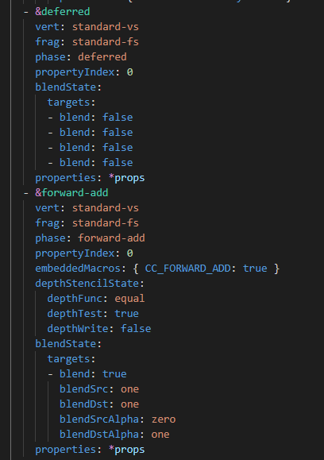
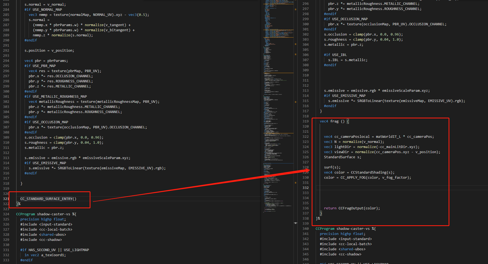
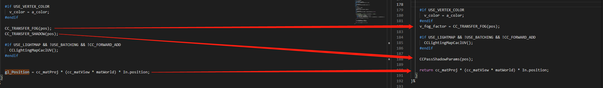
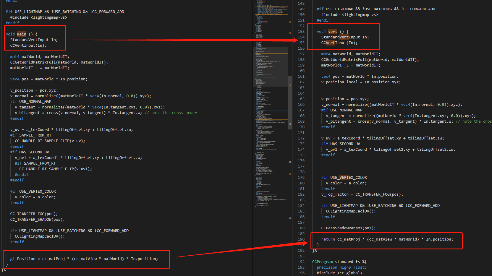

# Material upgrade documentation for v3.0 to v3.1
## 1.1 内置头文件&宏名称差异列表
| Creator3.0 Header    | Creator3.1 Header | 版本差异性 |
| :------ | :------ | :------ |
| cc-fog | cc-fog-vs/fs | 在3.1版本里头文件被拆分成了顶点着色器与片元着色器两个版本

| Creator3.0 Macro    | Creator3.1 Macro | 功能描述 |
| :------ | :------ | :------ |
| CCPassShadowParams | CC_TRANSFER_SHADOW | 从顶点着色器往片元着色器传递阴影参数的宏
## 1.2 内置新增effect功能
### 1.21 Deferred渲染管线
版本3.1新增头文件standard-surface-entry，可以使effect同时兼容forward渲染管线，和deferred渲染管线。3.1与3.0版本材质系统最大的区别就是3.1版本支持了deferred渲染管线，如下图:

### 1.22 新增片元着色器输出宏
3.1版本新增的宏CC_STANDARD_SURFACE_ENTRY()，可以用来替换原有片元着色器输出函数frag ()

## 1.3 effect版本差异

### 1.31 着色器之间的参数传输差异
3.1版本从顶点着色器往片元着色器传输FOG与SHADOW参数，采用了CC_TRANSFER_FOG与CC_TRANSFER_SHADOW这两个宏

### 1.32 着色器函数名称差异
3.1版本的VS主函数名称从vert改为了main,并且返回值赋值给gl_Position

