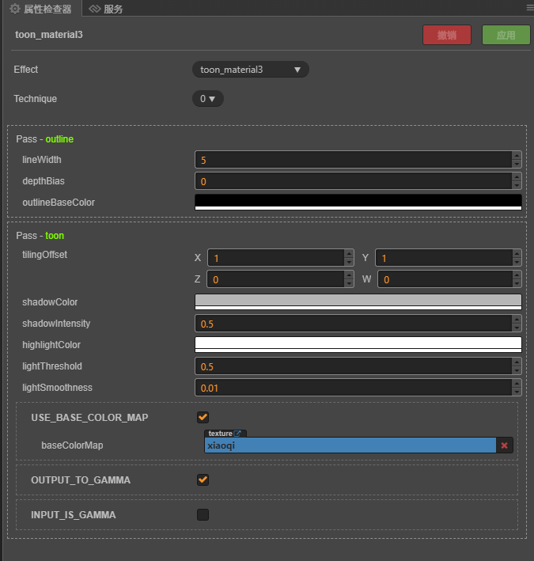
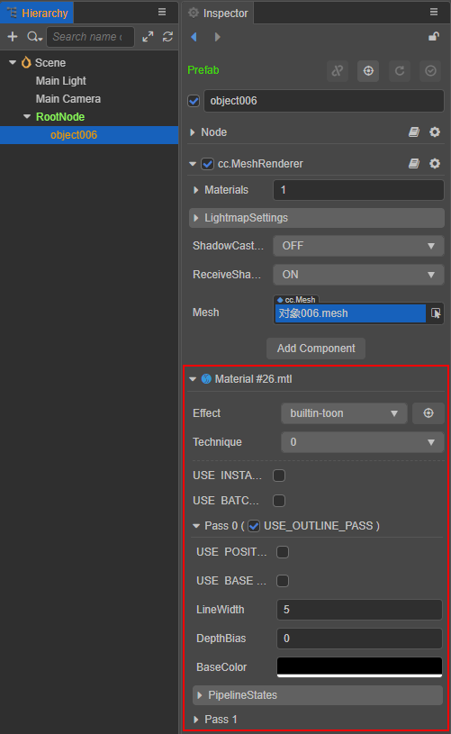
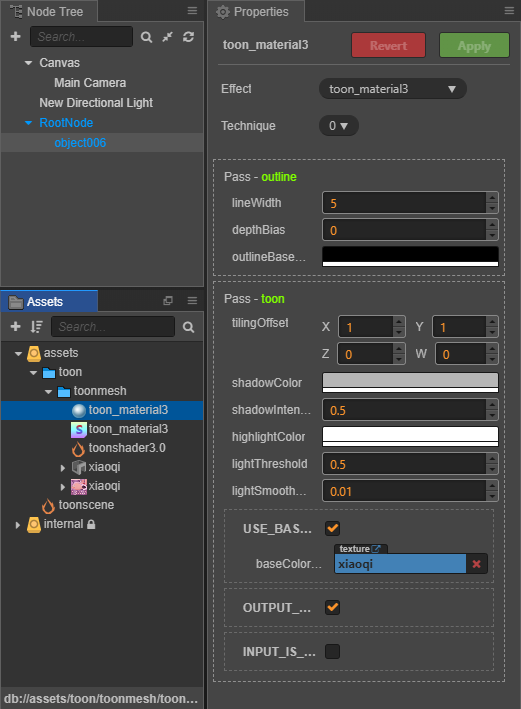
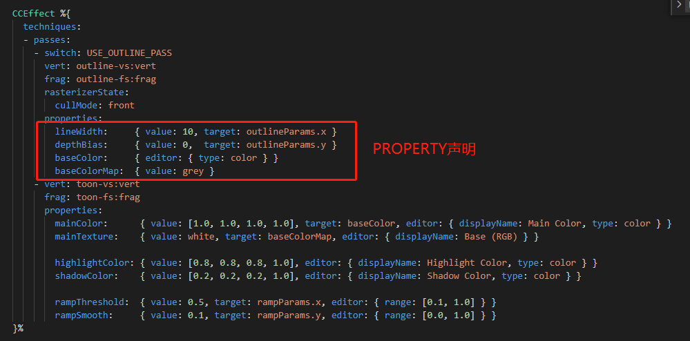
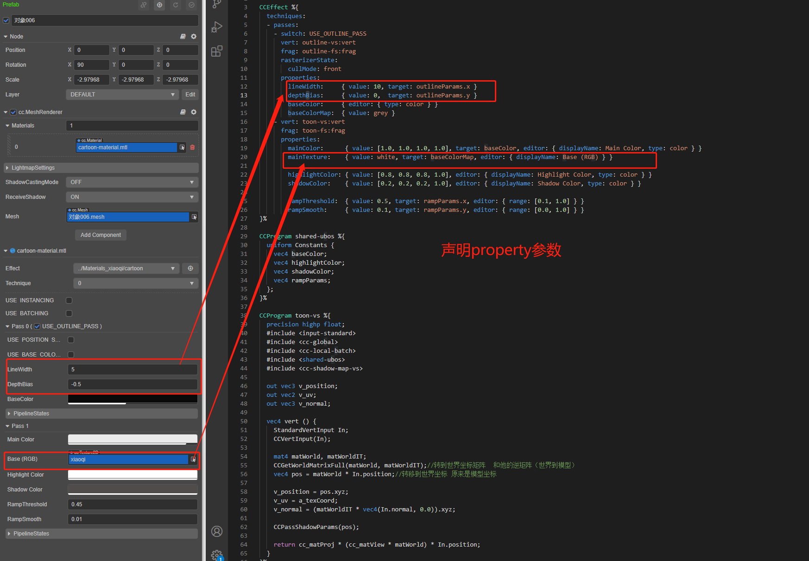
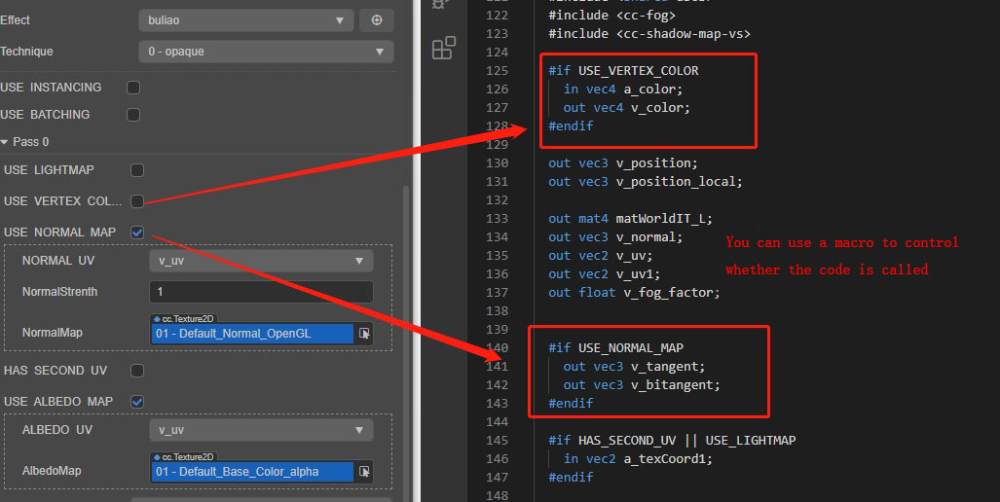

# Cocos Creator 3.0 材质升级指南

> 本文将详细介绍 Cocos Creator 2.x 的材质升级到 v3.0 的注意事项。

## 1. 材质系统基础设计简介

### 1.1 Cocos Creator 的材质系统框架

材质系统自上至下由四个核心类组成，分别是 Material、Effect、Technique 和 Pass，它们的关系可以通过下面的类图来理解：


#### Material

Material 资源可以看成是 EffectAsset 在场景中的资源实例，它本身的可配置参数有 effectAsset、technique、defines、states。

#### Cocos Shader

Cocos Shader 以 *.effect 作为后缀名，一个 Effect 文件表一种材质类型，是材质系统中最重要的核心资源，它决定了一个可渲染对象的最终效果。

#### Technique

我们把完成一个最终效果的方案称为一个渲染技术 Technique，一个技术可由一个或多个 Pass 来融合完成。

#### Pass

一个 Pass 就是一次 GPU 绘制，一般包括一次顶点着色器和一次片元着色器，在 Creator 里 Pass 有很多可选配置参数。

### 1.2 Material 材质实例面板

Material 材质实例是所有开发者接触到的最直观的材质编辑窗口，所有实际材质实例的配置都是通过它完成的。

Cocos Creator 3.0 的 Material 实例面板如下：


Cocos Creator 2.x 的 Material 实例面板如下：



由上面两图可以看出 v3.0 的实例面板相比 v2.4 的会复杂不少，一方面是由于材质配置复杂度有所增加，另一方面也是因为面板功能有所增强。

#### 材质面板的可配置项主要分为五种类型

1. Effect 资源：即 Cocos Shader 文件，下拉框会列出当前项目中所有的 Cocos Shader（*.effect） 资源文件，开发者可以选择当前材质使用的 Cocos Shader。切换后其他属性也会同步更新。
2. Technique 渲染技术选择：下拉框会列出当前使用的 Effect 资源中所有的 Technique，资源中可能会存在多个 Technique，每个 Technique 适用于不同的情况，比如效果差一点但是性能更好的 Technique 更适合用于手机平台。
3. 宏选项：通过这些宏来控制某些代码是否可以被启用（对应逐个 Pass）。
4. 属性列表（根据宏定义动态开放），并且使用不同的输入框适应不同类型的属性。编辑器的可编辑属性一般是 shader 中的某个 uniform 的映射，从 v3.0 开始也可以指定某个分量的映射（在 CCEffect 中使用 target 参数）
5. 在 v3.0 还新增了 PipelineStates 选项，主要用于定义材质依赖的管线状态，比如 DepthStencilState、BlendState、CullMode 等。

### 1.3 编辑器体验

v2.x 与 v3.0 在材质系统的编辑器体验上也有一定的区别。

v3.0 在 **层级管理器** 中选中包含模型和材质的节点后，**属性检查器** 面板会显示各组件属性以及详细的 Material 配置面板：



而 v2.x 在 **层级管理器** 中选中包含模型和材质的节点后，**属性检查器** 面板只会显示各组件属性，并不会直接显示详细的 Material 配置面板：


而是需要跳转到 **资源管理器** 面板选中 Material 资源才可以在 **属性检查器** 中编辑：



## 2. Cocos Shader 资源

Cocos Shader 文件后缀名为 *.effect。

这个章节主要介绍资源在 v2.x 和 v3.0 的共性和差异。

### 2.1 Cocos Shader 格式和内容

在 v2.x 和 v3.0 中，Cocos Shader 的 effect 文件均采用 YAML1.2 标准的语法和解析器，两个版本之间的差别不大。按照 [语法格式](yaml-101.md) 编写，可以定义以下信息：

- Technique 渲染技术列表
- 每个 Technique 的 pass 列表
- 每个 Pass 中所暴露给编辑器可编辑的属性列表（包含编辑器内的数据类型指定、分量映射关系等）
- 每个 Pass 的着色器程序，包含顶点和片元着色器程序

在语法细节方面，诸如 Property 声明和宏定义的方式都是一致的：







### 2.2 预设材质类型

v2.x 和 v3.0 在预设值材质方面有比较大的区别。

- v2.x 的预设材质包括 2D Sprite、经典的 blinn-phong 光照材质、无光照 unlit 材质、默认的卡通 toon 材质、粒子材质等。

- v3.0 的预设材质则是基于物理的渲染体系，包含基于物理光照的 standard PBR 材质、Skybox、toon 卡通渲染材质、3D 粒子材质（CPU & GPU）、粒子拖尾材质、传统的 2D Sprite 材质等。

v3.0 默认的 standard 材质支持标准的 Physically Based Rendering (PBR) 流程，其中包含很多提升材质质量和真实感的贴图信息，比如漫反射贴图、法线贴图、金属度（metallic）、粗糙度（roughness）、环境光遮蔽（occlusion）等等。整套算法基于标准的 BRDF 光照模型，这些是 v2.x 所不具备的，整体画面表现上 v3.0 也比 v2.x 要高一个档次。

### 2.3 Cocos Shader 文件格式差异

尽管 Cocos Shader 的语法规则在 v2.x 和 v3.0 基本是一致的，但很多内置的头文件、变量名以及函数名还是有区别的。

以获取主方向光源的方向为例，在 v3.0 里是 `cc_mainLitDir`，同时要包含头文件 `cc-global`。而在 v2.x 中想要获取光源方向要用到 `cc_lightDirection[i]` 这样一个数组，同时要包含头文件 `cc-lights`。具体的差异可参考下方第三点 **API 升级指南** 部分的介绍。

一些默认的着色器函数是 v3.0 独有的，例如 `CCStandardShading`、`CCToonShading` 等，这些在 v2.x 上是没有的。同样可以参考下方第三点 **API 升级指南** 部分的介绍。

关于 uniform 声明方面，v3.0 强制使用 UBO 来组织，内存布局方面强制最小单位为 vec4，不再支持单独声明 float 或 vec3 等类型的 uniform。

在头文件方面，v3.0 的编辑器内置头文件资源就在 **Internal DB** 的 `assets/chunks` 目录下。引用时可以不加目录直接引用，主要包括一些常用的 **工具函数** 和 **标准光照模型** 等。而 v2.x 的头文件是内置在编辑器中，无法直观地了解具体有哪些。

### 2.4 新增 Pass 选项

v3.0 新增了一些新的 Pass 选项：

- `PropertyIndex`：指定这个 pass 的运行时 uniform 属性数据要和哪个 pass 保持一致，比如 forward add 等 pass 需要和 base pass 一致才能保证正确的渲染效果。一旦指定了此参数，材质面板上就不再会显示这个 pass 的任何属性。

- `embeddedMacros`：指定在这个 pass 的 shader 基础上额外定义的常量宏。在多个 pass 的 shader 中只有宏定义不同时可使用此参数来复用 shader 资源。

详细的 Pass 参数请参考 [参数列表](./pass-parameter-list.md)。

## 3. API 升级指南

### 3.1 内置 Uniform 差异列表

如果要在 shader 中使用内置变量，则需要包含对应头文件。下表是常用功能 uniform 汇总表，有很多功能 v2.x 与 v3.0 是一样的，而有一些是有区别的。

| v2.x Header & Name     | v3.0 Header & Name| Type | 用途 |版本差异性 |
| :------ | :------ | :----- | :------ |:------ |
| `cc-local.chunk` & `cc_matWorld` | `cc-local.chunk` & `cc_matWorld` | mat4 | 模型空间转世界空间矩阵 |无差异 |
| `cc-local.chunk` & `cc_matWorldIT` |`cc-local.chunk` & `cc_matWorldIT` | mat4 | 模型空间转世界空间逆转置矩阵 |无差异 |
| `cc-global.chunk` & `cc_time` | `cc-global.chunk` & `cc_time` |vec4 | x：自开始以来的全球时间，以秒为单位<br>y：当前帧的增量时间<br>z：自开始以来的总帧数 |无差异 |
| `cc-global.chunk` & `cc_screenSize` | `cc-global.chunk` & `cc_screenSize` | vec4 | xy：屏幕尺寸<br>zw：屏幕尺寸倒数 |无差异 |
| `cc-global.chunk` & `cc_screenScale` | `cc-global.chunk` & `cc_screenScale` | vec4 | xy：屏幕比例<br>zw：逆屏幕比例 |无差异 |
| 无 | `cc-global.chunk` & `cc_nativeSize` | vec4 | xy：实际着色缓冲的尺寸<br>zw：实际着色缓冲的尺寸倒数 | v3.0 新功能，v2.x 没有 |
| `cc-global.chunk` & `cc_matView` | `cc-global.chunk` & `cc_matView` | mat4 | 视图矩阵 |无差异 |
| `cc-global.chunk` & `cc_matViewInv` | `cc-global.chunk` & `cc_matViewInv` | mat4 | 视图逆矩阵 |无差异 |
| `cc-global.chunk` & `cc_matProj` | `cc-global.chunk` & `cc_matProj` | mat4 | 投影矩阵 |无差异 |
| `cc-global.chunk` & `cc_matProjInv` | `cc-global.chunk` & `cc_matProjInv` | mat4 | 投影逆矩阵 |无差异 |
| `cc-global.chunk` & `cc_matViewProj` | `cc-global.chunk` & `cc_matViewProj` | mat4 | 视图投影矩阵 |无差异 |
| `cc-global.chunk` & `cc_matViewProjInv` | `cc-global.chunk` & `cc_matViewProjInv` | mat4 | 视图投影逆矩阵 |无差异 |
| `cc-global.chunk` & `cc_cameraPos` | `cc-global.chunk` & `cc_cameraPos` | vec4 | xyz：相机位置 |无差异 |
| 无 | `cc-global.chunk` & `cc_exposure` | vec4 | x：相机曝光<br>y：相机曝光倒数<br>z：是否启用 HDR<br>w：HDR 转 LDR 缩放参数 |v3.0 新功能，v2.x 没有 |

**另外，v2.x 与 v3.0 在光源和阴影方面差异很大，v3.0 相比 v2.x 有了很大的提升。下表列出了一些常用的功能 uniform。**

| v2.x Header & Name| v3.0 Header & Name| Type | 用途 | 版本差异性 |
| :------ | :------ | :----- | :------ |:------ |
| `cc-lights.chunk` & `cc_lightDirection[CC_MAX_LIGHTS]` | `cc-global.chunk` & `cc_mainLitDir` | vec4 | 得到光源方向 | v2.x：单个模型在 shader 中执行一次绘制受多少盏灯光影响，默认最大值为 1.0。如果要获取位置信息，填写 0 即可。例如 `cc_lightDirection[0]`<br>v3.0：xyz：主方向光源方向
| `cc-lights.chunk` & `cc_lightColor[CC_MAX_LIGHTS]` | `cc-global.chunk` & `cc_mainLitColor` | vec4 | 控制光的颜色强度 | v2.x：光的 exp，就是光的 pow 强度。<br>v3.0：xyz — 主方向光颜色；w — 主方向光强度 |
| `cc-lights.chunk` & `CC_CALC_LIGHTS` | `cc-global.chunk` & `cc_ambientSky` |v2.x：宏定义<br>v3.0：vec4| 控制天空颜色强度 | v2.x：这是一个宏，通过穿进去的 ambient 参数进行计算。而且还有函数重载，可以传入不同的参数。<br>v3.0：xyz — 天空颜色；w — 亮度 |
| 无 | `cc-global.chunk` & `cc_ambientGround` |vec4| xyz：地面反射光颜色 | v3.0 新功能，v2.x 没有 |
| 无 | `cc-environment.chunk` & `cc_environment` | samplerCube | xyz：IBL 环境贴图 | v3.0 新功能，v2.x 没有 |

### 3.2 Shader 内建函数和变量

在 v3.0，如果需要对接引擎动态合批和 instancing 流程，需要包含 `cc-local-batch` 头文件，通过 `CCGetWorldMatrix` 工具函数获取世界矩阵。

#### v3.0 新增着色函数

- `CCStandardShading`

    函数名 `CCStandardShading` 需要包含头文件 `shading-standard.chunk`，用于进行光照计算，构成 surface shader 流程。

    ```c
    #include <shading-standard>
    #include <output-standard>
    void surf (out StandardSurface s) {
        // fill in your data here
    }
    vec4 frag () {
        StandardSurface s; surf(s);
        vec4 color = CCStandardShading(s);
        return CCFragOutput(color);
    }
    ```

    在此框架下可方便地实现自己的 surface 输入，或其他 shading 算法。

    > **注意**：`CCFragOutput` 函数一般不需要自己实现，它只起到与渲染管线对接的作用。且对于含有光照计算的输出，因为计算结果已经在 HDR 范围，所以应该包含 `output-standard` 头文件而非 `output`。

- `CCToonShading`

    函数名 `CCToonShading`，需要包含头文件 `shading-toon.chunk`，进行卡通渲染的光影计算。

    ```c
    #include <shading-toon>
    #include <output-standard>
    void surf (out ToonSurface s) {
        // fill in your data here
    }
    vec4 frag () {
        ToonSurface s; surf(s);
        vec4 color = CCToonShading(s);
        return CCFragOutput(color);
    }
    ```

### 3.3 光影计算相关函数

v2.x 与 v3.0 的光影计算有很大不同，主要包括以下两部分内容。

#### 球面光

v2.x 中的 **点光源** 在 v3.0 调整为 **球面光**，有很多现成的功能，使用时需要加入头文件 `cc-forward-light.chunk`，常用功能 uniform 如下表所示：

| Name  | Type | Info |
|:------ | :------ | :----- |
| `cc_sphereLitPos[MAX_LIGHTS]` | vec4 |xyz：球面光位置 |
| `cc_sphereLitSizeRange[MAX_LIGHTS]` | vec4 | x：球光尺寸<br>y：球光范围 |
| `cc_sphereLitColor[MAX_LIGHTS]` | vec4 | xyz：球光颜色<br>w：球光强度 |

更多详细信息请参考 [常用 shader 内置 Uniform](builtin-shader-uniforms.md)。

#### 聚光灯

v3.0 中的聚光灯有很多现成的功能，使用时需要加入头文件 `cc-forward-light.chunk`，常用功能 uniform 如下表所示：

| Name  | Type | Info |
| :----- | :----- | :----- |
| `cc_spotLitPos[MAX_LIGHTS]` | vec4 | xyz：聚光灯位置 |
| `cc_spotLitSizeRangeAngle[MAX_LIGHTS]` | vec4 | x：聚光灯尺寸<br>y：聚光灯范围<br>z：聚光灯角度 |
| `cc_spotLitDir[MAX_LIGHTS]` | vec4 | xyz：聚光灯方向 |
| `cc_spotLitColor[MAX_LIGHTS]` | vec4 | xyz：聚光灯颜色<br>w：聚光灯强度 |

更多详细信息请参考 [常用 shader 内置 Uniform](builtin-shader-uniforms.md)。

### 3.4 阴影部分

v2.x 与 v3.0 的阴影计算区别很大，v2.0 加入了头文件 `shadow.chunk`，而 v3.0 加入的是头文件 `cc-shadow.chunk`。

**v2.0 头文件 `shadow.chunk` 的常用功能 uniform 和函数如下所示**：

| Name | Type | Info |
| :----- | :----- | :---- |
| `cc_shadow_lightViewProjMatrix[CC_MAX_SHADOW_LIGHTS]` | mat4 | 在灯光坐标下绘制阴影贴图 |
| `cc_shadow_info[CC_MAX_SHADOW_LIGHTS]` | vec4 | 计算阴影偏移 |

| Name（函数） | Type | Info |
| :------ | :----- | :----- |
| `getDepth` | float | 返回深度值 |
| `shadowSimple` | float | 阴影的硬采样会有锯齿问题 |

**v3.0 头文件 `cc-shadow.chunk` 的常用功能 uniform 如下所示**：

| Name    | Type | Info |
| :------ | :----- | :----- |
| `cc_matLightPlaneProj` | mat4| 平面阴影的变换矩阵 |
| `cc_shadowColor` | vec4 | 阴影颜色 |

#### ShadowPCF 软阴影

| 头文件   | 函数 |
| :------ | :----- |
| v2.x：`shadow.chunk`| `shadowPCF3X3`（**3 * 3** 采样）<br>`shadowPCF5X5`（**5 * 5** 采样)|
| v3.0：`cc-shadow-map-fs.chunk` | `CC_DIR_SHADOW_FACTOR`：直接修改内存中阴影颜色的数值 |
