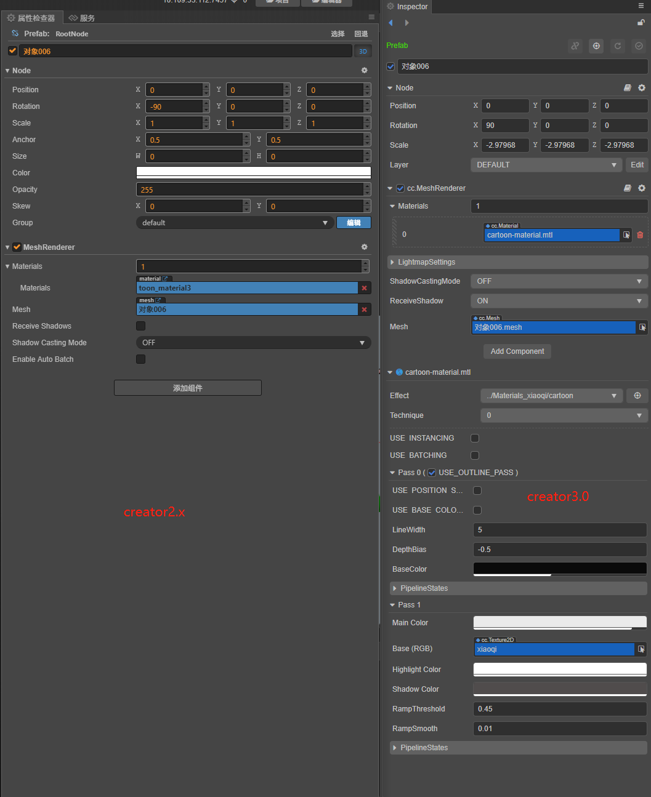
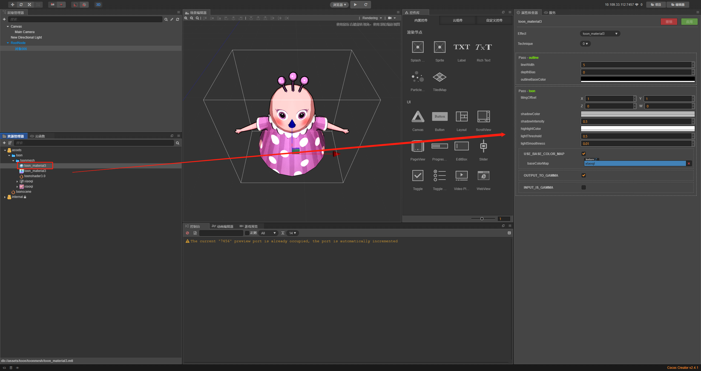

# Creator2.x 材质升级 Creator3.0 参考指南

## 1. 材质系统基础设计简介

### 1.1 Creator 的材质系统框架

材质系统自上至下由四个核心类组成，分别是 Material，Effect，Technique，Pass，它们的关系可以通过下面的类图来理解


#### Material

Material 资源可以看成是 EffectAsset 在场景中的资源实例，它本身的可配置参数有 effectAsset、technique、defines、states。

#### Effect

一个 Effect 资源代表一种材质类型，是材质系统中最重要的核心资源,如果希望在引擎中实现自定义的着色效果, 需要书写自定义 Effect。

#### Technique

我们把完成一个最终效果的方案称作一个渲染技术 Technique ，一个技术可由一个或多个 Pass 来融合完成。

#### Pass

一个 Pass 就是一次 GPU 绘制，一般包括一次顶点着色器和一次片元着色器，在 Creator 里 Pass 有很多可选配置参数。

### 1.2 Material 材质实例面板

Material 材质实例是所有开发者接触到的最直观的材质编辑窗口，所有实际材质实例的配置都是通过它完成的。

 Creator 3.0

 Creator 2.x

这是 Creator 3.0 和 Creator 2.x 的 Material 实例面板，可以看到 Creator3.0 会复杂不少，一方面是由于材质配置复杂度有所增加，另一方面也是因为面板功能有所增强。

#### 材质面板的可配置项主要分为五种类型

1. Effect 资源，下拉框会列出当前项目中所有的 Effect 资源，开发者可以选择当前材质使用的 Effect 资源。当切换了 Effect 后其他属性也会同步更新。
2. Technique 渲染技术选择，下拉框会列出当前使用的 Effect 资源中所有的 Technique，Effect 资源中可能会存在多个 Technique，每个 Technique 适用于不同的情况，比如效果差一点但是性能更好的 Technique 更适合用于手机平台。
3. Effect 中定义的宏选项,这些宏来控制某些代码是否可以被启用（对应逐个 Pass）。
4. Effect 中定义的属性列表（根据宏定义动态开放），并且使用不同的输入框适应不同类型的属性。编辑器的可编辑属性一般是 shader 中的某个 uniform 的映射，从 Creator3.0 开始也可以指定某个分量的映射（在 Effect 中使用 target 参数）
5. 在 Creator3.0 还新增了 PipelineStates 选项，主要用于定义材质依赖的管线状态，比如 DepthStencilState, BlendState, CullMode 等。

### 1.3 编辑器体验

材质系统的编辑器体验上，Creator 2.x 与 Creator 3.0 有一些区别。
- Creator 3.0 在点击包含模型和材质的节点后，在参数界面上有详细的 Material 配置面板，而 Creator 2.x 则没有，需要跳转到 Material 资源才可以编辑。





## 2. Effect 资源：（资源在 Creator2.x 和 Creator3.0 的共性和差异）

### 2.1 Effect 格式和内容

Effect 资源方面，Creator2.X 和 Creator3.0 都是采用 YAML1.2 标准的语法和解析器，在两个版本之间差别不大。Effect 资源定义了一种材质类型，通过按照[语法格式](https://docs.cocos.com/creator3d/manual/zh/material-system/yaml-101.html)编写，可以定义以下信息：

- Technique 渲染技术列表
- 每个 Technique 的 pass 列表
- 每个 Pass 中所暴露给编辑器可编辑的属性列表（包含编辑器内的数据类型指定、分量映射关系等）
- 每个 Pass 的着色器程序，包含顶点和片元着色器程序

在语法细节方面，诸如 Property 声明和宏定义的方式都是一致的


### 2.2 预设材质类型

Creator2.X 与 Creator3.0 在预设值材质方面有比较大的区别。

Creator2.X 的预设材质有 2D Sprite，经典的 blinn-phong 光照材质，无光照 unlit 材质，默认的卡通 toon 材质，粒子材质等。

而 Creator3.0 的预设材质则主要改为基于物理的渲染体系，包含基于物理光照的 standard PBR 材质，skybox，toon 卡通渲染材质，3D 粒子材质（CPU & GPU），粒子拖尾材质，传统的 2D sprite 材质等。

Creator3.0 默认的 standard 材质支持标准的 Physically Based Rendering (PBR) 流程，其中包含很多提升材质质量和真实感的贴图信息，比如漫反射贴图，法线贴图，金属度（metallic），粗糙度（roughness），环境光遮蔽（occlusion）等等。整套算法基于标准的 BRDF 光照模型。这些是 Creator2.x 所不具备的，整体画面表现上 Creator3.0 也比 Creator2.x 要高一个档次。

### 2.3 Effect 书写细节差异

尽管 Cocos Creator 的 Effect 语法规则在 Creator2.x 与 Creator3.0 中基本是一致的，但很多内置的头文件、变量名与函数名有所区别。

以获取主光源方向光的方向为例，在 Creator3.0 里是 cc_mainLitDir，同时要包含头文件 cc-global，而在 Creator2.X 里想要获取到灯光方向要用到 cc_lightDirection[i] 这样一个数组了，同时要包含头文件 cc-lights。具体的差异列表可以参考最后一个章节详细 API 升级指南。

一些默认的着色器函数，比如 CCStandardShading，CCToonShading 等。这些都是 Creator3.0 独有的，Creator2.X 上没有这些。同样可以参考最后一个章节详细 API 升级指南。

关于 uniform 声明方面，Creator3.0 强制使用 UBO 来组织，内存布局方面强制最小单位为 vec4，不再支持单独声明 float 或 vec3 等类型的 uniform。

在头文件方面，Creator3.0 的编辑器内置头文件资源就在 Internal DB 的 assets/chunks 目录下。引用时可以不加目录，直接引用，主要包括一些常用的工具函数, 和标准光照模型等。而 Creator2.x 的头文件是内置在编辑器中，无法直观的了解具体有哪些。

### 2.4 新增 Pass 选项

Creator 3.0 新增了一些新的 Pass 选项：

- PropertyIndex：指定这个 pass 的运行时 uniform 属性数据要和哪个 pass 保持一致，比如 forward add 等 pass 需要和 base pass 一致才能保证正确的渲染效果。一旦指定了此参数，材质面板上就不再会显示这个 pass 的任何属性。

- embeddedMacros：指定在这个 pass 的 shader 基础上额外定义的常量宏。在多个 pass 的 shader 只有宏定义不同时可使用此参数来复用 shader 资源。

参考详细的 Pass [参数列表](https://docs.cocos.com/creator3d/manual/zh/material-system/pass-parameter-list.html)

## 3. 详细 API 升级指南

### 3.1 内置 Uniform 差异列表

要在 shader 中使用内置变量，需要包含对应头文件。下表是常用功能汇总表，有很多功能 Creator2.x 与 Creator3.0 是一样的，有一些是有区别的。

| Creator2.x Header & Name     | Creator3.0 Header & Name| Type | 用途 |版本差异性 |
| :------ | :------ | :----- | :------ |:------ |
| cc-local.chunk& cc_matWorld | cc-local.chunk& cc_matWorld | mat4 | 模型空间转世界空间矩阵。 |无差异 |
| cc-local.chunk& cc_matWorldIT |cc-local.chunk& cc_matWorldIT | mat4 | 模型空间转世界空间逆转置矩阵 |无差异 |
| cc-global.chunk& cc_time | cc-global.chunk& cc_time |vec4 | x：自开始以来的全球时间，以秒为单位，y：当前帧的增量时间，z：自开始以来的总帧数 |无差异 |
| cc-global.chunk& cc_screenSize | cc-global.chunk& cc_screenSize | vec4 | xy：屏幕尺寸 zw：屏幕尺寸倒数 |无差异 |
| cc-global.chunk& cc_screenScale | cc-global.chunk& cc_screenScale | vec4 | xy：屏幕比例，zw：逆屏幕比例 |无差异 |
| 无 | cc-global.chunk& cc_nativeSizen | vec4 | xy：实际着色缓冲的尺寸 zw：实际着色缓冲的尺寸倒数 |3.0新功能，2.x没有 |
| cc-global.chunk& cc_matView | cc-global.chunk& cc_matView | mat4 | 视图矩阵 |无差异 |
| cc-global.chunk& cc_matViewInv | cc-global.chunk& cc_matViewInv | mat4 | 视图逆矩阵 |无差异 |
| cc-global.chunk& cc_matProj | cc-global.chunk& cc_matProj | mat4 | 投影矩阵 |无差异 |
| cc-global.chunk& cc_matProjInv | cc-global.chunk& cc_matProjInv | mat4 | 投影逆矩阵 |无差异 |
| cc-global.chunk& cc_matViewProj | cc-global.chunk& cc_matViewProj | mat4 | 视图投影矩阵 |无差异 |
| cc-global.chunk& cc_matViewProjInv | cc-global.chunk& cc_matViewProjInv | mat4 | 视图投影逆矩阵 |无差异 |
| cc-global.chunk& cc_cameraPos | cc-global.chunk& cc_cameraPos | vec4 | xyz：相机位置 |无差异 |
| 无 | cc-global.chunk& cc_exposure | vec4 | x：相机曝光 y：相机曝光倒数 z：是否启用 HDR w：HDR 转 LDR 缩放参数 |Creator3.0 新功能，Creator2.x 没有 |

---

</br>

**Creator2.x 与 Creator3.0 在光源和阴影方面差异很大。相比 Creator2.x 而言，Creator3.0 在灯光和阴影这一块有很大的提升。 我举一些常用的功能例子。**

</br>

| Creator2.x Header & Name| Creator3.0 Header & Name| Type | 用途 | |
| :------ | :------ | :----- | :------ |:------ |
| cc-lights.chunk& cc_lightDirection[CC_MAX_LIGHTS] | cc-global.chunk& cc_mainLitDir | vec4 | 得到光源方向 |

版本区别：</br>
Creator2.X ：单个模型在shader中一次绘制受多少盏灯光影响，默认最大值为 1.0 如果要获取到位置信息就填写 0。例如 cc_lightDirection[0]

Creator3.0 : xyz：主方向光源方向

</br>

| Creator2.x Header & Name| Creator3.0 Header & Name| Type | 用途 | |
| :------ | :------ | :----- | :------ |:------ |
| cc-lights.chunk& cc_lightColor[CC_MAX_LIGHTS] | cc-global.chunk& cc_mainLitColor | vec4 | 控制光的颜色强度 |

版本区别：</br>
Creator2.X ：光的 exp，就是光的 pow 强度

Creator3.0 ： xyz：主方向光颜色 w ：主方向光强度

</br>

| Creator2.x Header & Name| Creator3.0 Header & Name| Type | 用途 | |
| :------ | :------ | :----- | :------ |:------ |
| cc-lights.chunk&CC_CALC_LIGHTS | cc-global.chunk& cc_ambientSky |Creator2.X：宏定义 & Creator3.0：vec4| 控制天空颜色强度 |

版本区别：</br>

Creator2.X ：这是一个宏，通过穿进去的ambient参数来进行计算。而且还有函数重载，可以传入不同的参数。

Creator3.0 : xyz：天空颜色 w：亮度

</br>

| Creator2.x Header & Name| Creator3.0 Header & Name| Type | 用途 | |
| :------ | :------ | :----- | :------ |:------ |
| 无 | cc-global.chunk& cc_ambientGround |vec4| xyz：地面反射光颜色 |

版本区别：</br>

Creator3.0 新功能，Creator2.x 没有

</br>

| Creator2.x Header & Name| Creator3.0 Header & Name| Type | 用途 | |
| :------ | :------ | :----- | :------ |:------ |
| 无 | cc-environment.chunk& cc_environment |samplerCube| xyz：IBL 环境贴图 |

版本区别：</br>

Creator3.0 新功能，Creator2.x 没有

</br>

### 3.2 Shader 内建函数和变量

在 creator3.0 里另外如果需要对接引擎动态合批和 instancing 流程，需要包含 cc-local-batch 头文件，通过 CCGetWorldMatrix 工具函数获取世界矩阵。

#### **Creator3.0 新增着色函数**

函数名 CCStandardShading，需要包含头文件 shading-standard.chunk，用来进行光照计算，一起构成 surface shader 流程

``` c
#include <shading-standard>
#include <output-standard>
void surf (out StandardSurface s) {
  // fill in your data here
}
vec4 frag () {
  StandardSurface s; surf(s);
  vec4 color = CCStandardShading(s);
  return CCFragOutput(color);
}
```

在此框架下可方便地实现自己的 surface 输入，或其他 shading 算法

**注意：CCFragOutput 函数一般还是不需要自己实现，它只起与渲染管线对接的作用，且对于这种含有光照计算的输出，因计算结果已经在 HDR 范围，应包含 output-standard 而非 output 头文件。**

</br>

函数名 CCToonShading,需要包含头文件 shading-toon.chunk，进行卡通渲染的光影计算

``` c
#include <shading-toon>
#include <output-standard>
void surf (out ToonSurface s) {
  // fill in your data here
}
vec4 frag () {
    ToonSurface s; surf(s);
    vec4 color = CCToonShading(s);
    return CCFragOutput(color);
  }
```

### 3.3 光影计算相关函数

Creator2.x 与 Creator3.0 的光影计算有很大不同

#### 光源部分

在 Create3.0 里点光源叫球面光有很多现成的功能，要加入头文件 cc-forward-light.chunk 函数名称如下图所示

|Name    | Type |Info|
|------ | ------|------|
|cc_sphereLitPos[MAX_LIGHTS] | vec4|xyz：球面光位置|
|cc_sphereLitSizeRange[MAX_LIGHTS] | vec4|x：球光尺寸 y：球光范围|
|cc_sphereLitColor[MAX_LIGHTS]| vec4|xyz：球光颜色 w：球光强度|

更多详细信息参照[文档](https://docs.cocos.com/creator3d/manual/zh/material-system/builtin-shader-uniforms.html)

</br>

在 Create3.0 里聚光灯有很多现成的功能，要加入头文件 cc-forward-light.chunk 函数名称如下图所示

|Name    | Type |Info|
|------ | ------|------|
|cc_spotLitPos[MAX_LIGHTS] | vec4|xyz：聚光灯位置|
|cc_spotLitSizeRangeAngle[MAX_LIGHTS] | vec4|x：聚光灯尺寸 y：聚光灯范围 z：聚光灯角度|
|cc_spotLitDir[MAX_LIGHTS]| vec4|xyz：聚光灯方向|
|cc_spotLitColor[MAX_LIGHTS]| vec4|xyz：聚光灯颜色 w：聚光灯强度|

更多详细信息参照[文档](https://docs.cocos.com/creator3d/manual/zh/material-system/builtin-shader-uniforms.html)

</br>

### 3.4 阴影部分

Creator2.x 与 Creator3.0 阴影计算区别很大

Create2.0 : 加入头文件 shadow.chunk

|Name    | Type |Info|
|------ | ------|------|
|cc_shadow_lightViewProjMatrix[CC_MAX_SHADOW_LIGHTS] | mat4|在灯光坐标下绘制阴影贴图|
|cc_shadow_info[CC_MAX_SHADOW_LIGHTS] | vec4|计算阴影偏移|

</br>

|Name  (函数)    | Type |Info|
|------ | ------|------|
|getDepth | Float|返回深度值|
|shadowSimple | float|阴影的硬采样会有锯齿问题|

</br>

Creator3.0 : 加入头文件 cc-shadow.chunk

#### 常用阴影 uniform

|Name    | Type |Info|
|------ | ------|------|
|cc_matLightPlaneProj | mat4|平面阴影的变换矩阵|
|cc_shadowColor | vec4|阴影颜色|

</br>

#### ShadowPCF 软阴影

Creator2.x : 加入头文件 shadow.chunk</br>
函数有 shadowPCF3X3（3X3采样），shadowPCF5X5（5X5采样。

Creator3.0 ：加入头文件 cc-shadow-map-fs.chunk</br>
函数为 CC_DIR_SHADOW_FACTOR 直接修改内存里的阴影颜色数值。
