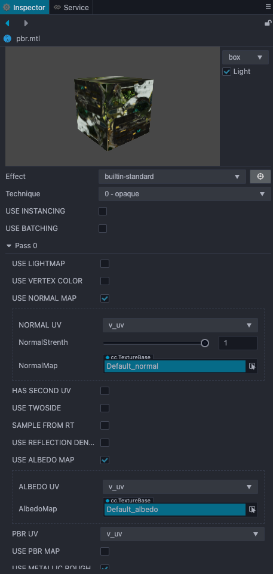

# 材质系统


在真实世界里，所有的物体都会与光交互。材质是一个数据集，包括纹理贴图、光照算法等，用于表现物体对光的交互，供渲染器读取数据，从而计算出光照结果，实现真实可信的光影效果。

## 基础面板



材质可应用到网格物体上，用它控制物体的可视外观。它包含对 [着色器](../shader/index.md)（Shader）对象的引用。如果着色器对象定义了材质属性，则材质还可能会包含纹理贴图。比如一个立方形物体究竟是水池还是箱子，是一个木头箱子还是铁皮箱，以及它们在受光情况下的明暗表现、光点、光反射、光散射等效果，这些都可以通过材质来描述。

## 材质系统类图

材质系统控制着每个模型最终的着色流程与顺序，在引擎内相关类间结构如下：

[](material.dot)

其中，[材质](../asset/material.md)（Material）和着色器资源（EffectAsset）属于资源。Material 负责 EffectAsset 声明的 Uniform、宏数据存储以及 Shader 使用和管理。编辑器可根据该数据提供可视化材质面板。Material 通常是被渲染组件使用，所有继承自 RenderableComponent 的组件都是渲染组件，MeshRenderer、Sprite 等都继承自 RenderableComponent。EffectAsset 负责提供属性、宏、Shader 列表定义。每个 EffectAsset 最终都会被编译成引擎内使用的格式，引擎根据该格式解析以及应用。所有解析后的 EffectAsset 信息都会被注册近引擎内的 ProgramLib 库里，方便用户直接通过代码获取实际引擎所使用的 EffectAsset 资源。

## 材质系统升级指南

Cocos Creator 从 v2.x 开始就支持了材质系统，在 v3.0 中我们持续改进了材质系统的设计和内置 Shader API，所以从 v2.x 升级到 v3.0 及后续版本时，部分内容可能还需要开发者手动进行调整，具体请参考下方的升级指南：

- [v2.x to v3.0 材质升级指南](./effect-2.x-to-3.0.md)

<!--
## 材质系统类图

材质系统控制着每个模型最终的着色流程与顺序，在引擎内相关类间结构如下：

[](material.dot)

## EffectAsset

EffectAsset 是由用户书写的着色流程描述文件，详细结构及书写指南可以参考 [Effect 语法](effect-syntax.md)。<br>
这里主要介绍引擎读取 EffectAsset 资源的流程：<br>
在编辑器导入 EffectAsset 时，会对用户书写的内容做一次预处理，替换 GL 字符串为管线内常量，提取 shader 信息，转换 shader 版本等。

以 `builtin-unlit.effect` 为例，编译输出的 EffectAsset 结构大致如下：

```json
{
  "name": "builtin-unlit",
  "techniques": [{
    "name": "opaque",
    "passes": [{
      "program": "builtin-unlit|unlit-vs:vert|unlit-fs:frag",
      "properties": {
        "mainTexture": {
          "value": "grey",
          "type": 28
        },
        "tilingOffset": {
          "value": [1, 1, 0, 0],
          "type": 16
        },
        "mainColor": {
          "value": [1, 1, 1, 1],
          "editor": { "type": "color" },
          "type": 16
        },
        "colorScale": {
          "value": [1, 1, 1],
          "type": 15,
          "handleInfo": ["colorScaleAndCutoff", 0, 15]
        },
        "alphaThreshold": {
          "value": [0.5],
          "editor": { "parent": "USE_ALPHA_TEST" },
          "type": 13,
          "handleInfo": ["colorScaleAndCutoff", 3, 13]
        },
        "color": {
          "editor": { "visible": false },
          "type": 16, "handleInfo": ["mainColor", 0, 16]
        },
        "colorScaleAndCutoff": {
          "type": 16,
          "editor": { "visible": false, "deprecated": true },
          "value": [1, 1, 1, 0.5]
        }
      },

      "migrations": {
        "properties": {
          "mainColor": { "formerlySerializedAs": "color" }
        }
      }
    }]
  }],

  "shaders": [{
      "name": "builtin-unlit|unlit-vs:vert|unlit-fs:frag",
      "hash": 2093221684,
      "glsl4": {
        "vert": "// glsl 460 vert source, omitted here for brevity",
        "frag": "// glsl 460 frag source, omitted here for brevity",
      },
      "glsl3": {
        "vert": "// glsl 300 es vert source, omitted here for brevity",
        "frag": "// glsl 300 es frag source, omitted here for brevity",
      },
      "glsl1": {
        "vert": "// glsl 100 vert source, omitted here for brevity",
        "frag": "// glsl 100 frag source, omitted here for brevity",
      },
      "attributes": [
        { "tags": ["USE_BATCHING"], "name": "a_dyn_batch_id", "type": 13, "count": 1, "defines": ["USE_BATCHING"], "location": 1 },
        { "name": "a_position", "type": 15, "count": 1, "defines": [], "location": 0 },
        { "name": "a_weights", "type": 16, "count": 1, "defines": ["USE_SKINNING"], "location": 2 },
        { "name": "a_joints", "type": 16, "count": 1, "defines": ["USE_SKINNING"], "location": 3 },
        { "tags": ["USE_VERTEX_COLOR"], "name": "a_color", "type": 16, "count": 1, "defines": ["USE_VERTEX_COLOR"], "location": 4 },
        { "tags": ["USE_TEXTURE"], "name": "a_texCoord", "type": 14, "count": 1, "defines": ["USE_TEXTURE"], "location": 5 }
      ],
      "varyings": [
        { "name": "v_color", "type": 16, "count": 1, "defines": ["USE_VERTEX_COLOR"], "location": 0 },
        { "name": "v_uv", "type": 14, "count": 1, "defines": ["USE_TEXTURE"], "location": 1 }
      ],
      "builtins": {
        "globals": {
          "blocks": [
            { "name": "CCGlobal", "defines": [] }
          ],
          "samplers": []
        },
        "locals": {
          "blocks": [
            { "name": "CCLocalBatched", "defines": ["USE_BATCHING"] },
            { "name": "CCLocal", "defines": [] },
            { "name": "CCSkinningTexture", "defines": ["USE_SKINNING", "ANIMATION_BAKED"] },
            { "name": "CCSkinningAnimation", "defines": ["USE_SKINNING", "ANIMATION_BAKED"] },
            { "name": "CCSkinningFlexible", "defines": ["USE_SKINNING"] }
          ],
          "samplers": [
            { "name": "cc_jointsTexture", "defines": ["USE_SKINNING", "ANIMATION_BAKED"] }
          ]
        }
      },
      "defines": [
        { "name": "USE_BATCHING", "type": "boolean", "defines": [] },
        { "name": "USE_SKINNING", "type": "boolean", "defines": [] },
        { "name": "ANIMATION_BAKED", "type": "boolean", "defines": ["USE_SKINNING"] },
        { "name": "CC_SUPPORT_FLOAT_TEXTURE", "type": "boolean", "defines": ["USE_SKINNING", "ANIMATION_BAKED"] },
        { "name": "USE_VERTEX_COLOR", "type": "boolean", "defines": [] },
        { "name": "USE_TEXTURE", "type": "boolean", "defines": [] },
        { "name": "FLIP_UV", "type": "boolean", "defines": ["USE_TEXTURE"] },
        { "name": "CC_USE_HDR", "type": "boolean", "defines": [] },
        { "name": "USE_ALPHA_TEST", "type": "boolean", "defines": [] },
        { "name": "ALPHA_TEST_CHANNEL", "type": "string", "defines": ["USE_ALPHA_TEST"], "options": ["a", "r", "g", "b"] }
      ],
      "blocks": [
        {
          "name": "TexCoords",
          "defines": ["USE_TEXTURE"],
          "binding": 0,
          "members": [
            { "name": "tilingOffset", "type": 16, "count": 1 }
          ]
        },
        {
          "name": "Constant",
          "defines": [],
          "binding": 1,
          "members": [
            { "name": "mainColor", "type": 16, "count": 1 },
            { "name": "colorScaleAndCutoff", "type": 16, "count": 1 }
          ]
        }
      ],
      "samplers": [
        { "name": "mainTexture", "type": 28, "count": 1, "defines": ["USE_TEXTURE"], "binding": 30 }
      ]
    }
  ]
}
```

这里的信息量不小，但大多数时候这些细节都不需要普通开发者关心，重要的是：
- 对任意目标平台，所有着色必要的基础信息全部都在这里提前准备好，以保证跨平台和最高的运行效率。
- 同时在最后构建时会针对当前平台剔除所有冗余的信息，以保证最好的空间利用率。

## Material

Material 资源可以看成是 EffectAsset 在场景中的资源实例，它本身的可配置参数包括：
- **effectAsset** 或 **effectName**：effect 资源引用，指定使用哪个 EffectAsset 所描述的流程进行渲染。（必备）
- **technique**：指定使用 EffectAsset 中的第几个 technique，默认为第 0 个。
- **defines**：宏定义列表，指定开启哪些宏定义，默认全部关闭。
- **states**：管线状态重载列表，指定对渲染管线状态（深度模板透明混合等）有哪些重载，默认与 effect 声明一致。

代码示例：

```ts
const mat = new Material();
mat.initialize({
  effectName: 'pipeline/skybox',
  defines: {
    USE_RGBE_CUBEMAP: true
  }
});
```

有了这些信息后，Material 就可以被正确初始化，正确初始化的标志是生成渲染使用的 Pass 对象数组，可用于具体模型的渲染。

根据所使用 EffectAsset 的信息，可以进一步设置每个 Pass 的 uniform 等参数。

```ts
mat.setProperty('cubeMap', someCubeMap);
console.log(mat.getProperty('cubeMap') === someCubeMap); // true
```

这些属性都是在材质资源对象本身内部生效，并不涉及场景。

要将 Material 应用到特定的模型上，需要将其挂载到一个 `RenderableComponent` 上，所有需要设定材质的 Component（MeshRenderer、SkinnedMeshRenderer 等）都继承自它。

```ts
const comp = someNode.getComponent(MeshRenderer);
comp.material = mat;
comp.setMaterial(mat, 0); // 与上一行作用相同
```

根据子模型的数量，Renderable 也可以引用多个 Material 资源：

```ts
comp.setMaterial(mat, 1); // 赋给第二个 submodel
```

同一个 Material 也可挂载到任意多个 Renderable 上，一般在编辑器中通过拖拽的方式即可自动赋值。

```ts
const comp2 = someNode2.getComponent(MeshRenderer);
comp2.material = mat; // the same material above
```

而当场景中某个模型的 Material 需要自定义一些属性时，会在从 Renderable 获取 Material 时自动做拷贝实例化，创建对应的 MaterialInstance，从而实现独立的定制。

```ts
const comp2 = someNode2.getComponent(MeshRenderer);
const mat2 = comp2.material; // 拷贝实例化，mat2 是一个 MaterialInstance，接下来对 mat2 的修改只会影响 comp2 的模型
```

Material 与 MaterialInstance 的最大区别在于，MaterialInstance 从一开始就永久地挂载在唯一的 Renderable 上，且只会对这个模型生效，而 Material 则无此限制。

对于一个已初始化的材质，如果希望修改最初的基本信息，可以直接再次调用 initialize 函数，重新创建渲染资源。

```ts
mat.initialize({
  effectName: 'builtin-standard',
  technique: 1
});
```

特别地，如果只是希望修改 defines 或 states，引擎提供了更高效的直接设置接口，只需提供相对当前值的重载即可：

```ts
mat2.recompileShaders({
  USE_EMISSIVE: true
});
mat2.overridePipelineStates({
  rasterizerState: {
    cullMode: GFXCullMode.NONE
  }
});
```

**注意**：这些接口只能调用 MaterialInstance 实例，而不能调用 Material 资源。

每帧动态更新 uniform 值是非常常见的需求，在类似这种需要更高效接口的情况下，可以手动调用对应 pass 的接口：

```ts
// 初始化时保存以下变量
const pass = mat2.passes[0];
const hColor = pass.getHandle('albedo');
const color = new Color('#dadada');

// 每帧更新时：
color.a = Math.sin(director.getTotalFrames() * 0.01) * 127 + 127;
pass.setUniform(hColor, color);
```

## Builtins

编辑器内置了几种常见类型的材质，包括无光照的 unlit、基于物理光照的 standard、skybox、粒子、sprite 等。

作为参考，下图是 `builtin-standard` 材质各着色参数的组装流程：


以下是对应参数和宏定义的完整列表：

| 参数 | 说明 |
| :------- | :--- |
| tilingOffset | 模型 UV 的平铺和偏移量，xy 对应平铺，zw 对应偏移 |
| albedo/mainColor | 漫反射颜色，指定模型的主要基色 |
| albedoMap/mainTexture | 漫反射贴图，如果有指定，这项会和漫反射颜色相乘 |
| albedoScale | 模型的漫反射强度，用于控制漫反射颜色对于最终颜色的影响权重 |
| alphaThreshold | 启用 alpha test 后的测试阈值。输出的 alpha 值低于此值的像素会被 discard 掉 |
| normalMap | 法线贴图，用于增加表面细节 |
| normalStrenth | 法线贴图强度，控制凹凸质感的强弱 |
| pbrMap<br>**R**（AO）<br>**G**（Roughness）<br>**B**（Metallic） | PBR 材质参数贴图：环境遮挡、粗糙度和金属度<br>采样结果会和常数项相乘 |
| metallicRoughnessMap<br>**G**（Roughness）<br>**B**（Metallic） | 独立的粗糙度和金属度贴图<br>采样结果会和常数项相乘 |
| occlusionMap | 独立的环境遮挡贴图<br>采样结果会和常数项相乘 |
| occlusion | 环境遮挡常数 |
| roughness | 粗糙度常数 |
| metallic | 金属度常数 |
| emissive | 自发光颜色，独立于光照计算，由模型本身直接发散出的颜色 |
| emissiveMap | 自发光贴图<br>如果有指定，这项会和自发光颜色相乘，因此需要把自发光颜色（默认是黑色）调高才会有效果 |
| emissiveScale | 自发光强度<br>用于控制自发光颜色对于最终颜色的影响权重 |

相对应的，还有控制这些参数的宏定义：

| 宏定义 | 说明 |
| :---- | :--- |
| USE_BATCHING | 是否启用动态 VB 合并式合批 |
| USE_INSTANCING | 是否启用动态 instancing |
| HAS_SECOND_UV | 是否存在第二套 UV |
| ALBEDO_UV | 指定采样漫反射贴图使用的 uv，默认为第一套 |
| EMISSIVE_UV | 指定采样自发光贴图使用的 uv，默认为第一套 |
| ALPHA_TEST_CHANNEL | 指定透明测试的测试通道，默认为 A 通道 |
| USE_VERTEX_COLOR | 如果启用，顶点色会与漫反射项相乘 |
| USE_ALPHA_TEST | 是否开启透明测试（镂空效果） |
| USE_ALBEDO_MAP | 是否使用漫反射贴图 |
| USE_NORMAL_MAP | 是否使用法线贴图 |
| USE_PBR_MAP | 是否使用 PBR 参数三合一贴图（**按 glTF 标准，RGB 通道必须分别对应遮挡、粗糙和金属度**） |
| USE_METALLIC_ROUGHNESS_MAP | 是否使用金属粗糙二合一贴图（**按 glTF 标准，GB 通道必须分别对应粗糙和金属度**） |
| USE_OCCLUSION_MAP | 是否使用遮挡贴图（**按 glTF 标准，只会使用 R 通道**） |
| USE_EMISSIVE_MAP | 是否使用自发光贴图 | -->
