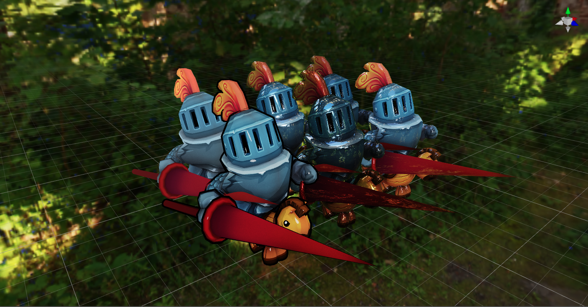

# 材质系统总览

在真实世界中，所有的物体都会与光交互，根据物体表面外观不同，在光照下所表现出来的效果也不同。

Cocos Creator 通过 **材质** 来描述物体外观，例如一个小球是玻璃球还是塑料球，一个箱子是木头箱子还是铁皮箱。它们在光照情况下所呈现出来的明暗、光点、光反射、光散射等效果，都是通过 [着色器](../shader/index.md) 来实现的。而材质则是着色器的数据集（包括纹理贴图、光照算法等），方便进行可视化调整。

材质系统主要包含以下内容：

- [材质资源](../asset/material.md)
- [程序化使用材质](material-script.md)
- [内置材质](builtin-material.md)
- [表面着色器](../shader/surface-shader.md)
- [材质系统类图](material-structure.md)
- [Cocos Creator 3.1 材质升级指南](Material-upgrade-documentation-for-v3.0-to-v3.1.md)
- [Cocos Creator 3.5 材质升级指南](effect-upgrade-documentation-for-v3.4.2-to-v3.5.md)

## 范例

Creator 提供了材质相关的 **material** 范例（[GitHub](https://github.com/cocos-creator/test-cases-3d/tree/v3.5/assets/cases/material) | [Gitee](https://gitee.com/mirrors_cocos-creator/test-cases-3d/tree/v3.5/assets/cases/material)），用户可根据需要参考使用。
