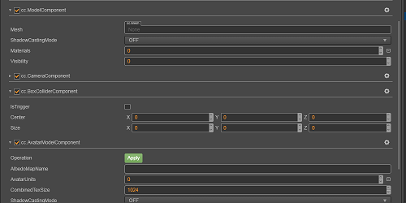
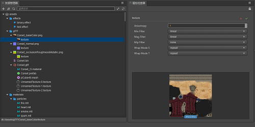
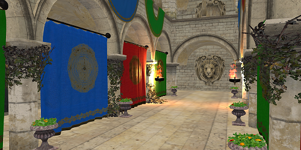

# 引擎功能地图导览

||||
|:-|:-|:-|
|[ 图形渲染 渲染系统，包括材质、光照、粒子等](./graphics.md)|[ UI 系统 UI 系统，包括与 UI 相关的全部内容](../2d-object/ui-system/index.md)|[ 动画系统 基于动画帧数据及骨骼顶点数据的通用动画及骨骼动画体系](../animation/index.md)
|[ 音频 控制声音片段的播放暂停等](../audio-system/overview.md)|[ 物理模拟 物理仿真模拟，主要包括刚体和碰撞等](../physics/physics.md)|[ 脚本指南及事件系统 用于实现用户定义行为的脚本使用指南，包括事件的触发机制等](../scripting/index.md)
|[ 组件 用于为游戏对象添加不同功能的组件](../editor/components/index.md)|[ 资源 引擎使用到的各种不同资源介绍及整体资源工作流概述](../asset/index.md)|[ 场景及环境设置 场景结构及环境相关设置](../concepts/scene/index.md)
