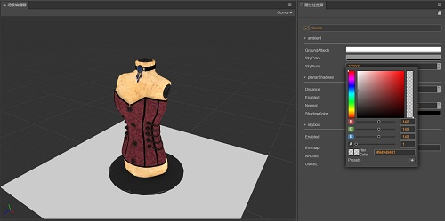

# 光照

||||
|:-|:-|:-|
|[ 光照概述 光照介绍的总览](../concepts/scene/light.md)|[ 基于物理光照 基于物理的光照介绍](../concepts/scene/light/pbr-lighting.md)|[ 主方向光 主方向光照](../concepts/scene/light/dir-light.md)
|[ 球面光 球面光照](../concepts/scene/light/sphere-light.md)|[ 聚光灯 聚光灯光照](../concepts/scene/light/spot-light.md)|[ 环境光照 环境光照](../concepts/scene/ambient.md)
|