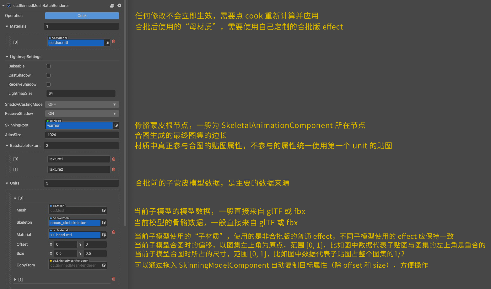

# 批量蒙皮网格渲染器组件（SkinnedMeshBatchRenderer）

批量蒙皮网格渲染器组件（SkinnedMeshBatchRenderer）用于将同一个骨骼动画组件控制的所有子蒙皮模型网格合并渲染。

| 属性 | 功能 |
| :--- | :--- |
| **Operation**         | 对属性的任何修改不会立即生效，需要点 **Cook** 按钮重新计算才能应用。 |
| **Materials**         | 合批后使用的“母材质”需要使用自己定制的合批版 effect。 |
| **LightmapSettings**  | 用于烘焙 Lightmap，详情请参考 [光照贴图](../../concepts/scene/light/lightmap.md)。 |
| **ShadowCastingMode** | 指定当前模型是否会投射阴影，需要先在场景中 [开启阴影](../../concepts/scene/light/shadow.md#%E5%BC%80%E5%90%AF%E9%98%B4%E5%BD%B1)。 |
| **ReceiveShadow**     | 指定当前模型是否会接收并显示其它物体产生的阴影效果，需要先在场景中 [开启阴影](../../concepts/scene/light/shadow.md#%E5%BC%80%E5%90%AF%E9%98%B4%E5%BD%B1)。该属性仅在阴影类型为 **ShadowMap** 时生效。 |
| **SkinningRoot**      |骨骼蒙皮的根节点，一般为 SkeletalAnimation 组件所在节点。  |
| **AtlasSize**         | 合图生成的最终图集的边长。 |
| **BatchableTextureNames** | 材质中真正参与合图的贴图属性，不参与的属性统一使用第一个 unit 的贴图。 |
| **Units**     | 合批前的子蒙皮模型数据，是主要的数据来源。 |
| **Mesh**      | 当前子模型的模型数据，一般直接来自 glTF 或 FBX 模型文件。 |
| **Skeleton**  | 当前模型的骨骼数据，一般直接来自 glTF 或 FBX 模型文件。 |
| **Materials** | 当前子模型使用的“子材质”，使用的是非合批版的普通 effect，不同子模型使用的 effect 应保持一致。 |
| **Offset**    | 当前子模型合图时的偏移，以图集左上角为原点，范围为 `[0, 1]`。比如图中数据代表子贴图与图集的左上角是重合的。 |
| **Size**      | 当前子模型合图时所占的尺寸，范围为 `[0, 1]`。比如图中数据代表子贴图占整个图集的 1/2。 |
| **CopyFrom**  | 可以通过拖入 **SkinningModelComponent** 自动复制目标属性（除了 `offset` 和 `size`），方便操作。 |

更多合批相关的内容，详情请参考文档 [骨骼动画 — BatchedSkinnedMeshRenderer 组件](../../animation/skeletal-animation.md)。

批量蒙皮网格渲染器组件的相关接口，请参考 [SkinnedMeshBatchRenderer API](__APIDOC__/zh/#/docs/3.3/zh/3d/Class/SkinnedMeshBatchRenderer)。
