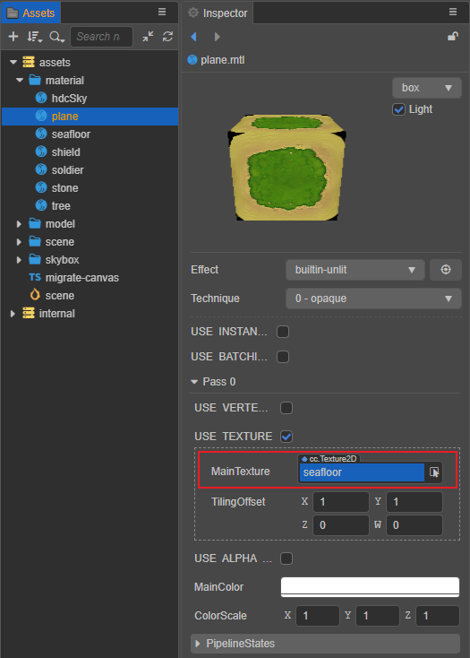

# 纹理（Textures）

纹理是一张可显示的图像，或一段用于计算的中间数据，通过 UV 坐标映射到渲染物体表面，使之效果更为丰富精彩且真实。Creator 中纹理的应用包括以下几种：

- 用于 2D 渲染，参考 [SpriteFrame](../../asset/sprite-frame.md)。

- 用于 3D 模型渲染，需要在材质中指定 [纹理贴图资源](../../asset/texture.md)，才能将其渲染映射到网格表面。纹理贴图还支持在 [导入图像资源](../../asset/image.md) 时将其切换为 **立方体贴图** 和 **法线贴图**。

  

- 用于粒子系统，使粒子表现更丰富。与 3D 模型一样，纹理在粒子系统中的应用也依赖于材质。

- 用于地形渲染，参考 [地形系统](../../editor/terrain/index.md)。

## 更多内容

- [渲染纹理（RenderTexture）](../../asset/render-texture.md)
- [压缩纹理](../../asset/compress-texture.md)
