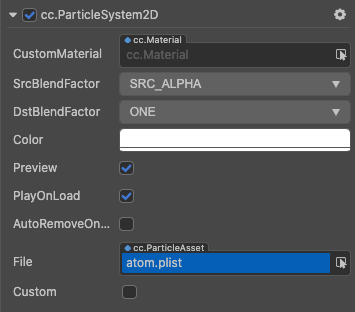

# 2D 粒子系统

## 概述

该组件是用来读取粒子资源数据，并且对其进行一系列例如播放、暂停、销毁等操作。粒子资源支持 `plist` 文件以及图片，这两个资源建议放在同一个文件夹下。

## 创建方式

2D 粒子属于 2D 渲染组件，因此可以通过 [相同的添加方式](../2d-object/create-2d/index.md#添加-2D-组件) 添加组件。

2D 粒子的脚本接口请参考 [ParticleSystem2D API](__APIDOC__/zh/classes/particle2d.particlesystem2d.html)。

## ParticleSystem2D 属性

文档下方涉及到（左）、（右）字样的代表同一个属性，在属性面板上的左右两个数值所表示的含义。

| 属性         | 功能说明                                                                                                             |
|--------------|------------------------------------------------------------------------------------------------------------------|
| CustomMaterial | 自定义材质，使用方法参考 [自定义材质](../engine/ui-material.md)｜
| Src Blend Factor | 当前图像混合模式。｜
| Dst Blend Factor | 背景图像混合模式，和上面的属性共同作用，可以将前景和背景 Sprite 用不同的方式混合渲染，效果预览可以参考 [glBlendFunc Tool](http://www.andersriggelsen.dk/glblendfunc.php)。｜
| Color | 图片颜色。 ｜
| Preview       | 在编辑器模式下预览粒子，启用后选中粒子时，粒子将自动播放。                    |
| Play On Load | 如果设置为 true 运行时会自动发射粒子                                                                   |
| Auto Remove On Finish   | 粒子播放完毕后自动销毁所在的节点。 |
| File  | Plist 格式的粒子配置文件。   |
| Sprite Frame       | 自定义的粒子贴图。                    |
| Duration | 发射器生存时间，单位秒，-1 表示持续发射。                                                                   |
| Emission Rate   | 每秒发射的粒子数目。 |
| Life  | 粒子的（左）运行时间及（右）变化范围。   |
| Total Particles       | 粒子最大数量。                    |
| Start Color | 粒子（左）初始颜色和（右）变化范围。                                                                   |
| End Color  | 粒子（左）结束颜色和（右）变化范围。   |
| Angle       | 粒子（左）角度和（右）变化范围。                    |
| Start Size | 粒子的（左）初始大小及（右）变化范围。                                                                   |
| End Size   | 粒子结束时的（左）大小及（右）变化范围。 |
| Start Spin  | 粒子开始（左）自旋角度及（右）变化范围。   |
| End Spin       | 粒子结束（左）自旋角度及（右）变化范围。                    |
| Pos Var   | （左）发射器位置和（右）变化范围。（横向和纵向） |
| Position Type  | 粒子位置类型，包括 **FREE**、**RELATIVE**、**GROUPED** 三种。详情可参考 [PositionType API](__APIDOC__/zh/classes/particle2d.particlesystem2d.html#positiontype)   |
| Emitter Mode | 发射器类型，包括 **GRAVITY**、**RADIUS** 两种。详情可参考 [EmitterMode API](__APIDOC__/zh/classes/particle2d.particlesystem2d.html#emittermode-1)。                                                                   |
| Gravity   | 重力。仅在 Emitter Mode 设为 **GRAVITY** 时生效。 |
| Speed  | （左）速度及（右）变化范围。仅在 Emitter Mode 设为 **GRAVITY** 时生效。   |
| Tangential Accel  | 每个粒子的切向（左）加速度及（右）变化范围，即垂直于重力方向的加速度。仅在 Emitter Mode 设为 **GRAVITY** 时生效。   |
| Radial Accel       | 粒子径向（左）加速度及（右）变化范围，即平行于重力方向的加速度。仅在 Emitter Mode 设为 **GRAVITY** 时生效。                    |
| Rotation Is Dir | 每个粒子的旋转是否等于其方向。仅在 Emitter Mode 设为 **GRAVITY** 时生效。                                                                   |
| Start Radius   | 初始半径及变化范围，表示粒子发射时相对发射器的距离。仅在 Emitter Mode 设为 **RADIUS** 时生效。 |
| End Radius  | 结束半径。仅在 Emitter Mode 设为 **RADIUS** 时生效。   |
| Rotate Per S  | 粒子每秒围绕起始点的（左）旋转角度及（右）变化范围。仅在 Emitter Mode 设为 **RADIUS** 时生效。   |
