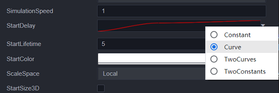
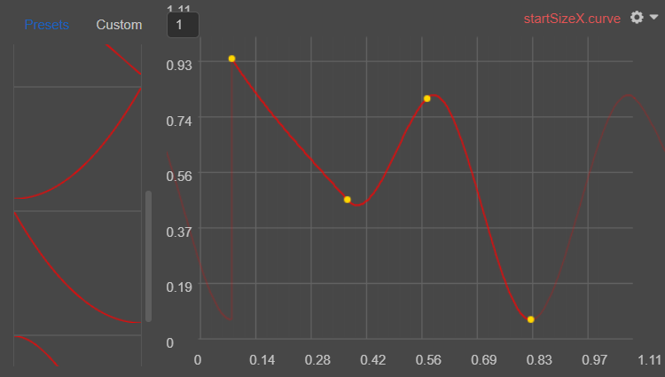
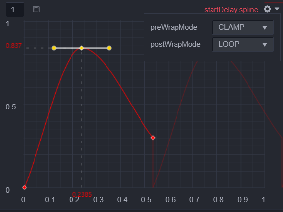
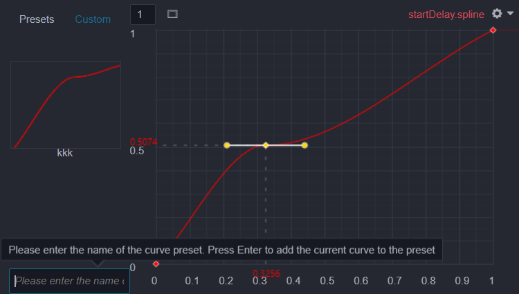

# 粒子曲线编辑器

粒子系统的许多属性都可能随着时间变化，这些属性在编辑器内可以指定不同的变化方式，例如：

**Constant**：属性的值在其整个生命周期内是固定的；
**Random Between Two Constant**：两个常量值定义了值的上限和下限；实际值随着时间的推移在这些边界之间随机变化；
**Curve**：属性的值变化由曲线图指定；
**Random Between Two Curves**：两条曲线定义了值在生命周期内给定点的上限和下限；当前值在这些边界之间随机变化；

将属性设置为 `Curve` 或 `Random Between Two Curves` 时，对应的控件将会显示曲线的预览图，点击预览图即可看到曲线编辑器。

## 曲线编辑

曲线编辑器可以设置粒子中某个属性随时间变化的曲线，横坐标表示粒子的单位化的生命周期，比如一个粒子的生命周期为 5s，则 0.5 代表 2.5s。纵坐标表示属性值，可通过上方编辑栏调整纵坐标区间，默认区间为 [0, 1] 或 [-1, 1]。当属性值是弧度值，在曲线编辑器内，值的显示区间将会默认调整为 [0, 180] 或 [-180, 180] 的角度区间。

曲线编辑器的界面如下所示：

### 曲线编辑

关于曲线编辑的一些通用功能请参考 [曲线编辑器](../../animation/curve-editor.md) 的相关文档。

除此之外，粒子曲线编辑器还提供以下功能：

#### 前后循环模式

点击右上方的齿轮按钮，可以看到有前后循环模式的下拉框可以修改。

循环模式支持以下选项：

- __Loop__：在粒子的生命周期内以指定的次数播放曲线。例如，如果制作一条缩放粒子大小的曲线，可以指定其多次循环，这会使“大小缩放”动画在粒子消亡之前多次播放，而不是仅播放一次。
- __Ping Pong__：与 __Loop__ 相似，但以连续振荡的方式依次向前和向后播放曲线。
- __Clamp__：将超出曲线时间范围的粒子查询限制为曲线的第一个或最后一个值。

### 曲线预设

粒子曲线编辑器，提供了一些默认预设以及添加预设曲线的功能。点击左侧已有的预设曲线即可应用，同时已编辑好的曲线也通过以下操作保存为自定义曲线：

切换到 Custom 页面，输入曲线预设名称，回车即可。

