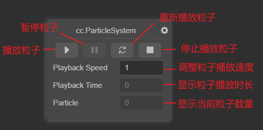
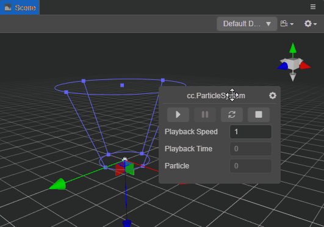

# 粒子控制面板

在 **层级管理器** 选中粒子节点时，**粒子控制面板** 便会默认显示在 **场景编辑器** 右下角：

粒子控制面板可在 **场景编辑器** 区域内拖动，通过粒子控制面板可执行以下操作及设置：

- ：不使用面板时，面板在 **场景编辑器** 区域中会造成遮挡。那么便可以点击该按钮选择 **Dock**，当鼠标不在面板上且面板在靠边位置时便会收起，避免遮挡。使用时，将鼠标悬停在面板收起时预留的突出部分，即可唤出面板。

    

- ：在 **场景编辑器** 中播放粒子

- ：暂停播放粒子

- ：重新播放粒子

- ：停止播放粒子

- **Playback Speed**：调整粒子播放速度

- **Playback Time**：显示粒子播放时长

- **Particle**：显示当前粒子数量
