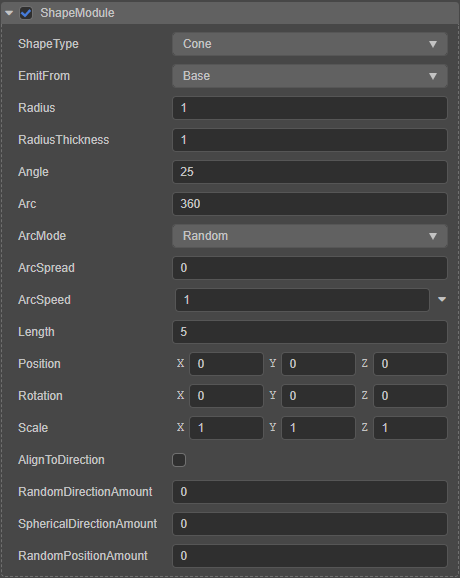
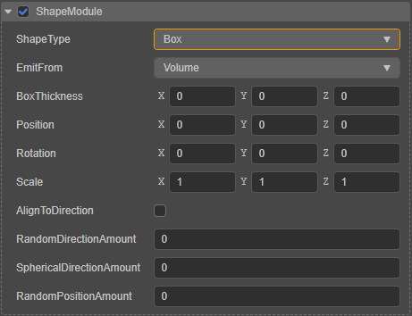
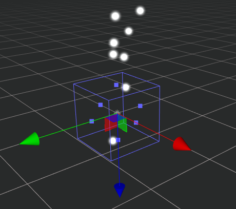
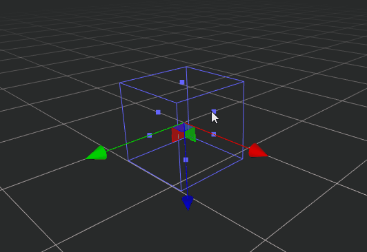
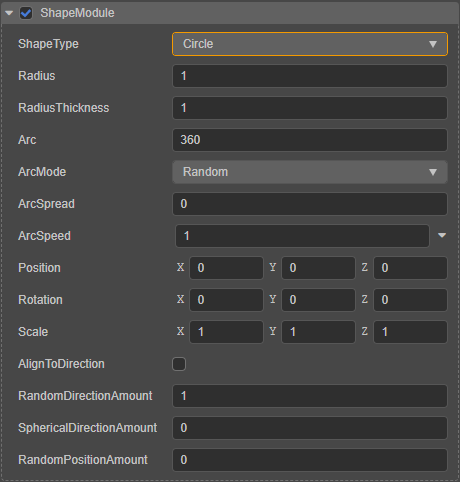
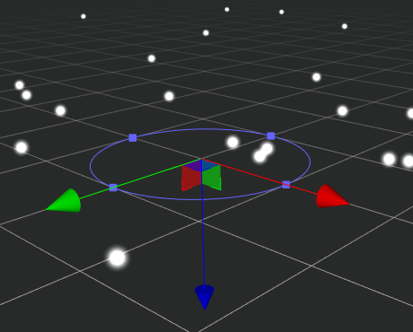
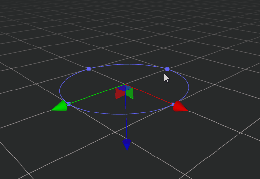
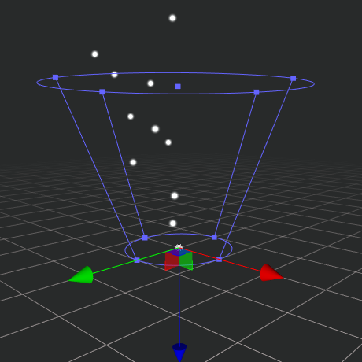
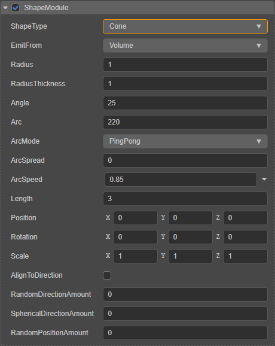

# 发射器模块（ShapeModule）

发射器模块主要用于设置粒子发射器形状、粒子发射方向和速度。

**ShapeType** 属性用于选择粒子发射器形状，可选项包括 **盒子**（Box）、**圆形**（Circle）、**锥体**（Cone）、**球**（Sphere）、**半球**（Hemisphere）。当形状选择不同时，可发射粒子的区域不同，相对应的属性设置项也不一致，详情请参考下文对应形状发射器的说明。

## 通用属性

各类型发射器有一些属性是通用的，包括：

| 属性 | 功能说明 |
| :---|:--- |
| **Position** | 发射器相对于所在节点的位置 |
| **Rotation** | 发射器相对于所在节点的旋转，可用于调整粒子发射方向 |
| **Scale**    | 发射器相对于所在节点的缩放，可用于调整发射器形状的大小，即粒子发射范围 |
| **AlignToDirection** | 根据粒子发射的初始方向决定粒子的移动方向，可用于模拟类似水从水桶中洒出的效果 |
| **RandomDirectionAmount** | 粒子生成方向随机设定 |
| **SphericalDirectionAmount** | 表示当前发射方向与当前位置到节点中心连线方向的插值，当该值设置为 1 时，粒子由中心向外部发射。 |
| **RandomPositionAmount**     | 粒子生成位置随机设定，当该值设置为 **非 0** 时，粒子生成位置会超出生成器的大小范围 |

## 盒子发射器

当 **ShapeType** 属性设置为 **Box** 时，我们称之为盒子发射器：

特有的属性项说明如下：

| 属性 | 功能说明 |
| :---|:--- |
| **EmitFrom** | 发射器从盒子的哪个部位发射粒子，包括： **Volume**：从盒子内部发射 **Shell**：从盒子表面发射 **Edge**：从盒子边框发射 |
| **BoxThickness** | 盒子发射器发射粒子的位置 |

同时在 **场景编辑器** 中会有一个盒子 Gizmo，显示盒子发射器的形状大小：

直接拖拽盒子 Gizmo 的方块控制点可以调整盒子发射器的 **Scale** 属性：

## 圆发射器

当 **ShapeType** 属性设置为 **Circle** 时，我们称之为圆发射器：

特有的属性项说明如下：

| 属性 | 功能说明 |
| :--- | :--- |
| **Radius**          | 设置圆发射器的半径 |
| **RadiusThickness** | 圆发射器发射粒子的位置。 设置为 **0** 时，表示从圆周发射 设置为 **1** 时，表示从圆心发射 设置为 **0~1** 之间时，表示从圆心到圆周之间，在一定的比例范围内发射 |
| **Arc**             | 设置圆发射器发射粒子的扇形区域 |
| **ArcMode**         | 设置粒子在扇形区域的发射方式，包括： **Random**：随机发射 **Loop**：沿某一方向循环发射，每次循环方向相同 **PingPong**：循环发射，每次循环方向相反 |
| **ArcSpread**       | 设置可能产生粒子的圆弧周围的离散间隔。例如： 设置为 0 时，可在圆弧任意位置生成粒子； 设置为 0.2 时，仅在圆弧周围以 20% 的间隔生成粒子。 |
| **ArcSpeed**        | 表示粒子沿圆弧发射的速度。点击右侧的向下图标按钮，即可选择打开曲线编辑器对该属性进行曲线编辑 |

同时在 **场景编辑器** 中会有一个圆形 Gizmo，显示发射器的形状大小：

直接拖拽圆形 Gizmo 的方块控制点可以调整圆发射器的 **Radius** 属性：

## 圆锥发射器

当 **ShapeType** 属性设置为 **Cone** 时，我们称之为圆锥发射器。在 **场景编辑器** 中会有一个圆锥 Gizmo，显示发射器的形状大小：

> 下文以上方图示为例，圆锥下方半径较小的横截面称为圆锥底部。

圆锥发射器的属性在 **属性检查器** 中显示如下：

特有的属性项说明如下：

| 属性| 功能说明 |
| :---|:--- |
| **EmitFrom**  | 发射器从圆锥的哪个部位发射粒子，包括： **Base**：从圆锥底部发射 **Shell**：从圆锥底部的圆周发射 **Volume**：从圆锥内部发射 |
| **Radius**    | 设置圆锥底部横截面的半径 |
| **RadiusThickness** | 圆锥发射器发射粒子的位置。 设置为 **0** 时，表示从圆锥表面发射 设置为 **1** 时，表示从圆锥中心发射 设置为 **0~1** 之间时，表示从圆锥的中心到表面之间，在一定的比例范围内发射 |
| **Angle**     | 圆锥的轴与母线的夹角，值越大夹角越大，圆锥发射器的开合程度越大 |
| **Arc**       | 设置圆锥发射器发射粒子的扇形区域 |
| **ArcMode**   | 表示粒子在扇形区域内的发射方式。 **Random**：随机位置 **Loop**：沿某一方向循环发射，每次循环方向相同 **PingPong**：循环发射，每次循环方向相反 **spread**：表示粒子在某个间断发射，比如，0 表示可以在任意位置发射；0.1 表示每隔圆周的十分之一位置发射 |
| **ArcSpeed**  | 表示粒子沿圆弧发射的速度 |
| **ArcSpread** | 表示粒子沿圆弧发射的速度。点击右侧的向下图标按钮，即可选择打开曲线编辑器对该属性进行曲线编辑 |
| **Length**    | 圆锥顶部截面距离底部的轴长 |

其中圆锥发射器的 **Angle**、**Length**、**Radius** 属性也可以通过直接拖拽场景中圆锥 Gizmo 的方块控制点进行设置。

## 球体/半球体发射器

当 **ShapeType** 属性设置为 **Sphere**/**Hemisphere** 时，我们称之为球体/半球体发射器。

球体发射器和半球体发射器的属性是一样的，这里我们以球体发射器为例：

特有的属性项说明如下：

| 属性| 功能说明 |
| :---|:--- |
| **EmitFrom**  | 发射器从球体的哪个部位发射粒子，包括： **Volume**：从球体内部发射 **Shell**：从球体表面发射（暂不生效，可通过 **RadiusThickness** 设置） |
| **Radius** | 球体半径。也可以直接拖拽 **场景编辑器** 中球体 Gizmo 的方块控制点进行设置 |
| **RadiusThickness** | 球体发射器发射粒子的位置。 设置为 **0** 时，表示从球表面发射 设置为 **1** 时，表示从球体中心发射 设置为 **0~1** 之间时，表示从表面到球心之间，在一定的比例范围内发射 |

球体发射器在 **场景编辑器** 中会有一个球 Gizmo，显示发射器的形状大小：

同样的，半球体发射器在 **场景编辑器** 中也有一个半球 Gizmo，显示发射器的形状大小：

