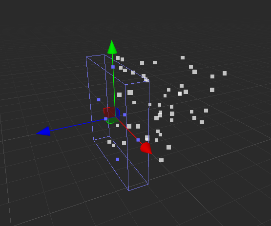
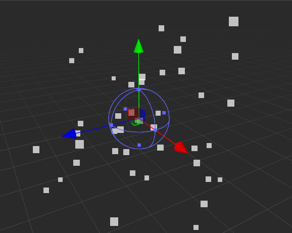
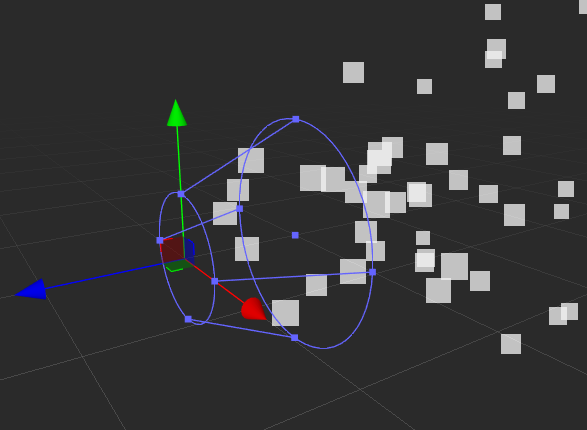

# 发射器模块(ShapeModule)

此模块可用于定义粒子起始发射区域、方向以及运动轨迹等。

## 公有属性

属性 | 作用
:---|:---
**ShapeType** | 发射体形状。目前支持 **方块（Box）**、**球、半球（Sphere\Hemisphere）**、**圆（Circle）**、**圆锥（Cone）** 这几种类型。
**Position** | 相对于挂载节点的位置
**Rotation** | 相对于挂载节点的旋转
**Scale** | 相对于挂载节点的缩放
**AlignToDirection** | 根据粒子的初始行进方向定向粒子。粒子会根据初始的运动方向决定粒子的初始旋转，可以通过主模块中的 StartRotation 来覆盖此功能
**RandomDirectionAmount** | 将粒子方向朝随机方向混合。值为 0 时，设置无效。该值为 1 时，方向完全随机
**SphericalDirectionAmount** | 将粒子方向朝球面方向混合，从它们的变换中心向外运动。该值为 0 时，设置无效。该值为 1 时，粒子方向从中心向外（与 ShapeType 设置为 Sphere 时的行为相同）。
**RandomPositionAmount** | 与粒子产出位置应用一定的随机值。该值为 0 时，设置无效。任何其他值都会对粒子的生成位置应用一些随机性。

## 方块（Box）

属性 | 作用
:---|:---
**EmitFrom** | 粒子从方块的哪个部位发射。 **Volume**：内部 **Edge**：边框 **Shell**：表面
**BoxThickness** | 方块每个发射方向的厚度。仅支持 **EmitFrom** 选择 **Shell** 模式

## 球、半球（Sphere\Hemisphere）

属性| 作用
:---|:---
**Radius** | 球体半径
**RadiusThickness** | 0：表示从球表面发射 1：表示从球体内部发射 0~1：之间表示从表面到球心之间发射

## 圆（Circle）

属性| 作用
:---|:---
**Radius** | 圆的半径
**RadiusThickness** | 0 表示从圆周发射 1 表示从圆内部发射 0~1 之间表示从圆周到圆心之间发射
**Arc** | 表示在圆的一个扇形区域发射
**ArcMode** | 表示粒子在扇形区域的发射方式。 **Random**：随机位置 **Loop**：沿某一方向循环发射，每次循环方向相同 **PingPong**：与 Loop 循环相同，不同之处在于每个连续循环方向都与上次方向相反。
**ArcSpeed**|表示粒子沿圆周发射的速度
**ArcSpread**|表示粒子沿圆周发射时，在圆弧哪些位置发射。例如，Arc 为 120°，ArcSpread 为 0.1，则从圆弧开始每隔 12° 发射一次粒子

## 圆锥（Cone）

属性| 作用
:---|:---
**ShapeType** | 发射体形状。Cone 代表粒子会从锥体的底部、锥体内部或者锥体边缘发射粒子。
**EmitFrom** | 粒子从锥体的哪个部位发射。 **base**：从圆锥底部随机位置发射  **volume**：在圆锥底部和内部之间随机出现
**Radius** |圆锥顶部截面半径
**RadiusThickness** | 0 表示从圆周发射 1 表示从圆内部发射 0~1 之间表示从圆周到圆心之间发射
**Angle** | 圆锥的轴与母线的夹角
**Arc** | 表示在圆的一个扇形区域发射
**ArcMode** | 表示粒子在扇形区域的发射方式。 **random**：随机位置 **loop**：逆时针方向循环产出  **pingPong**：循环发射，每次循环方向相反 **spread**：表示粒子在某个间断发射，比如，0 表示可以在任意位置发射；0.1 表示每隔圆周的十分之一位置发射
**ArcSpread**|表示粒子沿圆周发射时，在圆弧哪些位置发射。例如，Arc 为 120°，Spread 为 0.1，表示从圆弧开始每隔 12° 发射一次粒子
**ArcSpeed**|表示粒子沿圆周发射的速度
**Length** |圆锥顶部截面距离底部的轴长
