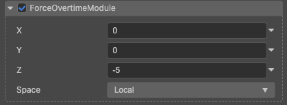

# 加速度模块（ForceOvertimeModule）

属性| 作用
:---|:---
**space** | 加速度在哪个坐标系中计算。 **Local**：基于本地坐标系的缩放。如果粒子节点此时在运动，所产出的所有粒子也会跟随一起运动 **World**：基于世界坐标系的缩放。如果粒子节点此时在运动，所产出的所有粒子不会跟随一起运动 **Custom**：自定义缩放，不受节点 **scale** 影响
**x、y、z** | 坐标轴三个方向上的加速度分量，可采用不同的计算模式。

