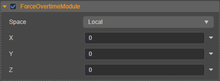

# 加速度模块（ForceOvertimeModule）

通过该模块可对粒子进行加速，以模拟类似风的效果。

## 属性

| 属性 | 说明 |
| :--- | :--- |
| **Space** | 加速度计算时选择基于 **世界坐标系**（World）或者 **本地坐标系**（Local） （**Custom** 目前暂不支持） |
| **X** | X 轴方向上的加速度分量 |
| **Y** | Y 轴方向上的加速度分量 |
| **Z** | Z 轴方向上的加速度分量 |

点击属性输入框右侧的  按钮，可选择对属性进行曲线编辑，详情请参考 [曲线编辑器](./editor/curve-editor.md)。
