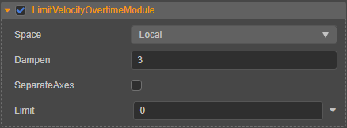

# 限速模块（LimitVelocityOvertimeModule）

限速模块用于设置粒子的速度在生命周期内逐渐减缓。

| 属性 | 说明 |
| :--- | :--- |
| **Space** | 速度计算时选择基于 **世界坐标系**（World）或者 **本地坐标系**（Local） （**Custom** 目前暂不支持） |
| **Dampen** | 当前速度与速度下限的插值
| **SeparateAxes** | 是否在 X、Y、Z 轴上分别限制粒子速度。若勾选该项，则可设置： **LimitX**：X 轴方向上的速度下限 **LimitY**：Y 轴方向上的速度下限 **LimitZ**：Z 轴方向上的速度下限
| **Limit** | 速度下限。若当前速度超出该值时，当前速度将会与速度下限进行线性插值。该项仅在不勾选 **SeparateAxes** 时生效

点击属性输入框右侧的  按钮，可选择对属性进行曲线编辑，详情请参考 [曲线编辑](./editor/curve-editor.md)。
