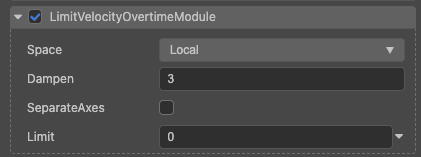

# 限速模块(LimitVelocityOvertimeModule)

该属性可以限定速度运动范围。

属性| 作用
:---|:---
**Space** | 速度在哪个坐标系中计算。
**Dampen** | 当粒子速度超出速度限制时粒子速度降低的比例（此处计算采用的是插值法）。
**SeparateAxes** | 是否分开三个轴分别限制速度。
**Limit** | 速度下限，当速度超出该值时，将当前速度与该速度做线性插值，当s **SeparateAxes** 为 false 时有效。
**Limit X Y Z** | 三个轴的速度下限，当 **SeparateAxes** 为 true 时有效。
