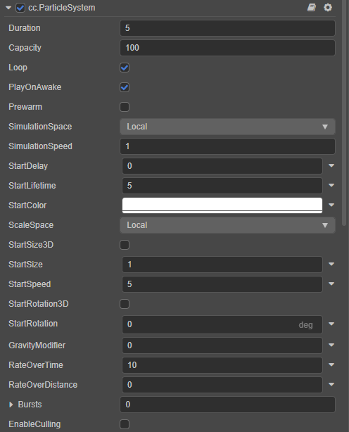
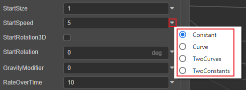

# 主模块（ParticleSystem）

粒子系统主模块用于存储在 **属性检查器** 中显示的所有数据，管理粒子生成、播放、更新，以及销毁。

| 属性 | 功能 |
| :--              | :-- |
| Duration         | 粒子系统单次运行一个周期的时间（s），也就是产生第一个粒子到最后一个粒子之间的时间 |
| Capacity         | 粒子系统能生成的最大粒子数量 |
| Loop             | 粒子系统是否循环播放 |
| PlayOnAwake      | 粒子系统加载后是否自动开始播放 |
| Prewarm          | 是否启用预热模式。若勾选该项，粒子系统会以已播放完一轮之后的状态开始播放（仅当勾选 **Loop** 时生效） |
| SimulationSpace  | 控制粒子系统所在的坐标系。 **Local**：基于本地坐标系 **World**：基于世界坐标系 |
| SimulationSpeed  | 控制整个粒子系统的运行速度 |
| StartDelay       | 粒子系统开始运行后，粒子延迟发射的时间（仅当不勾选 **Prewarm** 时生效） |
| StartLifetime    | 粒子生命周期（s），单个粒子从产生到消失的时间 |
| StartColor       | 粒子初始颜色 |
| ScaleSpace       | 粒子缩放时所在的坐标系： **Local**：基于本地坐标系的缩放 **World**：基于世界坐标系的缩放 **Custom**（目前暂不支持）：自定义缩放，不受节点的 **scale** 属性影响 |
| StartSize3D      | 分别设置粒子 X、Y、Z 轴的初始大小。 一般情况下，只需要设置 X 和 Y 轴即可。只有当粒子 [Renderer 模块](renderer.md) 的 **RenderMode** 属性设置为 **Mesh** 时，设置 Z 轴才有必要 |
| StartSize        | 粒子在 X、Y 方向的初始大小，与 **StartSize3D** 属性二者只能选其一。 若在勾选了 **StartSize3D** 后切换使用该项，则该项会使用 **StartSize3D** 中设置的 **StartSizeX** 的值 |
| StartSpeed       | 粒子初始速度   |
| StartRotation3D  | 分别设置粒子 X、Y、Z 轴的初始旋转角度    |
| StartRotation    | Z 轴初始旋转角度，与 `StartRotation3D` 属性二者只能选其一。 若在勾选了 **StartRotation3D** 后切换使用该项，则该项会使用 **StartRotation3D** 中设置的 **StartRotationZ** 的值 |
| GravityModifier  | 粒子受重力影响的重力系数。该项只支持 CPU 粒子，当 [渲染模块](./renderer.md) 中勾选 **UseGPU** 时不生效 |
| RateOverTime     | 每秒发射的粒子数 |
| RateOverDistance | 发射器每移动一个单位距离发射的粒子数 |
| Bursts           | 设定在指定时间发射指定数量粒子的 Burst 数量。可通过以下几个属性调整： **Time**：粒子播放多长时候后开始发射 Burst **RepeatCount**：在粒子生命周期内 Burst 的发射次数 **RepeatInterval**：每次发射的时间间隔 **Count**：每次发射的粒子数量 |
| EnableCulling      | 粒子系统资源剔除，详情请参考下文说明   |

点击上述部分属性输入框右侧的  按钮，即可开启粒子曲线/渐变色编辑器，对粒子属性进行编辑，详情请参考 [粒子属性编辑](./editor/index.md)。

粒子系统组件接口请参考 [ParticleSystem API](__APIDOC__/zh/classes/particle.particlesystem.html)。

## 粒子系统资源剔除

**EnableCulling** 选项用于剔除粒子系统中无用模块的资源数据。

粒子系统中各个模块都是作为独立对象存在，每个模块都会存储一些模块相关的数据，因此对于未勾选使用的模块，其记录的数据都是无用数据。当开发者不需要在运行时动态开启这些未使用的模块，可以勾选 **EnableCulling** 选项，对这些无用数据进行剔除，从而减小资源占用。
