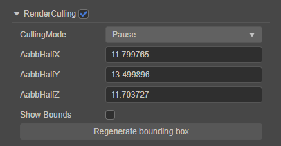

# 主模块（ParticleSystem）

粒子系统主模块用于存储在 **属性检查器** 中显示的所有数据，管理粒子生成、播放、更新，以及销毁。

| 属性 | 功能说明 |
| :--              | :-- |
| Duration         | 粒子系统运行一个周期的时间（s）。在周期内会根据设置持续发射粒子 |
| Capacity         | 粒子系统能生成的最大粒子数量 |
| Loop             | 粒子系统是否循环播放。如果勾选此选项，则会在粒子系统运行一个周期结束后开始下一个周期，循环反复。 |
| PlayOnAwake      | 粒子系统加载后是否自动开始播放 |
| Prewarm          | 是否启用预热模式。选中之后，粒子系统会以已播放完一轮之后的状态开始播放（仅当循环播放启用时有效） |
| SimulationSpace  | 控制粒子的运动位置。 **Local**：是始终相对于父对象的局部空间（会与父对象一起移动） **World**：还是始终保持在世界空间中运动 |
| SimulationSpeed  | 控制整个粒子系统的运行速度 |
| StartDelay       | 粒子系统开始运行后，粒子延迟发射的时间（仅当预热模式没有启用时有效） |
| StartLifetime    | 粒子生命周期（s）。决定粒子产出后历经多久才会被回收 |
| StartColor       | 粒子初始颜色 |
| ScaleSpace       | 粒子缩放时所在的坐标系 **Local**：基于本地坐标系的缩放，只有本地坐标系的缩放会对它产生影响，父对象的缩放不影响 **World**：基于世界坐标系的缩放，本地坐标系和父对象坐标系共同影响 |
| StartSize3D      | 分别设置粒子 X、Y、Z 轴的初始大小。在大多数情况下，只需要设置 X 和 Y 的值即可，只有当 `Renderer` 模块的 `RenderMode` 设置为 `Mesh` 后设置 Z 才有必要 |
| StartSize        | 粒子的初始大小，X、Y、Z 设置相同的值，与 `StartSize3D` 属性二者只能选其一。如果设置了 `StartSize3D` 后再切换过来，那么 `StartSize` 采用的是 `StartSize3D` X 的值 |
| StartSpeed       | 粒子初始速度   |
| StartRotation3D  | 分别设置粒子 X、Y、Z 轴的初始旋转角度    |
| StartRotation    | 设置 Z 轴初始旋转角度，与 `StartRotation3D` 属性二者只能选其一 |
| GravityModifier  | 粒子受重力影响的重力系数（只支持 CPU 粒子） |
| RateOverTime     | 每秒发射的粒子数 |
| RateOverDistance | 每移动一个单位距离发射的粒子数 |
| Bursts           | 设定在指定时间发射指定数量粒子的 Burst 数量。可通过以下几个属性调整： **Time**：粒子系统播放多长时候后开始发射 **RepeatCount**：粒子系统一个生命周期内的发射次数 **RepeatInterval**：每次发射的时间间隔 **Count**：每次发射的粒子数量 |
| DataCulling      | 粒子系统数据剔除，详情请参考下文说明   |
| RenderCulling    | 粒子剔除，详情请参考下文说明     |

点击上述部分属性输入框右侧的  按钮，即可开启粒子曲线/渐变色编辑器，对粒子属性进行编辑，详情请参考 [粒子属性编辑](./editor/index.md)。

粒子系统组件接口请参考 [ParticleSystem API](__APIDOC__/zh/#/docs/3.4/zh/particle/Class/ParticleSystem)。

## 粒子系统资源剔除

**DataCulling** 选项用于剔除粒子系统中无用模块的数据。

粒子系统中各个模块都是作为独立对象存在，每个模块都会存储一些模块相关的数据，因此对于未勾选使用的模块，其记录的数据都是无用数据。当开发者不需要在运行时动态开启这些未使用的模块，可以勾选 **DataCulling** 选项，对这些无用数据进行剔除，从而减小资源占用。

> **注意**：v3.4 之前该项是 **EnableCulling**，在 v3.4 为了与下方的 **RenderCulling** 区分，我们将其改名为 **DataCulling**。本次调整做了兼容性处理，对用户没有丝毫影响，无须担心。

## 粒子剔除

粒子系统从 v3.4 开始新增了 **RenderCulling** 选项，用于开启粒子剔除功能。

开启该项粒子发射器将会自动计算出一个包围盒，运行时便会根据包围盒是否在摄像机的可见范围内来剔除粒子发射器，若不在则剔除。剔除运算每一帧都会进行，适合一些耗时的特效，如果粒子个数少不建议开启该项。

包围盒的大小可以通过下图中的 **AabbHalf** 进行调整，调整完成后，点击 **Regenerate bounding box** 按钮即可重新计算包围盒。

| 属性 | 功能说明 |
| :--- | :-- |
| CullingMode            | 粒子发射器被剔除之后的行为，可设置的选项包括 **Pause**、**Pause and Catchup**、**Always Simulate**。 **Pause**：若粒子发射器包围盒不在摄像机的可见范围内，粒子暂停模拟。若恢复可见，则粒子会接着上次暂停的时间继续模拟； **Pause and Catchup**：若粒子发射器包围盒不在摄像机的可见范围内，粒子暂停模拟。若恢复可见，则粒子会以当前的时间开始模拟； **Always Simulate**：无论粒子发射器包围盒是否在摄像机的可见范围内，粒子都会一直模拟，只是不在摄像机的可见范围内时不进行渲染。 |
| AabbHalfX              | 设置粒子发射器包围盒半宽 |
| AabbHalfY              | 设置粒子发射器包围盒半高 |
| AabbHalfZ              | 设置粒子发射器包围盒半长 |
| Show Bounds            | 在 **场景编辑器** 中显示粒子发射器包围盒  |
| Regenerate bounding box| 包围盒大小调整完成后，点击该按钮重新计算包围盒 |
