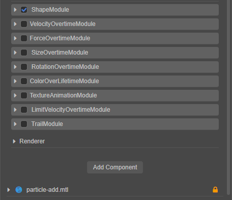

# 粒子系统功能介绍

Cocos Creator 的 **粒子系统** 存储了粒子发射的初始状态以及粒子发射后的状态更新子模块。

## 粒子系统模块

Cocos Creator 粒子系统操作面板如下：

 

粒子系统使用模块来组织功能，包括以下模块：

| 模块 | 说明 |
| :--- | :--- |
| Node | 粒子节点，用于设置粒子发射器的位置、方向、大小、渲染层级等属性 |
| [ParticleSystem](main-module.md)（主模块） | 用于存储在 **属性检查器** 中显示的所有数据，管理粒子生成、更新、销毁相关模块，控制粒子播放 |
| [ShapeModule](emitter.md)（发射器模块） | 用于控制粒子发射，包括发射方向与速度，支持预定义的发射方向，包括方块、圆、锥体、球、半球 |
| AnimatorModule（状态模块） | 用于控制粒子发射后的状态更新。已支持的功能包括： [速度模块（VelocityOvertimeModule）](velocity-module.md) [加速模块（ForceOvertimeModule）](force-module.md) [大小模块（SizeOvertimeModule）](size-module.md) [旋转模块（RotationOvertimeModule）](rotation-module.md) [颜色模块（ColorOvertimeModule）](color-module.md) [贴图动画模块（TextureAnimationModule）](texture-animation-module.md) [限速模块（LimitVelocityOvertimeModule）](limit-velocity-module.md) [拖尾模块（TrailModule）](trail-module.md) |
| [Renderer](renderer.md) | 用于生成粒子渲染所需要的数据。包括 VB、IB、渲染状态相关的控制 |
