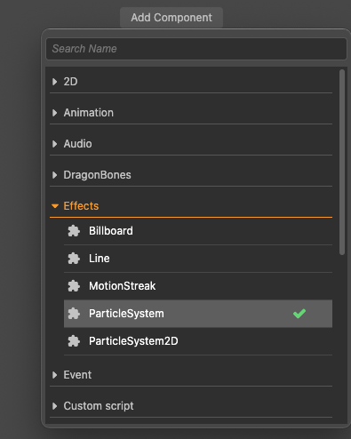
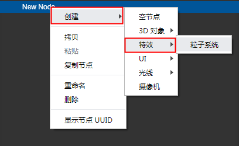
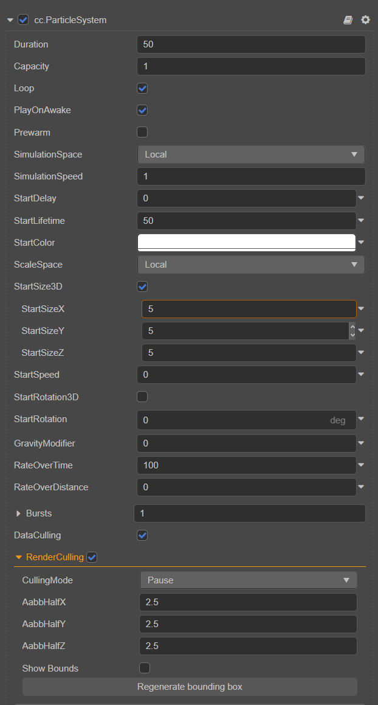
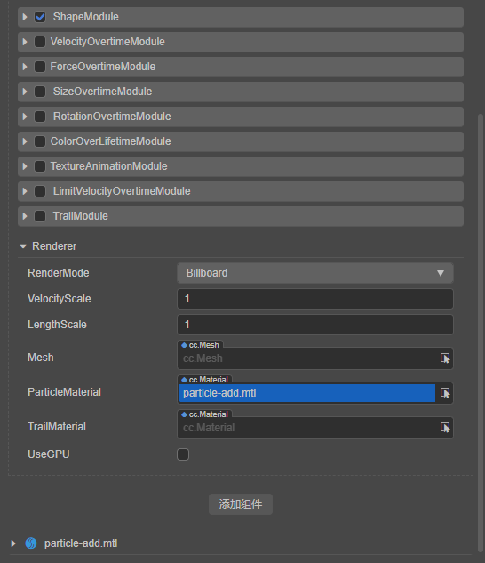

# Particle System Overview

粒子系统是游戏引擎特效表现的基础，它可以用于模拟的火、烟、水、云、雪、落叶等自然现象，也可用于模拟发光轨迹、速度线等抽象视觉效果。

## 基本结构

粒子系统的基本单元是粒子，一个粒子一般具有位置、大小、颜色、速度、加速度、生命周期等属性。在每一帧中，粒子系统一般会执行如下步骤：

1. 产生新的粒子，并初始化
2. 删除超过生命周期的粒子
3. 更新粒子的动态属性
4. 渲染所有有效的粒子

粒子系统一般由以下几个部分组成：

1. 发射器，用于创建粒子，并初始化粒子的属性
2. 影响器，用于更新粒子的属性
3. 渲染器，渲染粒子
4. 粒子类，存储粒子的属性
5. 粒子系统类，管理上面的模块

## 添加粒子系统

在编辑器中添加粒子系统组件有以下两种方式：

1. 在 **层级管理器** 中选中节点，然后点击右侧 **属性检查器** 面板上的 **添加组件** 按钮添加粒子，如下图：

    

2. 在左侧的 **层级管理器** 面板中点击鼠标右键，然后选择 **创建 -> 特效 -> 粒子系统** 来添加一个粒子系统组件，如下图：

    

## 粒子模块

Cocos Creator 粒子系统操作面板如下：

Cocos Creator 粒子系统用模块来组织功能，包括以下模块：

| 模块 | 说明 |
| :--- | :--- |
| Node | 粒子节点，用于设置粒子发射器的位置、方向、大小、渲染层级 |
| [ParticleSystem](main-module.md) | 用于存储在 **属性检查器** 中显示的所有数据，管理粒子生成、更新、销毁相关模块，控制粒子播放 |
| [ShapeModule](emitter.md) | 用于控制粒子发射，包括发射方向与速度，支持预定义的发射方向，包括方块、圆、锥体、球、半球 |
| [AnimatorModule](module.md) | 用于控制粒子发射后的状态更新。已支持的功能有：[速度模块(VelocityOvertimeModule)](velocity-module.md)、[加速模块(ForceOvertimeModule)](force-module.md)、[大小模块(SizeOvertimeModule)](size-module.md)、[旋转模块(RotationOvertimeModule)](rotation-module.md)、[颜色模块(ColorOvertimeModule)](color-module.md)、[贴图动画模块(TextureAnimationModule)](texture-animation-module.md)、[限速模块(LimitVelocityOvertimeModule)](limit-velocity-module.md)、[拖尾模块(TrailModule)](trail-module.md) |
| [ParticleSystemRenderer](renderer.md) | 用于生成粒子渲染所需要的数据。包括 vb、ib、渲染状态相关的控制 |

## 粒子剔除

粒子系统目前支持在运行时根据粒子包围盒和视景体动态剔除粒子发射器，剔除的发射器将会暂停播放粒子特效直到相机再次看到粒子包围盒。勾选 RenderCulling 选项打开剔除功能，剔除包含如下模式：Pause、Pause and Catchup、Always Simulate，剔除模式定义发射器被剔除以后的行为，发射器将会自动计算出一个包围盒进行剔除运算，可以修改 AabbHalf 参数改变发射器包围盒的大小，如果需要重新计算包围盒点击 Regenerate bounding box 按钮。剔除运算每一帧都会进行，适合一些耗时的特效，如果粒子个数少可以考虑关闭该选项。
