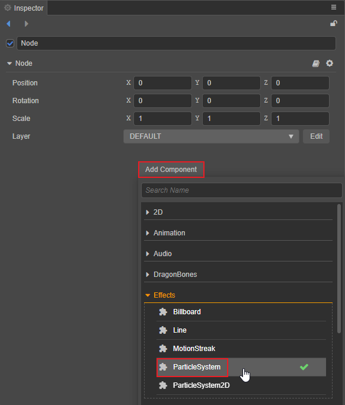
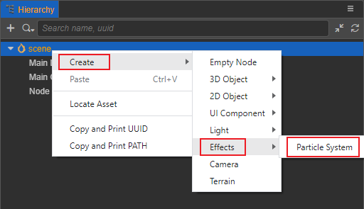
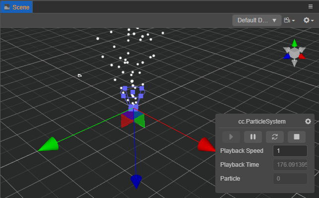

# 3D 粒子系统

粒子系统是游戏引擎特效表现的基础，它可以用于模拟的火、烟、水、云、雪、落叶等自然现象，也可用于模拟发光轨迹、速度线等抽象视觉效果。

## 基本结构

粒子系统的基本单元是粒子，一个粒子一般具有位置、大小、颜色、速度、加速度、生命周期等属性。在每一帧中，粒子系统一般会执行如下步骤：

1. 产生新的粒子，并初始化
2. 删除超过生命周期的粒子
3. 更新粒子的动态属性
4. 渲染所有有效的粒子

粒子系统一般由以下几个部分组成：

1. 发射器，用于创建粒子，并初始化粒子的属性
2. 影响器，用于更新粒子的属性
3. 渲染器，渲染粒子
4. 粒子类，存储粒子的属性
5. 粒子系统类，管理上面的模块

## 添加 3D 粒子系统

在编辑器中添加粒子系统组件有以下两种方式：

1. 在 **层级管理器** 中选中节点，然后点击右侧 **属性检查器** 面板上的 **添加组件** 按钮添加粒子，如下图：

    

2. 在左侧的 **层级管理器** 面板中点击鼠标右键，然后选择 **创建 -> 特效 -> 粒子系统**，即可创建一个带有粒子系统组件的节点，如下图：

    

添加完成后，粒子在 **场景编辑器** 中显示如下：

右下角的粒子系统控制面板用于控制粒子的播放暂停等，详情请参考 [粒子控制面板](./editor/particle-effect-panel.md)。

## 内容

粒子系统主要包括以下两部分内容：

- [粒子系统模块](./module.md)

- [粒子属性编辑](./editor/index.md)
