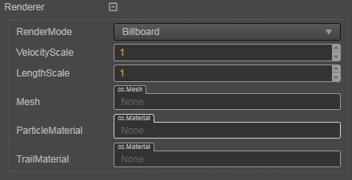

# 粒子渲染（Renderer）

| 属性 | 说明 |
| :--- | :--- |
| **RenderMode** | 设置一个粒子面片的生成方式。 **Billboard** 粒子始终面向摄像机 **StretchedBillboard** 粒子始终面向摄像机，但会根据相关参数进行拉伸 **HorizontalBillboard** 粒子面片始终与 x-z 平面平行 **VerticalBillboard** 粒子面片始终与 Y 轴平行，但会朝向摄像机 **Mesh** 粒子为一个模型。 |
| **VelocityScale** | 在 **StretchedBillboard** 模式下，根据粒子 **速度大小** 按比例进行拉伸。将值设置为 0 可禁用基于速度的拉伸 |
| **LengthScale** | 在 **StretchedBillboard** 模式下，根据粒子 **粒子大小** 按比例进行拉伸。将值设置为 0 粒子会消失，相当于粒子大小为 0 |
| **Mesh** | 在 **RenderMode** 设置为 **Mesh** 时，指定要渲染的粒子的模型。 |
| **ParticleMaterial** | 用于粒子渲染的材质。 当使用 CPU 渲染器时，也就是不勾选 **UseGPU** 的情况下，材质使用的 effect 只能是 `builtin-particle`，不支持其它的 effect。 当使用 GPU 渲染器时，也就是勾选 **UseGPU** 的情况下，材质使用的 effect 只能是 `builtin-particle-gpu`，不支持其它的 effect。 |
| **TrailMaterial** | 用于渲染粒子拖尾的材质，材质的 effect 只支持 `builtin-particle-trail`，不支持其它的 effect。 |
| **UseGPU** | 是否使用 GPU 渲染器进行粒子的渲染，默认不勾选。 不勾选时，使用 CPU 渲染器进行粒子的渲染。 勾选时，使用 GPU 渲染器进行粒子的渲染。 |
| **AlignSpace** | 粒子对齐方向空间，可选项包括 **View**（视角空间）、**World**（世界空间）和 **Local**（局部空间），默认使用视角空间。选择不同空间可以决定粒子初始方向： 选择 **View** 时，粒子网格的旋转方向将会跟随摄像机的视角方向； 选择 **World** 时，粒子网格的方向将会使用发射器所在节点的世界空间旋转方向； 选择 **Local** 时，粒子网格将会使用发射器所在节点的局部空间旋转方向。 |

## 粒子渲染器

粒子渲染部分由渲染器控制，渲染器分为 **CPU 渲染器** 和 **GPU 渲染器**。

CPU 渲染器通过一个对象池来维护所有粒子，根据粒子当前状态来生成对应的顶点（vb）、顶点索引（ib）数据，持有粒子需要渲染的材质，并且保存相关渲染状态。

GPU 渲染器目前是在 CPU 端生成粒子，只提交初始参数的顶点、顶点索引数据，但是模块相关的计算则是通过预采样数据的形式，初始化时提交一次数据，后续的模块系统则是在 GPU 端对数据进行提取模拟运算，减少 CPU 端的计算压力，目前不支持拖尾（TrailModule）和限速（LimitVelocityOvertimeModule）两个模块，后续版本仍将持续对粒子系统进行优化改进。
