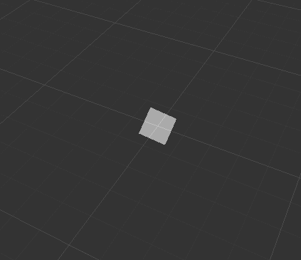
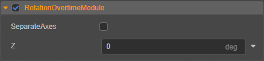

# 旋转模块（RotationOvertimeModule）

## 属性

| 属性 | 说明 |
| :--- | :--- |
| **SeparateAxes** | 是否在 X、Y、Z 轴上分别控制粒子旋转（目前暂不支持该功能） |
| **Size** | 绕 Z 轴设定旋转。该项与 **separateAxes** 属性，二者只能选其一。 |

点击属性输入框右侧的  按钮，可选择对属性进行曲线编辑，详情请参考 [曲线编辑](./editor/curve-editor.md)。
