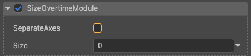
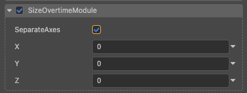

# 大小模块(SizeOvertimeModule)

通过该模块可以控制粒子在其生命周期内的大小，从而实现火焰、雪花等各种大小不一的粒子。

属性| 作用
:---|:---
**SeparateAxes** | 是否三个轴分开进行缩放。详情请见下方 [非均匀粒子缩放](#非均匀粒子缩放)
**Size** | 大小随时间变化的曲线，可通过右边的下拉三角选择不同的设置方式。当 **SeparateAxes** 为 false 时有效。
**X Y Z** | 大小随时间变化的曲线，可对三个坐标轴设置不同缩放，可通过右边的下拉三角选择不同的设置方式。当 **SeparateAxes** 为 true 时有效。

## 非均匀粒子缩放

当在粒子大小模块上勾选 **SeparateAxes**，则可以指定粒子的 X、Y、Z 如何在生命周期内的变化（Z 仅用于网格粒子）。

