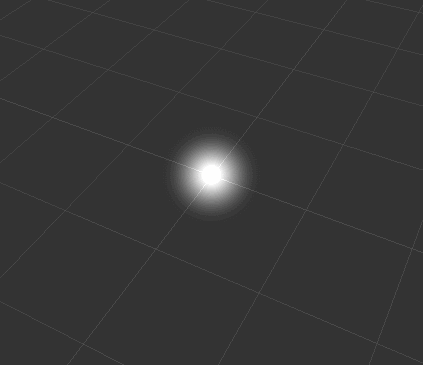
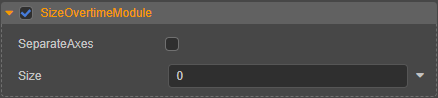
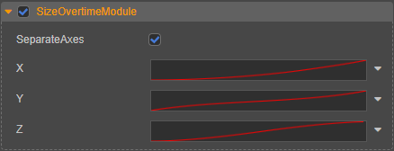

# 大小模块（SizeOvertimeModule）

大小模块可用于曲线改变粒子的大小。

## 属性

| 属性 | 说明 |
| :--- | :--- |
| **SeparateAxes** | 是否在 X、Y、Z 轴上分别控制粒子大小。若勾选该项，则可设置： **X**：定义一条曲线来决定粒子在其生命周期中 X 轴方向上的大小变化。 **Y**：定义一条曲线来决定粒子在其生命周期中 Y 轴方向上的大小变化。 **Z**：定义一条曲线来决定粒子在其生命周期中 Z 轴方向上的大小变化。 |
| **Size** | 定义一条曲线来决定粒子在其生命周期中的大小变化。该项与 **separateAxes** 属性，二者只能选其一。 |

点击属性输入框右侧的  按钮，可选择对属性进行曲线编辑，详情请参考 [曲线编辑](./editor/curve-editor.md)。

