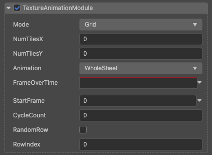

# 贴图动画模块(TextureAnimationModule)

属性| 作用
---|---
**mode** | grid 一张贴图包含一个粒子播放的动画帧。
**numTilesX** | x 方向动画帧数。
**numTilesY** | y 方向动画帧数。
**animation** | wholeSheet 播放贴图中的所有帧，singleRow 只播放其中一行。
**frameOverTime** | 一个周期内动画播放的帧与时间变化曲线。
**startFrame** | 从第几帧开始播放，时间为整个粒子系统的生命周期。
**cycleCount** | 一个生命周期内播放几次循环。

