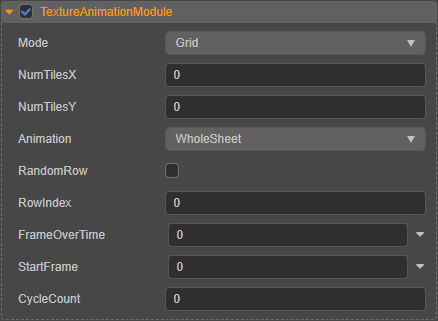

# 贴图动画模块（TextureAnimationModule）

贴图动画模块用于将 [渲染模块](./renderer.md) 中指定的 **ParticleMaterial** 的贴图纹理作为动画帧进行动态播放，用于实现类似下图中的效果：

## 属性

| 属性 | 说明 |
| :--- | :--- |
| **Mode** | 设定粒子动画贴图的类型，目前只支持 **Grid**（网格）模式。一张贴图包含一个粒子播放的动画帧。
| **NumTilesX** | 贴图纹理在 X 方向上划分的动画帧数。
| **NumTilesY** | 贴图纹理在 Y 方向上划分的动画帧数。
| **Animation** | 动画播放方式，包括：  **WholeSheet**：播放贴图中的所有帧； **SingleRow**：只播放其中一行。
| **RandomRow** | 随机从动画贴图中选择一行生成动画。该项仅在动画播放方式设置为 **SingleRow** 只播放其中一行时生效。
| **RowIndex** | 从动画贴图中选择特定行以生成动画。该项仅在动画播放方式设置为 **SingleRow** 并且禁用 **RandomRow** 时生效。
| **FrameOverTime** | 设置动画播放的帧随时间推移发生的变化，可点击右侧的  按钮对其进行曲线编辑。
| **StartFrame** | 指定动画在整个粒子系统生命周期的第几帧开始播放。
| **CycleCount** | 动画帧在粒子生命周期内重复播放的次数。
