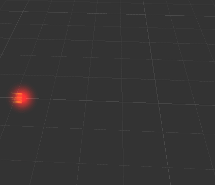
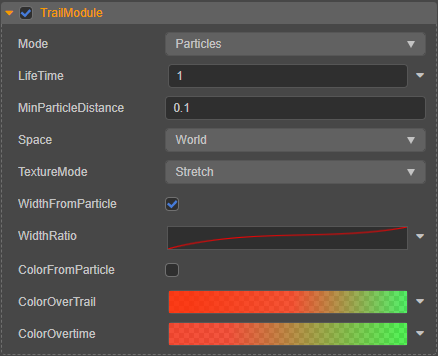

# 轨迹模块（TrailModule）

该模块用于将轨迹添加到粒子上，实现类似下图中的拖尾效果：

## 属性

| 属性 | 说明 |
| :--- | :--- |
| **Mode**                | 粒子系统生成轨迹的方式，目前仅支持 **Particles**，表示在每个粒子上都生成轨迹。
| **LifeTime**            | 生成的轨迹的生命周期。
| **MinParticleDistance** | 粒子每生成一个拖尾节点所运行的最短距离。
| **Space**               | 拖尾轨迹运行时选择基于 **世界坐标系**（World）或者 **本地坐标系**（Local） （**Custom** 目前暂不支持）
| **TextureMode**         | 当在 [渲染模块](./renderer.md) 中指定了 **TrialMaterial** 贴图时，贴图在轨迹中的展开形式。目前仅支持 **Stretch**，表示将贴图覆盖在整条拖尾上。
| **WidthFromParticle**   | 轨迹宽度跟随粒子大小
| **WidthRatio**          | 轨迹宽度，如果继承自粒子则是粒子大小的比例
| **ColorFromParticle**   | 轨迹颜色是否跟随粒子初始颜色
| **ColorOverTrail**      | 轨迹颜色随着轨迹自身长度的变化而变化
| **ColorOvertime**       | 轨迹颜色随着时间的变化而变化

点击属性输入框右侧的  按钮，可选择对属性进行曲线编辑/渐变色编辑，详情请参考 [粒子属性编辑](../editor/index.md)。
