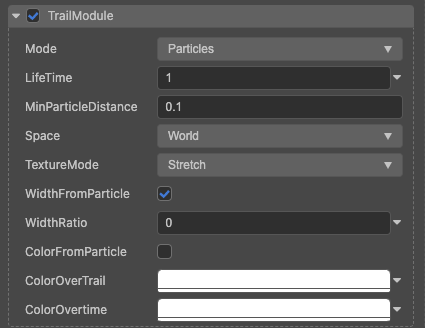

# 拖尾模块（TrailModule）

通过该模块可在例子尾部添加一个轨迹效果。比如：子弹射击时的轨迹特效，刹车特效等。

属性| 作用
:---|:---
**Mode** | **Particle** 在每个粒子的运动轨迹上形成拖尾效果。
**LifeTime** | 拖尾的生命周期。
**MinParticleDistance** | 粒子每生成一个拖尾节点所运行的最短距离。
**Space** | 拖尾所在的坐标系，World 在世界坐标系中运行，Local 在本地坐标系中运行。
**TextureMode** | 贴图在拖尾上的展开形式，Stretch 贴图覆盖在整条拖尾上。
**WidthFromParticle** | 拖尾宽度继承自粒子大小
**WidthRatio** | 拖尾宽度。如果勾选 **WidthFromParticle** 继承自粒子，则是粒子大小乘以比例
**ColorFromParticle** | 拖尾颜色是否继承自粒子
**ColorOverTrail** | 拖尾颜色随拖尾自身长度的颜色渐变
**ColorOvertime** | 拖尾颜色随时间的颜色渐变

