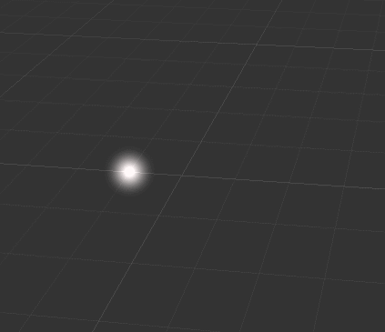
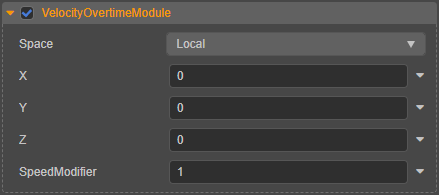

# 速度模块（VelocityOvertimeModule）

粒子系统的速度模块可用于控制粒子在生命周期内的速度。

## 属性

| 属性 | 说明 |
| :--- | :--- |
| **Space** | 速度计算时选择基于 **世界坐标系**（World）或者 **本地坐标系**（Local） （**Custom** 目前暂不支持） |
| **X** | X 轴方向上的速度分量 |
| **Y** | Y 轴方向上的速度分量 |
| **Z** | Z 轴方向上的速度分量 |
| **SpeedModifier** | 速度修正系数，只支持 CPU 粒子。当 [渲染模块](./renderer.md) 中勾选 **UseGPU** 时不生效 |

部分属性输入框右侧有  按钮的，可点击选择对属性进行曲线编辑，详情请参考 [曲线编辑](./editor/curve-editor.md)。
