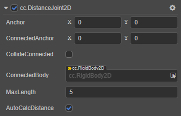
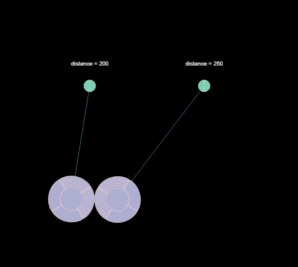

# DistanceJoint2D 关节

**距离关节**就是使两个物体保持一定的距离之内。类似于生活中的钟摆或者摆锤。

属性 | 功能说明
:---|:---
**Anchor** | 关节本端链接的刚体的锚点。
**ConnectedAnchor** | 关节链接另一端刚体的锚点。
**CollideConnected**  |  关节两端的刚体是否能够互相碰撞。
**ConnectedBody**  |  关节链接的另一端的刚体。
**MaxLength**  |  两个刚体之间允许的最长距离。
**AutoCalcDistance**  | 是否自动计算关节连接的两个刚体间的距离。

如果勾选 `AutoCalcDistance` 选项，那么 `MaxLength` 就会自动转为两个刚体之间当前的距离。如果取消勾选，那么 `MaxLength` 就会变回原来手动设定的距离。

具体的使用方法，详情可参考 [physics-samples](https://github.com/cocos-creator/physics-samples/tree/v3.x/2d/box2d/assets/cases/example/joints) 范例中的 `distance-joint` 和 `distance-joint-chain` 场景。

DistanceJoint2D 接口相关请参考 [DistanceJoint2D API](https://docs.cocos.com/creator/3.0/api/zh/classes/physics2d.distancejoint2d.html)。
