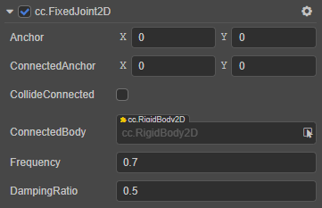
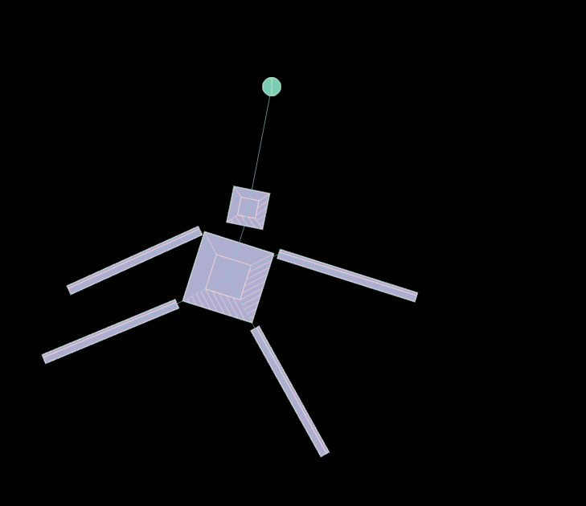

# FixedJoint2D 关节

**固定关节** 就是使两个刚体固定一个距离保持不变，当一个刚体位置移动时，另一个刚体也进行移动，保持相对静止状态。如墙上的钉子和机器人身上的关节等。

属性 | 功能说明
:---|:---
**Anchor** | 关节本端链接的刚体的锚点。
**ConnectedAnchor** | 关节链接另一端刚体的锚点。
**CollideConnected**  |  关节两端的刚体是否能够互相碰撞。
**ConnectedBody**  |  关节链接的另一端的刚体。
**Frequency**  |  弹性系数。
**DampingRatio**  | 阻尼，表示关节变形后，恢复到初始状态受到的阻力。

<!--  -->

具体的使用方法，详情可参考 [physics-samples](https://github.com/cocos-creator/physics-samples/tree/v3.x/2d/box2d/assets/cases/example/joints) 范例中的 `fixed-joint-ragdoll` 场景。

FixedJoint2D 接口相关请参考 [FixedJoint2D API](__APIDOC__/zh/classes/physics2d.fixedjoint2d.html)。
