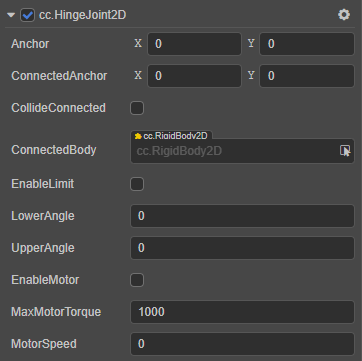
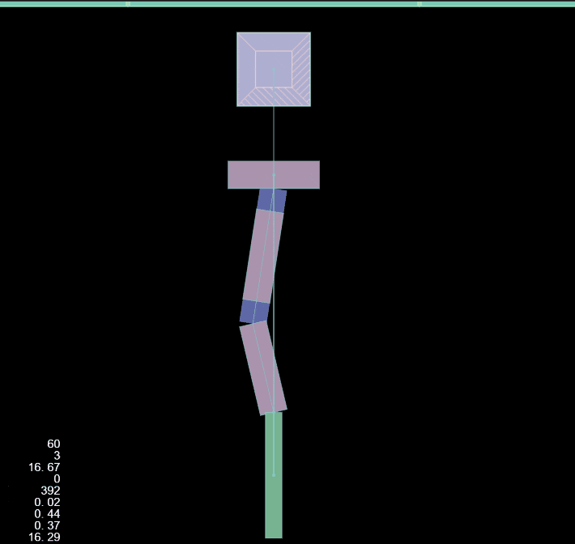

# HingeJoint2D 关节

**铰链关节** 是由两个刚体组成，对刚体进行约束，使得它们就好像被连接在一个铰链上那样运动。铰链关节用途非常广泛，利用铰链关节不仅仅可以做门，风车的模型，甚至可以做机动车的模型。

属性 | 功能说明
:---|:---
**Anchor** | 关节本端链接的刚体的锚点。
**ConnectedAnchor** | 关节链接另一端刚体的锚点。
**CollideConnected**  |  关节两端的刚体是否能够互相碰撞。
**ConnectedBody**  |  关节链接的另一端的刚体。
**EnableLimit**  | 是否开启关节的限制。
**LowerAngle**  | 角度的最低限制。
**UpperAngle**  | 角度的最高限制。
**EnableMotor**  | 是否开启关节马达。
**MaxMotorTorque**  | 可以施加到刚体的最大扭矩。
**MotorSpeed**  | 期望的马达速度。

HingeJoint2D 如果开启 `EnableMotor` 属性 开启关节马达，则会获得施加到刚体的扭矩，为刚体的运动提供动力。

<!--  -->

具体的使用方法，详情可参考 [physics-samples](https://github.com/cocos-creator/physics-samples/tree/v3.x/2d/box2d/assets/cases/example/joints) 范例中的 `hinge-joint` 和 `hinge-joint-crank` 场景。

HingeJoint2D 接口相关请参考 [HingeJoint2D API](__APIDOC__/zh/classes/physics2d.hingejoint2d.html)。
