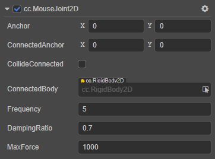
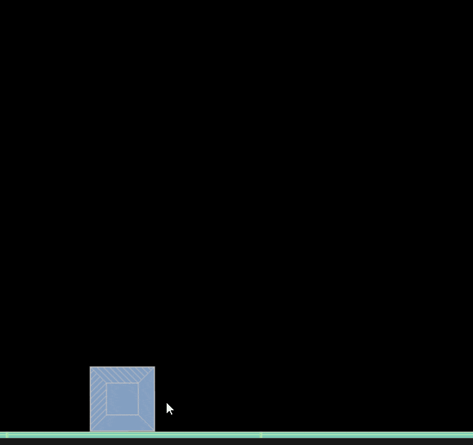

# MouseJoint2D 关节

**鼠标关节** 可以指定一个最大的力来施加一个柔和的约束。鼠标关节会在触摸移动事件中移动选中的刚体。

属性 | 功能说明
:---|:---
**Anchor** | 关节本端链接的刚体的锚点。
**ConnectedAnchor** | 关节链接另一端刚体的锚点。
**CollideConnected**  |  关节两端的刚体是否能够互相碰撞。
**ConnectedBody**  |  关节链接的另一端的刚体。
**Frequency**  |  弹性系数。
**DampingRatio**  | 阻尼，表示关节变形后，恢复到初始状态受到的阻力。
**MaxForce**  | 最大阻力值。

具体的使用方法，详情可参考 [physics-samples](https://github.com/cocos-creator/physics-samples/tree/v3.x/2d/box2d/assets/cases/example/joints) 范例中的 `mouse-joint` 场景。

MouseJoint2D 接口相关请参考 [MouseJoint2D API](https://docs.cocos.com/creator/3.0/api/zh/classes/physics2d.mousejoint2d.html)。
