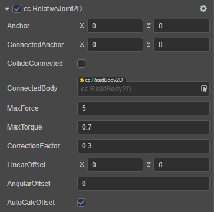

# RelativeJoint2D 关节

**相对关节** 是指将两个刚体以相对的位置固定在一起，并且两个物体以你决定的位置和角度相互偏移。即使发生移动，它们之间的相对位置和角度也将不变。例如在游戏中，玩家身后有额外的宠物。这种情况下可以使用相对关节，使宠物在玩家身后一定距离，但让宠物随玩家一起旋转时没有滞后。

属性 | 功能说明
:---|:---
**Anchor** | 关节本端链接的刚体的锚点。
**ConnectedAnchor** | 关节链接另一端刚体的锚点。
**CollideConnected**  |  关节两端的刚体是否能够互相碰撞。
**ConnectedBody**  |  关节链接的另一端的刚体。
**MaxForce**  |  最大阻力值。
**MaxTorque**  | 可以应用于刚体的最大扭矩值。
**CorrectionFactor**  | 位置矫正系数，范围为 [0, 1]。
**LinearOffset**  | 关节另一端的刚体相对于起始端刚体的位置偏移量。
**AngularOffset**  | 关节另一端的刚体相对于起始端刚体的角度偏移量。
**AutoCalcOffset**  | 是否自动计算关节连接的两个刚体间的 `angularOffset` 和 `linearOffset`。

具体的使用方法，详情可参考 [physics-samples](https://github.com/cocos-creator/physics-samples/tree/v3.x/2d/box2d/assets/cases/example/joints) 范例中的 `relative-joint-human` 和 `relative-joint-linear-offset` 场景。

RelativeJoint2D 接口相关请参考 [RelativeJoint2D API](__APIDOC__/zh/classes/physics2d.relativejoint2d.html)。
