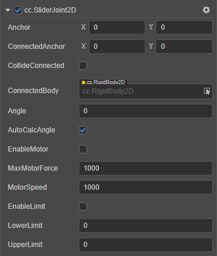

# SliderJoint2D 关节

**滑动关节** 是让刚体沿着指定的一个轴进行滑动。在开发中可以用于手动或自动的滑块机关或者滑动门等。

属性 | 功能说明
:---|:---
**Anchor** | 关节本端链接的刚体的锚点。
**ConnectedAnchor** | 关节链接另一端刚体的锚点。
**CollideConnected**  |  关节两端的刚体是否能够互相碰撞。
**ConnectedBody**  |  关节链接的另一端的刚体。
**Angle**  |  滑动的方向。
**AutoCalcAngle**  | 是否根据连接的两个刚体自动计算滑动方向。
**EnableMotor**  | 是否开启关节马达。
**MaxMotorForce**  | 可以施加到刚体的最大力。
**MotorSpeed**  | 期望的马达速度。
**EnableLimit**  | 是否开启关节的距离限制。
**LowerLimit**  | 刚体能够移动的最小值。
**UpperLimit**  | 刚体能够移动的最大值。

如果开启 `EnableMotor` 属性则会自动往指定的方向滑动。

具体的使用方法，详情可参考 [physics-samples](https://github.com/cocos-creator/physics-samples/tree/v3.x/2d/box2d/assets/cases/example/joints) 范例中的 `slider-joint` 场景。

SliderJoint2D 接口相关请参考 [SliderJoint2D API](__APIDOC__/zh/classes/physics2d.sliderjoint2d.html)。
