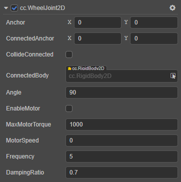

# WheelJoint2D 关节

**车轮关节** 就是模拟车轮的滚动即车轮以车轴为圆心旋转。在游戏中经常用于模拟汽车车轮、某些旋转特效等。

属性 | 功能说明
:---|:---
**Anchor** | 关节本端链接的刚体的锚点。
**ConnectedAnchor** | 关节链接另一端刚体的锚点。
**CollideConnected**  |  关节两端的刚体是否能够互相碰撞。
**ConnectedBody**  |  关节链接的另一端的刚体。
**Angle**  | 轮子震动方向。
**EnableMotor**  | 是否开启关节马达。
**MaxMotorTorque**  | 可以施加到刚体的最大扭矩。
**MotorSpeed**  | 期望的马达速度。
**Frequency**  | 弹性系数。
**DampingRatio**  | 阻尼，表示关节变形后，恢复到初始状态受到的阻力。

通过开启 `EnableMotor` 属性可以获得动力进行滚动。

具体的使用方法，详情可参考 [physics-samples](https://github.com/cocos-creator/physics-samples/tree/v3.x/2d/box2d/assets/cases/example/joints) 范例中的 `wheel-joint` 场景。

WheelJoint2D 接口相关请参考 [WheelJoint2D API](https://docs.cocos.com/creator/3.0/api/zh/classes/physics2d.wheeljoint2d.html)。
