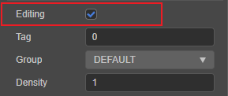
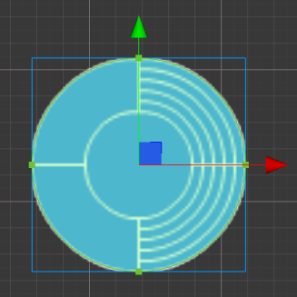

# 2D 碰撞组件

## 物理碰撞组件属性

- sensor - 指明碰撞体是否为传感器类型，传感器类型的碰撞体会产生碰撞回调，但是不会发生物理碰撞效果。
- density - 碰撞体的密度，用于刚体的质量计算
- friction - 碰撞体摩擦力，碰撞体接触时的运动会受到摩擦力影响
- restitution - 碰撞体的弹性系数，指明碰撞体碰撞时是否会受到弹力影响

### Box2D 物理碰撞组件内部细节

Box2D 物理碰撞组件内部是由 Box2D 的 b2Fixture 组成的，由于 Box2D 内部的一些限制，一个多边形物理碰撞组件可能会由多个 b2Fixture 组成。

这些情况为：

1. 当多边形物理碰撞组件的顶点组成的形状为凹边形时，物理系统会自动将这些顶点分割为多个凸边形。
2. 当多边形物理碰撞组件的顶点数多于 `b2.maxPolygonVertices`（一般为 8）时，物理系统会自动将这些顶点分割为多个凸边形。

一般情况下这些细节是不需要关心的，但是当使用射线检测并且检测类型为 `ERaycast2DType.All` 时，一个碰撞体就可能会检测到多个碰撞点，原因即是检测到了多个 b2Fixture。

## 编辑碰撞组件

当添加了一个碰撞组件后，可以通过点击 **属性检查器** 中的 **editing** 来开启碰撞组件的编辑，如下图。

### 多边形碰撞组件

如果编辑的是 **多边形碰撞组件** 的话，则会出现类似下图所示的 **多边形编辑区域**。区域中的这些绿色点都是可以拖动的，拖动的结果会反映到 **多边形碰撞组件** 的 **points** 属性中。

当鼠标移动到两点连成的线段上时，鼠标指针会变成 **添加** 样式，这时点击鼠标左键会在这个地方添加一个点到 **多边形碰撞组件** 中。

多边形碰撞组件还有一个 **Regenerate Points** 的功能，这个功能可以根据组件依附的节点上的 **Sprite** 组件的贴图的像素点来自动生成相应轮廓的顶点。

**Threshold** 指明生成贴图轮廓顶点间的最小距离，值越大则生成的点越少，可根据需求进行调节。

### 圆形碰撞组件

如果编辑的是 **圆形碰撞组件** 的话，则会出现类似下图所示的 **圆形编辑区域**：

鼠标左键拖动显示的点可以修改 **圆形碰撞组件** 的半径大小，拖动圆内的区域可以拖动圆形区域。

### 矩形碰撞组件

如果编辑的是 **矩形碰撞组件** 的话，则会出现类似下图所示的 **矩形编辑区域**：

当鼠标悬浮在 **矩形碰撞区域** 的顶点上时，点击鼠标左键拖拽可以同时修改 **矩形碰撞组件** 的长宽； 
当鼠标悬浮在 **矩形碰撞区域** 的区域内时，点击鼠标左键拖拽将修改 **矩形碰撞组件** 的偏移量。

按住 **Alt** 按键拖拽时，在拖拽过程中将会保持 **矩形中心点位置** 不变。

### 修改碰撞组件偏移量

在所有的碰撞组件调整中，都可以在各自的 **碰撞中心区域** 点击鼠标左键拖拽来快速编辑碰撞组件的 **偏移量**
