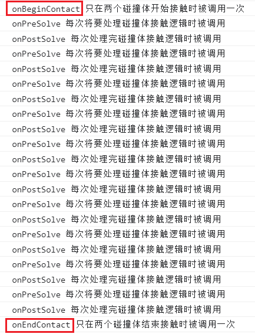

# 2D 碰撞回调

在物理场景中，物体移动或者彼此之间发生碰撞，完善的物理引擎已经为开发者模拟出来了，因此对于这一点开发者来说并不需要担心。但是开发者偶尔需要在物体碰撞的时候触发一些事件。例如，当游戏玩家触碰到怪物时，游戏可能需要结束，或者一个球碰撞到地面应该发出声音等等情况。因此，开发者需要一种从物理引擎中获取此信息的方法。这就是 **碰撞回调**。

为了让游戏开发更加简单、友好和高效，Cocos Creator v3.0 针对 2D 物理采用了 **多物理后端**，用于接入不同的物理引擎，目标是能够在开发时，切换到不同的物理引擎后端中，满足对于不同游戏所需要的不同物理功能。

对于不同的物理引擎，Cocos Creator  **封装了统一的 API** 使用。为开发者提供更简易的处理方式。

关于如何切换 2D 物理引擎，可以查看 [2D 物理系统](./physics-2d.md)。

## Builtin 2D 物理引擎

Builtin 2D 物理引擎 **仅有碰撞检测** 的功能，它没有复杂的物理模拟计算。如果您的项目不需要这一部分的物理模拟，那么可以考虑使用 `Builtin`，这将使得游戏的 **包体更小**。

若使用 `Builtin` 进行开发，请注意以下几点：

- Builtin 只有 trigger 类型的事件。
- Collider 中的 isTrigger 无论值真假，都为触发器。
- Builtin 物理只会触发 `BEGIN_CONTACT` 开始碰撞回调和 `END_CONTACT` 结束碰撞回调。
- 碰撞回调中 `contact` 参数的值为空。

## Box2D 物理引擎

Box2D 物理包含较为完善的物理模拟功能，开发者可以使用它让游戏中的物体运动起来更真实。让游戏世界更具交互性。因此需要更玩完善的物理模拟计算的开发者，可以考虑使用 `Box2D`。

若使用 `Box2D` 进行开发，请注意以下几点：

- 需要先在 `RigidBody` 组件中开启碰撞监听，才会有相应的回调产生。
- 在回调中创建的物理物体，比如刚体、关节等，这些不会立刻就创建出 `Box2D` 对应的物体，会在整个物理系统更新完成后再进行这些物体的创建。
- `Box2D` 不允许在 **碰撞回调中** 修改物理世界，因为开发者可能会摧毁 `Box2D` 正在运算的对象，造成 **野指针**。这有可能导致开发者的程序崩溃。
- 回调中的信息仅在当前回调中生效。如果需要在其他地方引用该回调信息，请使用 **深拷贝** 将信息保存到你自己的缓存中，不能直接引用。

## 碰撞回调

注册一个碰撞回调函数有两种方式，一种是通过指定的 `Collider` 注册；另一种是通过 2D 物理系统注册一个全局的回调函数。

```ts
@ccclass('TestContactCallBack')
export class TestContactCallBack extends Component {
    start () {
        // 注册单个碰撞体的回调函数
        let collider = this.getComponent(Collider2D);
        if (collider) {
            collider.on(Contact2DType.BEGIN_CONTACT, this.onBeginContact, this);
            collider.on(Contact2DType.END_CONTACT, this.onEndContact, this);
            collider.on(Contact2DType.PRE_SOLVE, this.onPreSolve, this);
            collider.on(Contact2DType.POST_SOLVE, this.onPostSolve, this);
        }

        // 注册全局碰撞回调函数
        if (PhysicsSystem2D.instance) {
            PhysicsSystem2D.instance.on(Contact2DType.BEGIN_CONTACT, this.onBeginContact, this);
            PhysicsSystem2D.instance.on(Contact2DType.END_CONTACT, this.onEndContact, this);
            PhysicsSystem2D.instance.on(Contact2DType.PRE_SOLVE, this.onPreSolve, this);
            PhysicsSystem2D.instance.on(Contact2DType.POST_SOLVE, this.onPostSolve, this);
        }
    }
    onBeginContact (selfCollider: Collider2D, otherCollider: Collider2D, contact: IPhysics2DContact | null) {
        // 只在两个碰撞体开始接触时被调用一次
        console.log('onBeginContact');
    }
    onEndContact (selfCollider: Collider2D, otherCollider: Collider2D, contact: IPhysics2DContact | null) {
        // 只在两个碰撞体结束接触时被调用一次
        console.log('onEndContact');
    }
    onPreSolve (selfCollider: Collider2D, otherCollider: Collider2D, contact: IPhysics2DContact | null) {
        // 每次将要处理碰撞体接触逻辑之前被调用
        console.log('onPreSolve');
    }
    onPostSolve (selfCollider: Collider2D, otherCollider: Collider2D, contact: IPhysics2DContact | null) {
        // 每次处理完碰撞体接触逻辑时被调用
        console.log('onPostSolve');
    }
}

```

上述的代码示例演示了如何在脚本中添加所有的碰撞回调函数。回调一共有四种，作用如上述 **注释所示**，每种回调函数都有三个参数。

### 回调函数

`onBeginContact`回调函数只会在碰撞体开始碰撞， `onEndContact` 回调函数只会在结束碰撞的时候调用一次。使用起来相对简单，如果我们的游戏过程对物理要求不高，仅仅是实现碰撞检测功能，那么只需要使用上述两个回调函数即可。而 `onPreSolve` 和 `onPostSolve` 回调函数则会在碰撞期间每次处理碰撞体接触逻辑时被调用。下图展示一个普通碰撞的回调函数流程与顺序：



如果我们要处理碰撞之前和碰撞之后的效果，根据碰撞中产生的相互作用力来计算物理碰撞后的移动，则我们必须好好的利用全部这四个回调函数，它们联合作用起来，可以模拟出比较真实而复杂的物理碰撞效果。

### 碰撞回调参数

回调的参数包含了所有的碰撞接触信息，每个回调函数都提供了三个参数。

#### selfCollider 参数

selfCollider 参数指的是触发事件中的自己的碰撞体，包含了自己的碰撞体的所有信息。详细参数可以查看 [Collider2D](https://docs.cocos.com/creator/3.0/api/zh/classes/physics2d.polygoncollider2d.html)

#### otherCollider 参数

otherCollider 参数指的是发生碰撞的另一个碰撞体，包含了另一个碰撞体的所有信息。详细参数可以查看 [Collider2D](https://docs.cocos.com/creator/3.0/api/zh/classes/physics2d.polygoncollider2d.html)

#### contact 参数

可以通过 `contact` 参数获得碰撞中的所有碰撞点的信息。详细的参数可以查看 [碰撞点信息](https://docs.cocos.com/creator/3.1/api/zh/interfaces/cocos_physics_2d_spec.iphysics2dcontact.html)。

其中比较常用的信息就是碰撞的位置和法向量。

如果需要获取本地（局部）坐标系下的碰撞信息。可以采用下述这种方式：

```ts
const manifold = contact.getManifold();
const points = manifold.points;
const normal = manifold.localNormal;
```

其中 `points` 包含了是接触信息中的接触点信息。它拥有关于几何和接触点的详细信息。详细信息可以查看 [接触点信息](https://docs.cocos.com/creator/3.3/api/zh/#/docs/3.3/zh/physics2d/Interface/IPhysics2DManifoldPoint)

`localNormal` 为本地坐标系下碰撞体的法向量。

如果需要获取世界坐标系下的碰撞信息。可以采用下述这种方式：

```ts
const worldManifold = contact.getWorldManifold();
const points = worldManifold.points;
const normal = worldManifold.normal;
```

其中 `points` 为碰撞点集合。当碰撞体碰撞时表面相接触可能会有一定接触区域，在 Box2D 则近似地以少数点来接触。

它们不一定会精确地在碰撞体碰撞的地方上，如下图所示（除非你将刚体设置为 `Bullet` 类型，但是会比较耗性能），但实际上这些点在使用时一般都是够用的。

 

>**注意**：不是每一个碰撞都会有多个碰撞点，在模拟的更多的情况下只会产生一个碰撞点。

`normal` 为世界坐标系下碰撞体的法向量，由自身碰撞体指向对方碰撞体，指明解决碰撞最快的方向。

### 修改单次碰撞回调信息

如果想要修改本次碰撞回调的信息，那么需要在 `onPreSolve` 回调函数中对 `contact` 参数进行修改，因为 `onPreSolve` 是在物理引擎处理碰撞信息前回调的，所以对碰撞信息的修改会影响到后面的碰撞计算。

例如:开发者想要修改本次碰撞中碰撞体之间的摩擦力和弹性系数，则可以如下述所示：

```ts
 onPreSolve (selfCollider: Collider2D, otherCollider: Collider2D, contact: IPhysics2DContact | null) {
    const friction = 0.2;
    // 修改碰撞体间的摩擦力
    contact.setFriction(friction);

    const restitution = 0.5;
    // 修改碰撞体间的弹性系数
    contact.setRestitution(restitution);
    }

```

>注意：这些修改只会在本次物理处理步骤中生效。

### 忽略单次碰撞

在开发过程中，有时会遇到需要物理引擎忽略掉本次碰撞。例如：是男人就上一百层这样的小游戏楼梯，在玩家跳上去时不发生碰撞，玩家掉落时才发生碰撞。

遇到这样的问题则可以通过在 `onPreSolve` 回调函数中对 `contact` 参数进行禁用，如下述所示：

```ts
 onPreSolve (selfCollider: Collider2D, otherCollider: Collider2D, contact: IPhysics2DContact | null) {
    //如果 disabled 被设置为 true，那么直到接触结束此接触都将被忽略。
    contact.disabled = true;

    }

```

如果只想在本次物理处理步骤中忽略碰撞，可以使用 disabledOnce。

```ts
contact.disabledOnce = true;
```
