# 2D 关节组件

物理系统包含了一系列用于链接两个刚体的关节组件。关节组件可以用来模拟真实世界物体间的交互，比如铰链，活塞、绳子、轮子、滑轮、机动车、链条等。学习如何使用关节组件可以创建一个真实有趣的场景。

> **注意**：
> 1. 关节组件在 Builtin 2D 物理模块中是无效的。
> 2. 关节组件都需要搭配 [刚体](./physics-2d-rigid-body.md) 才可以正确运行。如下图所示：
>
>    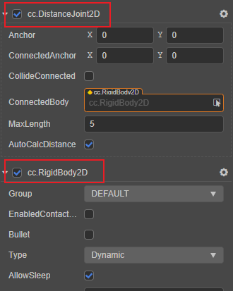

## 添加关节

在 **属性检查器** 上点击 **添加组件** 按钮并输入 2D 关节的组件名。

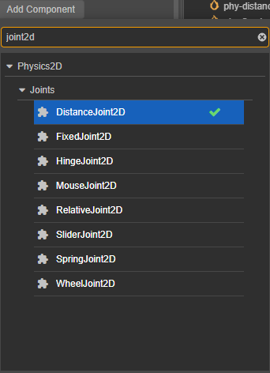

## 关节的共用属性

虽然每种关节都有不同的表现，但是它们也有一些共同的属性：

| 属性 | 说明 |
| :-- | :-- |
| **ConnectedBody** | 关节链接的另一端的刚体   **注意**：在 v3.7 版本中，如该属性没有被设置，则会默认取原点坐标，以与 **3D 物理** 中的约束在实现上统一 |
| **Anchor** | 关节本端链接的刚体的锚点 |
| **ConnectedAnchor** | 关节链接另一端刚体的锚点 |
| **CollideConnected** | 关节两端的刚体是否能够互相碰撞 |

每个关节都需要链接两个刚体才能够发挥它的功能，我们把和关节挂在同一节点下的刚体视为关节的本端，把 **ConnectedBody** 视为另一端的刚体。通常情况下，每个刚体会选取自身周围的某个位置设定成锚点。根据关节组件类型的不同，锚点决定了物体的旋转中心，或者是用来保持一定距离的坐标点，等等。

**CollideConnected** 属性用于确定关节两端的刚体是否需要继续遵循常规的碰撞规则。

如果你现在准备制作一个布娃娃，你可能会希望大腿和小腿能够部分重合，然后在膝盖处链接到一起，那么就需要设置 **CollideConnected** 属性为 false。如果你准备做一个升降机，希望升降机平台和地板能够碰撞，那么就需要设置 **CollideConnected** 属性为 true。

## 调整锚点

在场景中可以通过点击并拖拽  来调整 **Anchor** 属性，通过 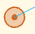 来调整 **ConnectedAnchor**。

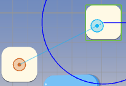

## 距离关节

在 **属性检查器** 上点击 **添加组件** 并输入 **DistanceJoint2D** 则可以添加距离关节。

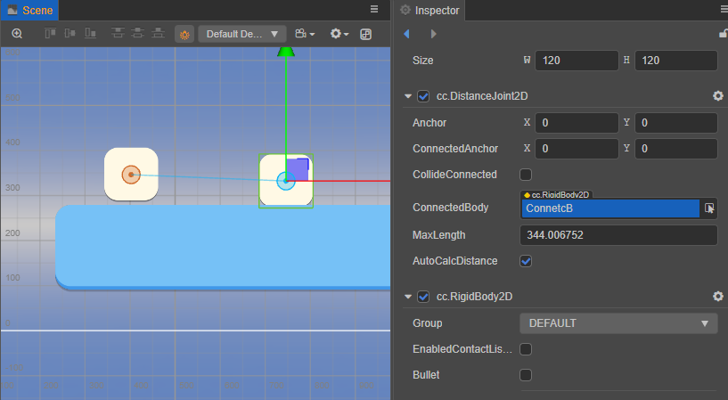

**距离关节（Distance Joint）** 会将关节两端的刚体约束在一个最大范围内。超出该范围时，刚体的运动会互相影响。

低于该范围则不会互相影响。

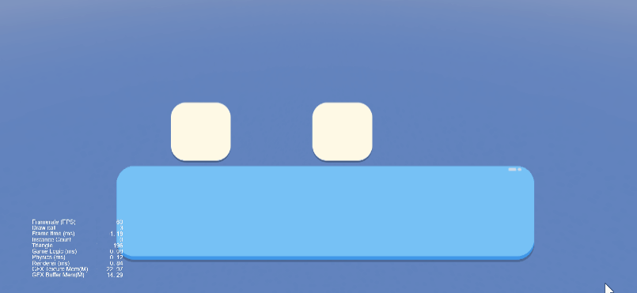

### 属性

| 属性 | 说明 |
| :-- | :-- |
| **MaxLength** | 最大距离 |
| **AutoCalcDistance** | 是否自动计算关节连接的两个刚体间的距离 |

## 固定关节

在 **属性检查器** 上点击 **添加组件** 并输入 **FixedJoint2D** 则可以添加固定关节。

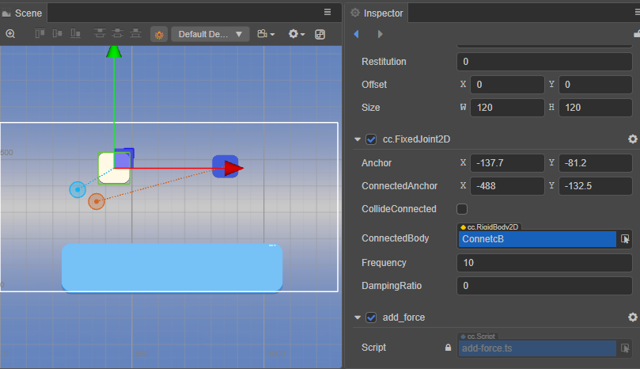

**固定关节（Fixed Joint）**，根据两个物体的初始角度将两个物体上的两个点固定在一起。

### 属性

| 属性 | 说明 |
| :-- | :-- |
| **Frequency** | 弹性系数 |
| **DampingRatio** | 阻尼，表示关节变形后，恢复到初始状态受到的阻力 |

## 铰链关节

在 **属性检查器** 上点击 **添加组件** 并输入 **HingeJoint2D** 则可以添加铰链关节。

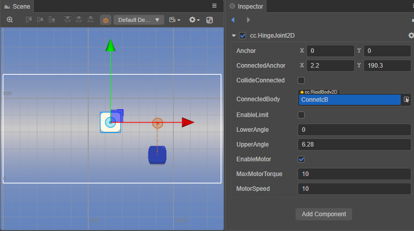

**铰链关节（Hinge Joint）**，可以看做一个铰链或者钉，刚体会围绕一个共同点来旋转。

### 属性

| 属性 | 说明 |
| :-- | :-- |
| **EnableLimit** | 是否开启关节的限制 |
| **LowerAngle** | 角度的最低限制 |
| **UpperAngle** | 角度的最高限制 |
| **EnableMotor** | 是否开启关节马达 |
| **MaxMotorTorque** | 可以施加到刚体的最大扭矩 |
| **MotorSpeed** | 期望的马达速度 |

启用马达速度后，关节连接的刚体会尝试逐渐加速到期望速度。

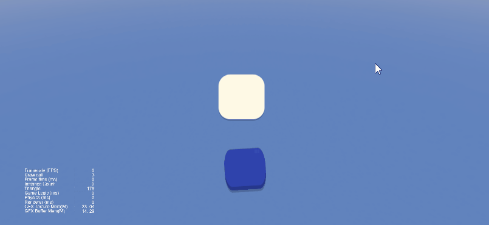

## 相对关节

在 **属性检查器** 上点击 **添加组件** 并输入 **RelativeJoint2D** 则可以添加相对关节。

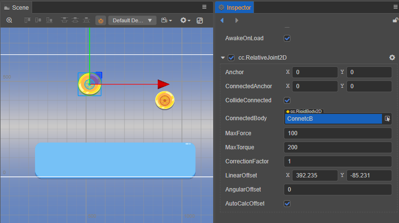

**相对关节（Relative Joint）**，控制两个刚体间的相对运动。

### 属性

| 属性 | 说明 |
| :-- | :-- |
| **MaxForce** | 可以应用于刚体的最大的力值 |
| **MaxTorque** | 可以应用于刚体的最大扭矩值 |
| **CorrectionFactor** | 位置矫正系数，范围为 [0, 1] |
| **LinearOffset** | 关节另一端的刚体相对于起始端刚体的位置偏移量
| **AngularOffset** | 关节另一端的刚体相对于起始端刚体的角度偏移量
| **AutoCalcOffset** | 自动计算关节连接的两个刚体间的 angularOffset 和 linearOffset |

## 滑动关节

在 **属性检查器** 上点击 **添加组件** 并输入 **SliderJoint2D** 则可以添加滑动关节。

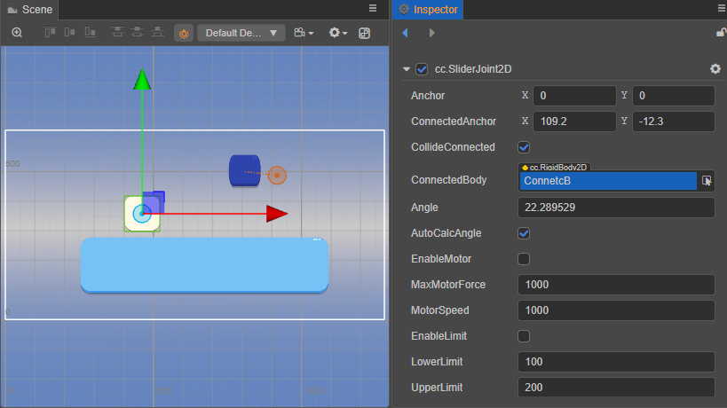

**滑动关节（Slider Joint）**，两个刚体位置间的角度是固定的，它们只能在一个指定的轴上滑动。如下图蓝色方块虽然受重力影响，但实际上由于关节的约束，只能沿设定的方向运动。

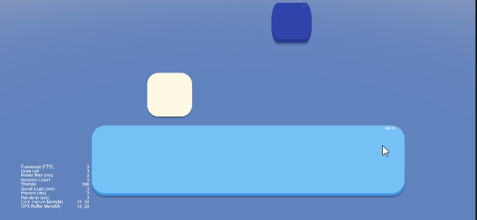

### 属性

| 属性 | 说明 |
| :-- | :-- |
| **Angle** | 滑动的方向 |
| **AutoCalcAngle** | 根据连接的两个刚体自动计算滑动方向 |
| **EnableMotor** | 是否开启关节马达 |
| **MaxMotorForce** | 可以施加到刚体的最大力 |
| **MotorSpeed** | 期望的马达速度 |
| **EnableLimit** | 是否开启关节的距离限制 |
| **LowerLimit** | 刚体能够移动的最小值 |
| **UpperLimit** | 刚体能够移动的最大值 |

## 弹簧关节

在 **属性检查器** 上点击 **添加组件** 并输入 **SpringJoint2D** 则可以添加弹簧关节。

**弹簧关节（Spring Joint）**，将关节两端物体像弹簧一样连接在一起。

### 属性

| 属性 | 说明 |
| :-- | :-- |
| **Frequency** | 弹性系数 |
| **DamingRatio** | 阻尼，表示关节变形后，恢复到初始状态受到的阻力 |
| **Distance** | 关节两端的距离 |
| **AutoCalcDistance** | 自动计算关节连接的两个刚体间的距离 |

## 轮子关节

在 **属性检查器** 上点击 **添加组件** 并输入 **WheelJoint2D** 则可以添加轮子关节。

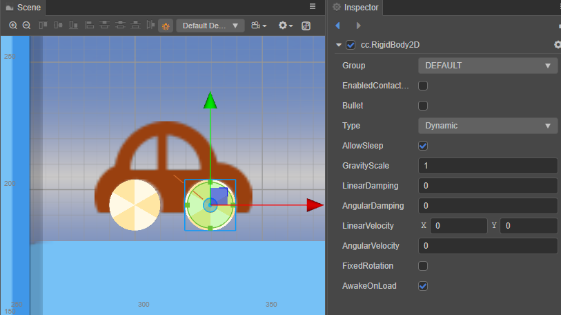

**轮子关节（Wheel Joint）**，用于模拟机动车车轮。

在模拟现实中四驱的情况下，可以考虑将前后轮的轮子关节都启用 **EnableMotor**，而非四驱的情况下可以考虑只启用驱动轮的 **EnableMotor**。 图示中仅前轮开启了 **EnableMotor**，从而模拟前驱的情况。

### 属性

| 属性 | 说明 |
| :-- | :-- |
| **Angle** | 轮子震动方向 |
| **EnableMotor** | 是否开启关节马达 |
| **MaxMotorTorque** | 可以施加到刚体的最大扭矩 |
| **MotorSpeed** | 期望的马达速度 |
| **Frequency** | 弹性系数 |
| **DampingRatio** |  阻尼，表示关节变形后，恢复到初始状态受到的阻力 |
