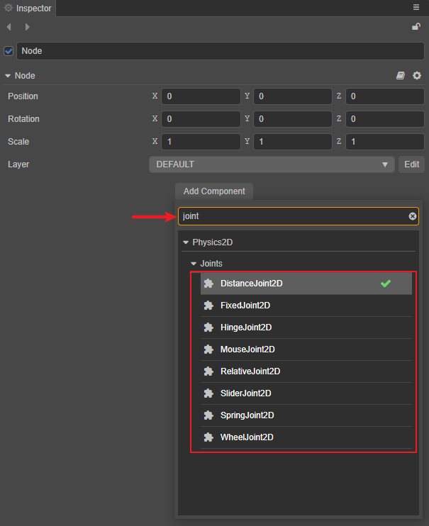

# 2D 关节组件

物理系统包含了一系列用于连接两个刚体的关节组件。关节组件依赖于刚体组件。可以用来模拟真实世界中物体间的交互，比如铰链、活塞、绳子、轮子、滑轮、机动车、链条等。学习如何使用关节组件可以创建一个真实有趣的场景。

> **注意**：关节组件在 Builtin 2D 物理模块中是无效的。

目前物理系统中提供了以下八种关节组件，详情可参考下方文档：

- [DistanceJoint2D](./joint-2d/distanceJoint2D.md)：2D 距离关节，将关节两端的刚体约束在一个最大范围内。
- [FixedJoint2D](joint-2d/fixedJoint2D.md)：2D 固定关节，根据两个物体的初始角度将两个物体上的两个点固定在一起。
- [HingeJoint2D](joint-2d/hingeJoint2D.md)：2D 铰链关节，可以看做一个铰链或者钉，刚体会围绕一个共同点来旋转。
- [MouseJoint2D](joint-2d/mouseJoint2D.md)：2D 鼠标关节，当用鼠标拖动一个刚体时，刚体会随着鼠标移动。
- [RelativeJoint2D](joint-2d/relativeJoint2D.md)：2D 相对关节，控制两个刚体间的相对运动。
- [SliderJoint2D](joint-2d/sliderJoint2D.md)：2D 滑动关节，两个刚体位置间的角度是固定的，它们只能在一个指定的轴上滑动。
- [SpringJoint2D](joint-2d/springJoint2D.md)：2D 弹簧关节，将关节两端物体像弹簧一样连接在一起。
- [WheelJoint2D](joint-2d/wheelJoint2D.md)：2D 车轮关节，用于模拟机动车车轮。

各个关节组件具体的使用方法，详情可参考官方范例 [joints](https://github.com/cocos-creator/physics-samples/tree/v3.x/2d/box2d/assets/cases/example/joints)。

## 添加 2D 关节组件

在 **层级管理器** 中选中要添加关节组件的节点，然后在 **属性检查器** 中点击 **添加组件 -> Physics2D -> Joints**，然后选择添加所需的关节组件。 或者也可以直接在添加组件的搜索框中搜索，前提是需要开启 **偏好设置 -> 实验室** 中的 **使用弹窗方式添加组件** 功能。

