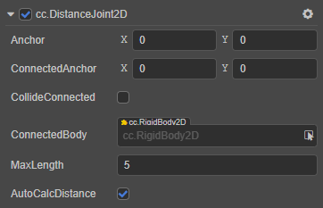
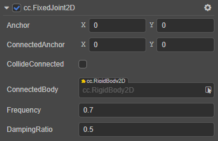
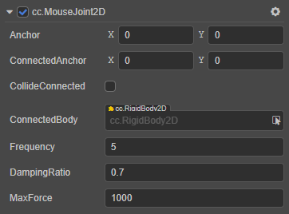
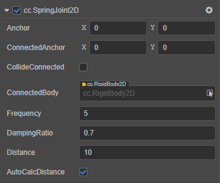

# 2D 关节组件

物理系统包含了一系列用于连接两个刚体的关节组件。关节组件可以用来模拟真实世界中物体间的交互，比如铰链、活塞、绳子、轮子、滑轮、机动车、链条等。学习如何使用关节组件可以创建一个真实有趣的场景。

> **注意**：关节组件在 Builtin 2D 物理模块中是无效的。

目前物理系统中提供了以下可用的关节组件：

- **DistanceJoint2D**：2D 距离关节，将关节两端的刚体约束在一个最大范围内。
- **FixedJoint2D**：2D 固定关节，根据两个物体的初始角度将两个物体上的两个点固定在一起。
- **HingeJoint2D**：2D 铰链关节，可以看做一个铰链或者钉，刚体会围绕一个共同点来旋转。
- **MouseJoint2D**：2D 鼠标关节，当用鼠标拖动一个刚体时，刚体会随着鼠标移动。
- **RelativeJoint2D**：2D 相对关节，控制两个刚体间的相对运动。
- **SliderJoint2D**：2D 滑动关节，两个刚体位置间的角度是固定的，它们只能在一个指定的轴上滑动。
- **SpringJoint2D**：2D 弹簧关节，将关节两端物体像弹簧一样连接在一起。
- **WheelJoint2D**：2D 车轮关节，用于模拟机动车车轮。

各个关节组件具体的使用方法，详情可参考官方范例 [joints](https://github.com/cocos-creator/physics-samples/tree/v3.x/2d/box2d/assets/cases/example/joints)。

## 添加 2D 关节组件

在 **层级管理器** 中选中要添加关节组件的节点，然后在 **属性检查器** 中点击 **添加组件 -> Physics2D -> Joints**，然后选择添加所需的关节组件。 或者也可以直接在添加组件的搜索框中搜索，前提是需要开启 **偏好设置 -> 实验室** 中的 **使用弹窗方式添加组件** 功能。

## 关节组件属性

### 各关节组件共有属性

虽然每种关节都有不同的表现，但是它们也有一些共同的属性：

- `Anchor`：关节本端链接的刚体的锚点。
- `ConnectedAnchor`：关节链接另一端刚体的锚点。
- `CollideConnected`：关节两端的刚体是否能够互相碰撞。
- `ConnectedBody`：关节链接的另一端的刚体。

每个关节都需要链接两个刚体才能够发挥它的功能，我们把和关节挂在同一节点下的刚体视为关节的本端，把 **connectedBody** 视为另一端的刚体。通常情况下，每个刚体会选取自身周围的某个位置设定成锚点。根据关节组件类型的不同，锚点决定了物体的旋转中心，或者是用来保持一定距离的坐标点，等等。

**collideConnected** 属性用于确定关节两端的刚体是否需要继续遵循常规的碰撞规则。

如果想要制作一个布娃娃，希望大腿和小腿能够部分重合，然后在膝盖处链接到一起，那么就需要设置 **collideConnected** 属性为 `false`。如果想要做一个升降机，希望升降机平台和地板能够碰撞，那么就需要设置 **collideConnected** 属性为 `true`。

### 各关节属性

#### DistanceJoint2D

- `MaxLength`：两个刚体之间允许的最长距离。
- `AutoCalcDistance`：是否自动计算关节连接的两个刚体间的距离。

具体的使用方法，详情可参考 [physics-samples](https://github.com/cocos-creator/physics-samples/tree/v3.x/2d/box2d/assets/cases/example/joints) 范例中的 `distance-joint` 和 `distance-joint-chain` 场景。

DistanceJoint2D 接口相关请参考 [DistanceJoint2D API](https://docs.cocos.com/creator/3.0/api/zh/classes/physics2d.distancejoint2d.html)。

#### FixedJoint2D

- `Frequency`：弹性系数。
- `DampingRatio`：阻尼，表示关节变形后，恢复到初始状态受到的阻力。

具体的使用方法，详情可参考 [physics-samples](https://github.com/cocos-creator/physics-samples/tree/v3.x/2d/box2d/assets/cases/example/joints) 范例中的 `fixed-joint-ragdoll` 场景。

FixedJoint2D 接口相关请参考 [FixedJoint2D API](https://docs.cocos.com/creator/3.0/api/zh/classes/physics2d.fixedjoint2d.html)。

#### HingeJoint2D

- `EnableLimit`：是否开启关节的限制。
- `LowerAngle`：角度的最低限制。
- `UpperAngle`：角度的最高限制。
- `EnableMotor`：是否开启关节马达
- `MaxMotorTorque`：可以施加到刚体的最大扭矩。
- `MotorSpeed`：期望的马达速度。

具体的使用方法，详情可参考 [physics-samples](https://github.com/cocos-creator/physics-samples/tree/v3.x/2d/box2d/assets/cases/example/joints) 范例中的 `hinge-joint` 和 `hinge-joint-crank` 场景。

HingeJoint2D 接口相关请参考 [HingeJoint2D API](https://docs.cocos.com/creator/3.0/api/zh/classes/physics2d.hingejoint2d.html)。

#### MouseJoint2D

- `Frequency`：弹性系数。
- `DampingRatio`：阻尼，表示关节变形后，恢复到初始状态受到的阻力。
- `MaxForce`：最大阻力值。

具体的使用方法，详情可参考 [physics-samples](https://github.com/cocos-creator/physics-samples/tree/v3.x/2d/box2d/assets/cases/example/joints) 范例中的 `mouse-joint` 场景。

MouseJoint2D 接口相关请参考 [MouseJoint2D API](https://docs.cocos.com/creator/3.0/api/zh/classes/physics2d.mousejoint2d.html)。

#### RelativeJoint2D

- `MaxForce`：最大阻力值。
- `MaxTorque`：可以应用于刚体的最大扭矩值。
- `CorrectionFactor`：位置矫正系数，范围为 [0, 1]。
- `LinearOffset`：关节另一端的刚体相对于起始端刚体的位置偏移量。
- `AngularOffset`：关节另一端的刚体相对于起始端刚体的角度偏移量。
- `AutoCalcOffset`：是否自动计算关节连接的两个刚体间的 `angularOffset` 和 `linearOffset`。

具体的使用方法，详情可参考 [physics-samples](https://github.com/cocos-creator/physics-samples/tree/v3.x/2d/box2d/assets/cases/example/joints) 范例中的 `relative-joint-human` 和 `relative-joint-linear-offset` 场景。

RelativeJoint2D 接口相关请参考 [RelativeJoint2D API](https://docs.cocos.com/creator/3.0/api/zh/classes/physics2d.relativejoint2d.html)。

#### SliderJoint2D

- `Angle`：滑动的方向。
- `AutoCalcAngle`：是否根据连接的两个刚体自动计算滑动方向。
- `EnableMotor`：是否开启关节马达。
- `MaxMotorForce`：可以施加到刚体的最大力。
- `MotorSpeed`：期望的马达速度。
- `EnableLimit`：是否开启关节的距离限制。
- `LowerLimit`：刚体能够移动的最小值。
- `UpperLimit`：刚体能够移动的最大值。

具体的使用方法，详情可参考 [physics-samples](https://github.com/cocos-creator/physics-samples/tree/v3.x/2d/box2d/assets/cases/example/joints) 范例中的 `slider-joint` 场景。

SliderJoint2D 接口相关请参考 [SliderJoint2D API](https://docs.cocos.com/creator/3.0/api/zh/classes/physics2d.sliderjoint2d.html)。

#### SpringJoint2D

- `Frequency`：弹性系数。
- `DampingRatio`：阻尼，表示关节变形后，恢复到初始状态受到的阻力。
- `Distance`：关节两端的距离。
- `AutoCalcDistance`：是否自动计算关节连接的两个刚体间的距离。

具体的使用方法，详情可参考 [physics-samples](https://github.com/cocos-creator/physics-samples/tree/v3.x/2d/box2d/assets/cases/example/joints) 范例中的 `spring-joint-damp` 和 `spring-joint-frequency` 场景。

SpringJoint2D 接口相关请参考 [SpringJoint2D API](https://docs.cocos.com/creator/3.0/api/zh/classes/physics2d.springjoint2d.html)。

#### WheelJoint2D

- `Angle`：轮子震动方向。
- `EnableMotor`：是否开启关节马达。
- `MaxMotorTorque`：可以施加到刚体的最大扭矩。
- `MotorSpeed`：期望的马达速度。
- `Frequency`：弹性系数。
- `DampingRatio`：阻尼，表示关节变形后，恢复到初始状态受到的阻力。

具体的使用方法，详情可参考 [physics-samples](https://github.com/cocos-creator/physics-samples/tree/v3.x/2d/box2d/assets/cases/example/joints) 范例中的 `wheel-joint` 场景。

WheelJoint2D 接口相关请参考 [WheelJoint2D API](https://docs.cocos.com/creator/3.0/api/zh/classes/physics2d.wheeljoint2d.html)。
