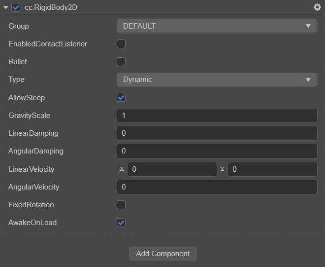

# 2D 刚体组件

刚体是组成物理世界的基本对象，你可以将刚体想象成一个你不能看到（绘制）也不能摸到（碰撞）的带有属性的物体。

由于 Builtin 2D 物理系统只带有碰撞检测的功能，所以刚体对于 Builtin 2D 物理系统是 **不生效的**，本篇设置只对其它 2D 物理系统产生作用。



属性 | 功能说明
:---|:---
**Group** | 碰撞分组，用于与其他碰撞体相遇时检测是否产生碰撞效果
**EnabledContactListener** | 刚体的碰撞监听，默认为 false
**Bullet**  |  这个刚体是否是一个快速移动的刚体，并且需要禁止穿过其他快速移动的刚体。此选项只关注于 动态刚体
**Type** | 刚体类型
**AllowSleep**  |  是否允许物理系统自动休眠，默认为 true
**GravityScale**  |  缩放应用在此刚体上的重力值
**LinearDamping**  |  线性阻尼，用于衰减线性速度，值越大，衰减越快
**AngularDamping**  |  角阻尼，用于减小物体的旋转速率
**LinearVelocity**  |  刚体在世界坐标下的线性速度
**AngularVelocity**  |  刚体的角速度体类型
**FixedRotation**  |  是否禁止此刚体进行旋转
**AwakeOnLoad**  |  是否在初始化时唤醒此刚体

>**注意：** 应该尽量少的使用 `Bullet` 选项，因为它会增加程序处理时间。

更多的使用方法，详情可参考 [physics-samples](https://github.com/cocos-creator/physics-samples/tree/v3.x/2d/box2d/assets/cases) 中的范例。

刚体组件接口请参考 [RigidBody2D API](__APIDOC__/zh/classes/physics2d.rigidbody2d.html)

## 刚体属性

### 质量

刚体的质量是通过 [碰撞组件](physics-2d-collider.md) 的 **密度** 与 **大小** 自动计算得到的。若需要计算物体应该受到多大的力，需要使用到这个属性。

```ts
// 获取刚体质量
const mass = rigidbody.getMass();
```

### 移动速度

```ts
// 获取移动速度
const velocity = rigidbody.linearVelocity;
// 设置移动速度
rigidbody.linearVelocity = velocity;
```

移动速度衰减系数，值越大物体移动越慢，可以用来模拟空气摩擦力等效果。

```ts
// 获取移动速度衰减系数
const damping = rigidbody.linearDamping;
// 设置移动速度衰减系数
rigidbody.linearDamping = damping;
```

>**注意：** 衰减系数可以大于 1，但是当衰减系数比较大的时候，衰减的效果会变得比较敏感。

如果要获取刚体上某个点的移动速度，可以通过  `getLinearVelocityFromWorldPoint` 来获取。比如一个盒子旋转着往前飞，碰到了墙，这时候可能会希望获取盒子在发生碰撞的点的速度。

传入一个 `cc.Vec2` 对象作为第二个参数来接收返回值，这样你可以使用你的缓存对象来接收这个值，避免创建过多的对象来提高效率。

**刚体的 get 方法都提供了 out 参数来接收函数返回值。**

```ts
let velocity = new Vec2();
rigidbody.getLinearVelocityFromWorldPoint(worldPoint, velocity);
```

### 旋转速度

```ts
// 获取旋转速度
const velocity = rigidbody.angularVelocity;
// 设置旋转速度
rigidbody.angularVelocity = velocity;
```

旋转速度衰减系数，与移动衰减系数相同。

```ts
// 获取旋转速度衰减系数
const damping = rigidbody.angularDamping;
// 设置旋转速度衰减系数
rigidbody.angularDamping = damping;
```

### 旋转、位移与缩放

旋转、位移与缩放是游戏开发中最常用的功能，几乎每个节点都会对这些属性进行设置。而在物理系统中，系统会自动将节点的这些属性与 Box2D 中对应属性进行同步。

**注意**：
1. Box2D 中只有旋转和位移，并没有缩放，所以如果设置节点的缩放属性时，会重新构建这个刚体依赖的全部碰撞体。一个有效避免这种情况发生的方式是将渲染的节点作为刚体节点的子节点，只对这个渲染节点作缩放，尽量避免对刚体节点进行直接缩放。

2. 在物理系统每次迭代（物理系统是在 `postUpdate` 进行迭代的）的最后会把所有刚体信息同步到对应节点上去，而出于性能考虑，只有当开发者对刚体所在节点的相关属性进行显示设置时，节点的信息才会同步到刚体上，并且刚体只会监视他所在的节点，也就是说，如果修改了节点的父节点的旋转位移，是不会同步这些信息的。

### 固定旋转

做平台跳跃游戏时通常都不会希望主角的旋转属性也被加入到物理模拟中，因为这样会导致主角在移动过程中东倒西歪，这时可以设置刚体的 `fixedRotation` 为 `true`，禁止旋转。

```ts
// 是否禁止此刚体进行旋转
rigidbody.fixedRotation = true;
```

### 开启碰撞监听

只有开启了刚体的碰撞监听，刚体发生碰撞时才会回调到对应的组件上。

```ts
rigidbody.enabledContactListener = true;
```

## 刚体类型

Box2D 原本的刚体类型是三种：**Static**、**Dynamic**、**Kinematic**。在 Cocos Creator 里多添加了一个类型：**Animated**。

- `cc.RigidBodyType.Static`

  静态刚体，零质量，零速度，即不会受到重力或速度影响，但是可以设置他的位置来进行移动。

- `cc.RigidBodyType.Dynamic`

  动态刚体，有质量，可以设置速度，会受到重力影响。

- `cc.RigidBodyType.Kinematic`

  运动刚体，零质量，可以设置速度，不会受到重力的影响，但是可以设置速度来进行移动。

- `cc.RigidBodyType.Animated`

动画刚体，Animated 是从 Kinematic 类型衍生出来的，一般的刚体类型修改 **旋转** 或 **位移** 属性时，都是直接设置的属性，而 Animated 会根据当前旋转或位移属性，与目标旋转或位移属性计算出所需的速度，并且赋值到对应的移动或旋转速度上。<br>
添加 Animated 类型主要是防止对刚体做动画时可能出现的奇怪现象，例如穿透。
>**注意** ：如果没有碰撞体，2D 刚体不能相互碰撞。

下图为各种刚体之间的碰撞情况：

|  | 静态刚体 |动态刚体 |运动刚体|动画刚体
:---|:---|:---|:---|:---
**静态刚体**|不碰撞|碰撞|不碰撞|不碰撞|
**动态刚体**|碰撞|碰撞|碰撞|碰撞|
**运动刚体**|不碰撞|碰撞|不碰撞|不碰撞|
**动画刚体**|不碰撞|碰撞|不碰撞|不碰撞|

## 刚体方法

### 获取或转换旋转位移属性

使用这些 API 来获取世界坐标系下的旋转和位移会比通过节点来获取更方便，因为节点中还需要去运算得到结果，而使用 API 是直接得到结果的。

#### 本地坐标与世界坐标转换

```ts
// 世界坐标转换到本地坐标
let localPoint = new Vec2();
rigidbody.getLocalPoint(worldPoint, localPoint);
```

```ts
// 本地坐标转换到世界坐标
let worldPoint = new Vec2();
rigidbody.getLocalPoint(localPoint, worldPoint);
```

```ts
// 本地向量转换为世界向量
let worldVector = new Vec2();
rigidbody.getWorldVector(localVector, worldVector);
```

```ts
// 世界向量转换为本地向量
let localVector = new Vec2();
rigidbody.getLocalVector(worldVector, localVector);
```

### 获取刚体质心

当对一个刚体施加力的时候，一般会选择刚体的质心作为施加力的作用点，这样能保证力不会影响到旋转值。

```ts
// 获取本地坐标系下刚体的质心
let localCenter = new Vec2();
rigidbody.getLocalCenter(localCenter);

// 或者通过参数来接收返回值
localCenter = new Vec2();
rigidbody.getLocalCenter(localCenter);

// 获取世界坐标系下的刚体质心
let worldCenter =  new Vec2();
rigidbody.getWorldCenter(worldCenter);

// 或者通过参数来接收返回值
worldCenter = new Vec2();
rigidbody.getWorldCenter(worldCenter);
```

### 力与冲量

移动一个物体有两种方式：

1. 可以施加一个力或者冲量到这个物体上。力会随着时间慢慢修改物体的速度，而冲量会立即修改物体的速度。
2. 直接修改物体的位置，只是这看起来不像真实的物理，你应该尽量去使用力或者冲量来移动刚体，这会减少可能带来的奇怪问题。

```ts
// 施加一个力到刚体上指定的点，这个点是世界坐标系下的一个点
rigidbody.applyForce(force, point,true);

// 或者直接施加力到刚体的质心上
rigidbody.applyForceToCenter(force,true);

// 施加一个冲量到刚体上指定的点，这个点是世界坐标系下的一个点
rigidbody.applyLinearImpulse(impulse, point,true);
```

力与冲量也可以只对旋转轴产生影响，这样的力叫做扭矩。

```ts
// 施加扭矩到刚体上，因为只影响旋转轴，所以不再需要指定一个点
rigidbody.applyTorque(torque,true);

// 施加旋转轴上的冲量到刚体上
rigidbody.applyAngularImpulse(impulse,true);
```

### 其他

如果要获取刚体在某一点上的速度时，可以通过 `getLinearVelocityFromWorldPoint` 来获取，比如当物体碰撞到一个平台时，需要根据物体碰撞点的速度来判断物体相对于平台是从上方碰撞的还是下方碰撞的。

```ts
// 获取刚体上指定点的线性速度
let linear = new Vec2(); 
rigidbody.getLinearVelocityFromWorldPoint(worldPoint,linear);
```
