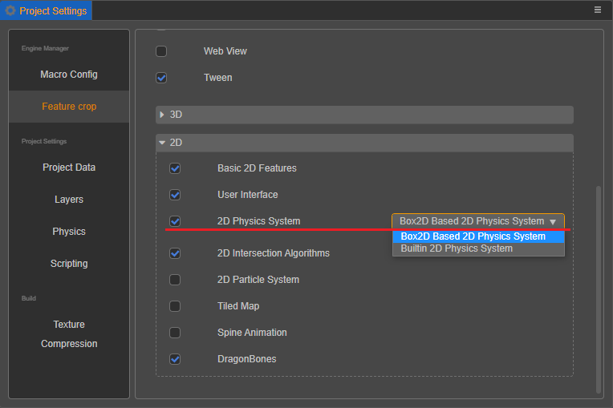

# 2D 物理简介

Cocos Creator 的 2D 物理支持内置的轻量 **Builtin** 物理系统和强大的 **Box2D** 物理系统：

- **Builtin** 物理系统只提供了碰撞检测的功能。推荐物理计算较为简单的项目使用，这样可以避免加载物理引擎并构建物理世界的运行时开销。
- **Box2D** 物理系统提供了更完善的交互接口和刚体、关节等已经预设好的组件，适用于功能需求比较复杂的项目。

开发者可以根据项目需求，通过编辑器主菜单中的 **项目 -> 项目设置 -> 功能裁剪 -> 2D 物理系统** 来选择合适的物理模块。

## 详细介绍

- [2D 物理系统](./physics-2d-system.md)
- [2D 刚体组件](./physics-2d-rigid-body.md)
- [2D 碰撞组件](./physics-2d-collider.md)
- [2D 碰撞回调](./physics-2d-contact-callback.md)
- [2D 物理关节](./physics-2d-joint.md)

## 2D 物理示例

具体的使用方法可参考范例 **physics-samples**（[GitHub](https://github.com/cocos-creator/physics-samples/tree/v3.x/2d) | [Gitee](https://gitee.com/mirrors_cocos-creator/physics-samples/tree/v3.x/2d)）中的实现。
