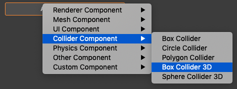
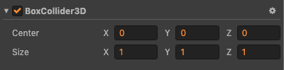
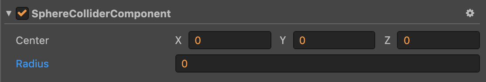

# 3D 碰撞系统

## 开启碰撞系统

碰撞系统 (Collision3DManager) 默认是关闭的，如需使用碰撞系统，必须开启碰撞系统，否则运行时不会产生任何效果。

```javascript
cc.director.getCollision3DManager().enabled = true;
```

## 射线检测

射线检测的用法与物理系统完全一至，请参考 [3D 物理系统](./physics-manager.md)

## 碰撞组件

碰撞系统的碰撞组件与物理系统相比，没有物理材质和触发器属性。

添加盒碰撞组件 (BoxColliderComponent)



盒碰撞组件属性预览



添加球碰撞组件 (SphereColliderComponent)


球碰撞组件属性预览



## 碰撞事件

碰撞系统的碰撞事件与物理系统相比，只有触发类型的事件，分为三种 onCollisionEnter、onCollisionStay、onCollisionExit，分别表示碰撞开始，碰撞保持，碰撞结束，使用方法与 [物理事件](./physics-event.md) 用法类似。

**ColliderComponent 是碰撞系统中所有碰撞组件的基类**